# Aciclovir Population Parallel Workflow Report

# Table of Contents

 * [1 Sensitivity Analysis](#sensitivity-analysis)
 * [2 PK parameters](#pk-parameters)
   * [2.1 PK Parameters of Aciclovir Plasma](#1_pk_parameters_organism_peripheralvenousblood_aciclovir_plasma__peripheral_venous_blood_)
     * [2.1.1 AUC_tEnd](#2_pk_parameters_organism_peripheralvenousblood_aciclovir_plasma__peripheral_venous_blood__auc_tend)
     * [2.1.2 Total body clearance/F](#7_pk_parameters_organism_peripheralvenousblood_aciclovir_plasma__peripheral_venous_blood__cl)
     * [2.1.3 Vss (plasma)/F](#12_pk_parameters_organism_peripheralvenousblood_aciclovir_plasma__peripheral_venous_blood__vss)
     * [2.1.4 C_max](#17_pk_parameters_organism_peripheralvenousblood_aciclovir_plasma__peripheral_venous_blood__c_max)
 * [3 Time profiles and residual plots](#time-profiles)
   * [3.1 Time profiles and residual plots for Aciclovir Adults](#time-profiles-aciclovir_adults)
   * [3.2 Time profiles and residual plots for Aciclovir Children](#time-profiles-aciclovir_children)

# 1 Sensitivity Analysis

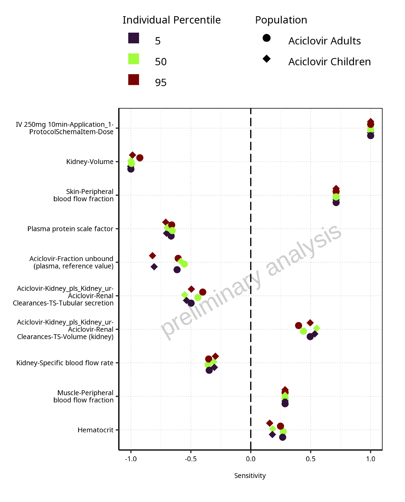

**Figure 1-1: Most sensitive parameters for AUC_tEnd of Aciclovir Plasma for individuals at percentiles 5, 50, 95 for Aciclovir Children, Aciclovir Adults.**

 
 

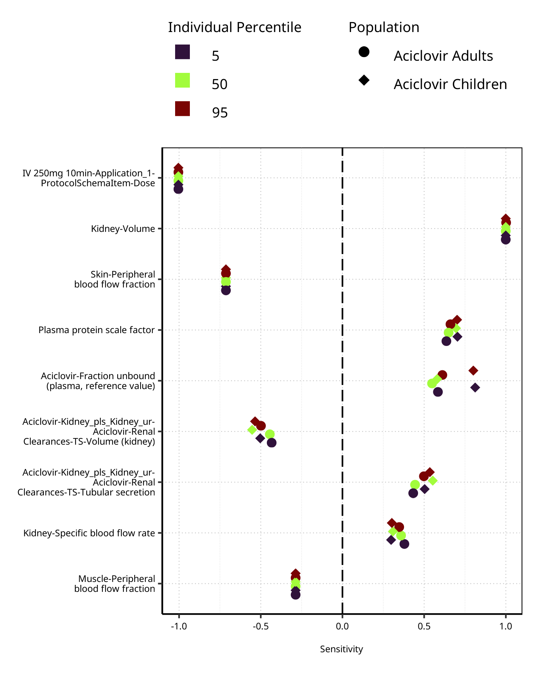

**Figure 1-2: Most sensitive parameters for Total body clearance/F of Aciclovir Plasma for individuals at percentiles 5, 50, 95 for Aciclovir Adults, Aciclovir Children.**

 
 

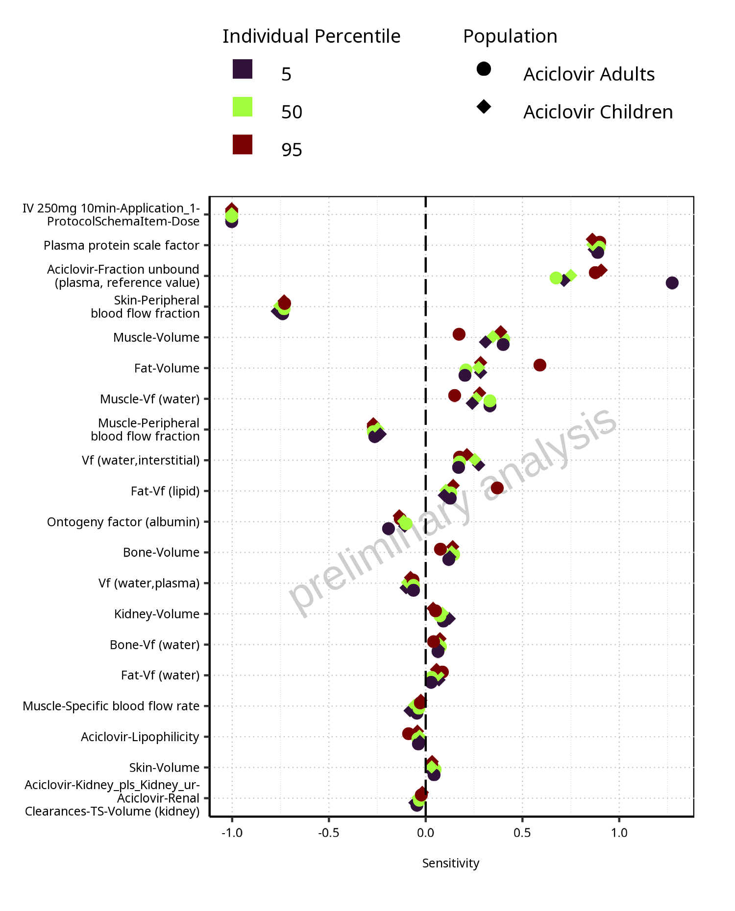

**Figure 1-3: Most sensitive parameters for Vss (plasma)/F of Aciclovir Plasma for individuals at percentiles 5, 50, 95 for Aciclovir Adults, Aciclovir Children.**

 
 

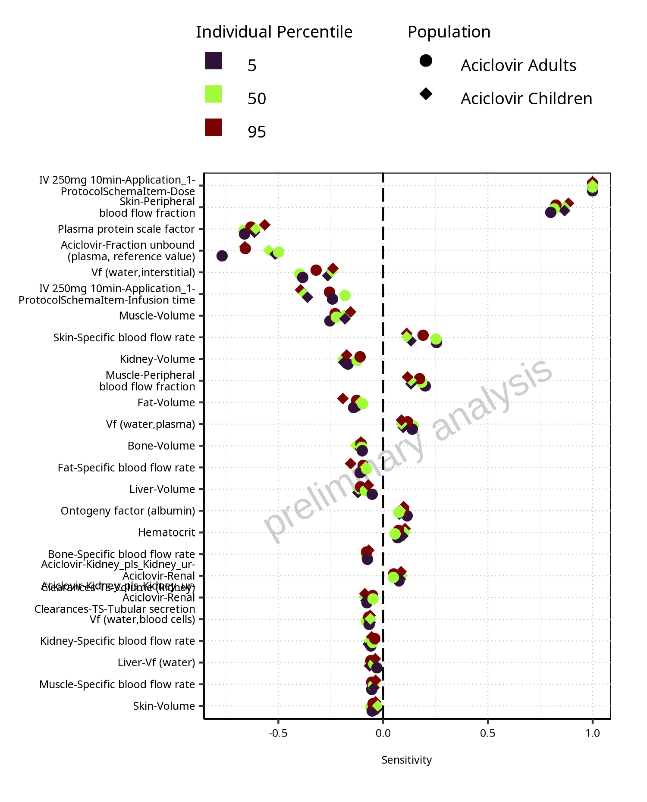

**Figure 1-4: Most sensitive parameters for C_max of Aciclovir Plasma for individuals at percentiles 5, 50, 95 for Aciclovir Children, Aciclovir Adults.**

 
 

# 2 PK parameters

## 2.1 PK Parameters of Aciclovir Plasma

### 2.1.1 AUC_tEnd

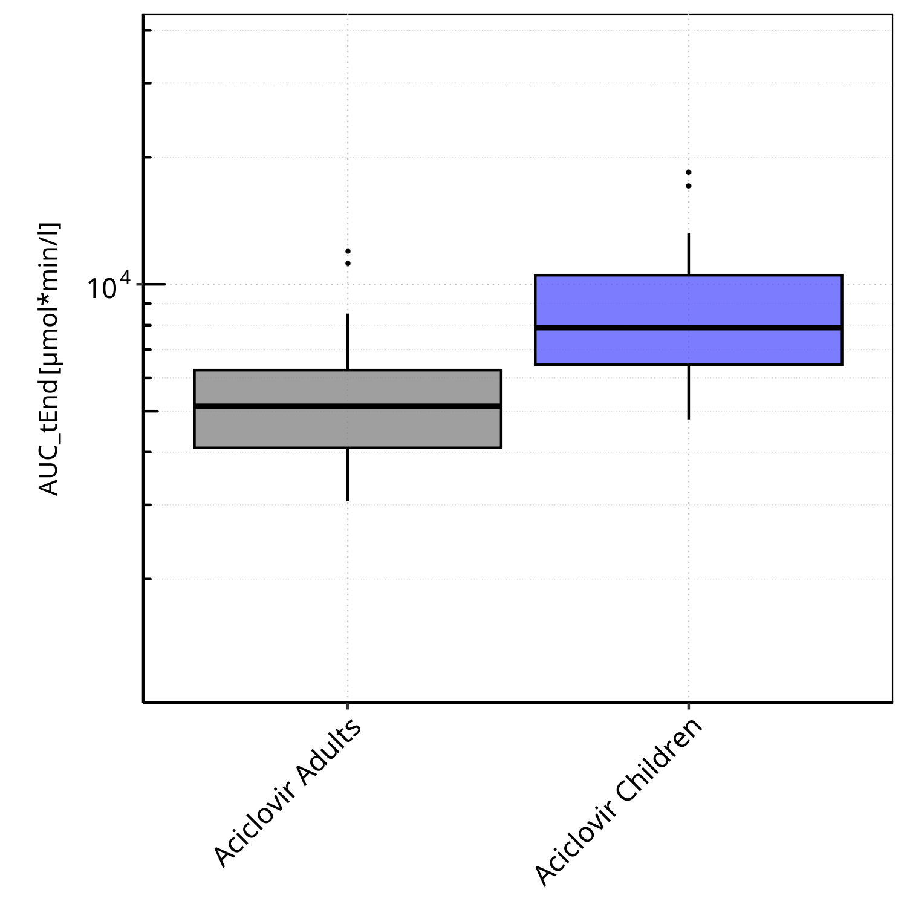

**Figure 2-1: AUC_tEnd of Aciclovir Plasma for Aciclovir Adults, Aciclovir Children shown as box-whisker plot, which indicates  the 5th, 25th, 50th, 75th, 95th percentiles in logarithmic scale.**

 
 

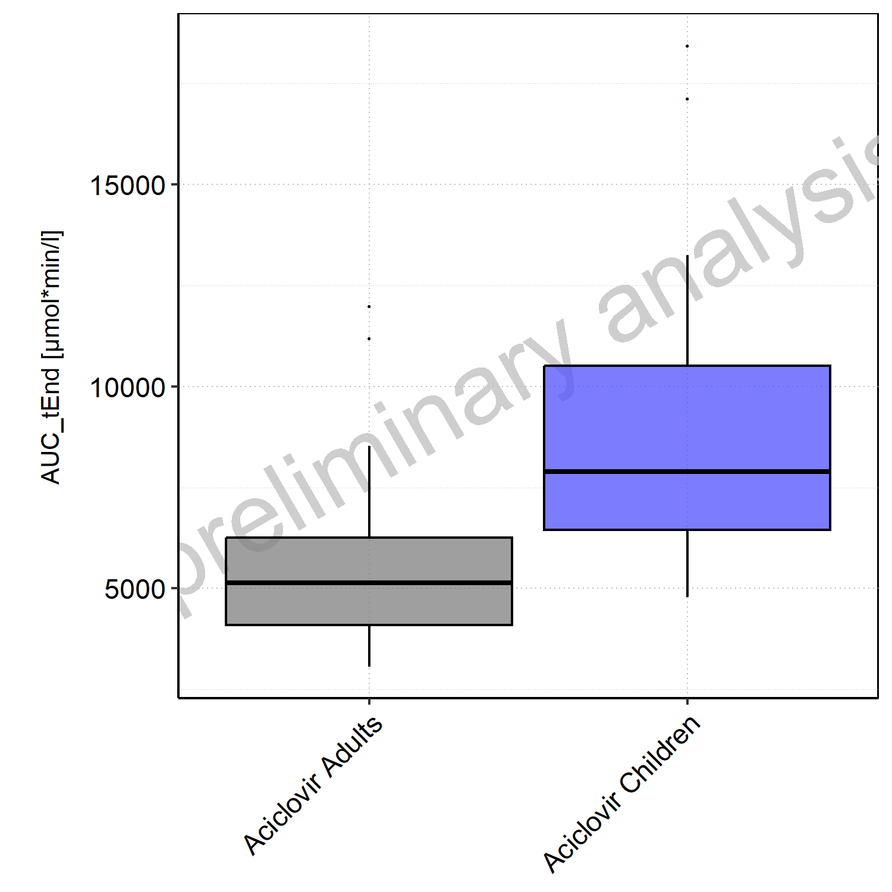

**Figure 2-2: AUC_tEnd of Aciclovir Plasma for Aciclovir Adults, Aciclovir Children shown as box-whisker plot, which indicates  the 5th, 25th, 50th, 75th, 95th percentiles in linear scale.**

 
 

**Table 2-1: Population statistics summarizing AUC_tEnd of Aciclovir Plasma for Aciclovir Adults, Aciclovir Children reported in [µmol*min/l]**

|Population         |N   |5th pctl |25th pctl |50th pctl |75th pctl |95th pctl |Mean    |SD      |Geo Mean |Geo SD |
|:------------------|:---|:-------------------|:--------------------|:--------------------|:--------------------|:--------------------|:-------|:-------|:--------|:------|
|Aciclovir Adults   |100 |3059.31             |4093.57              |5140.20              |6258.52              |8520.73              |5387.42 |1792.62 |5117.26  |1.38   |
|Aciclovir Children |100 |4780.92             |6455.52              |7889.49              |10507.43             |13250.47             |8594.20 |2965.27 |8135.55  |1.39   |

 
 

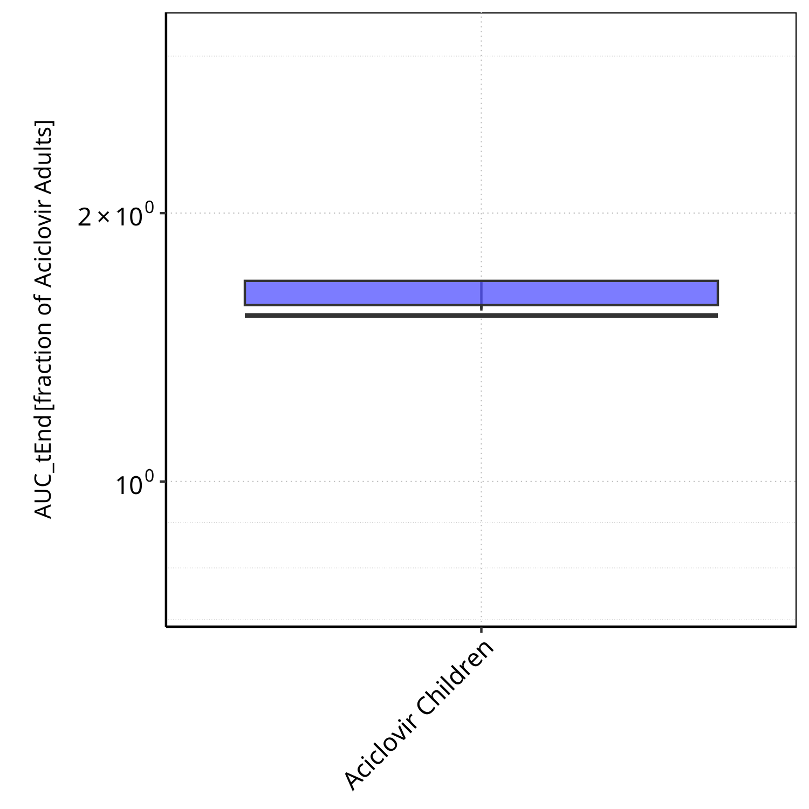

**Figure 2-3: Ratio of population summary statistics of AUC_tEnd of Aciclovir Plasma  for  Aciclovir Children in comparison to Aciclovir Adults shown as box-whisker plot, which indicates ratios of the 5th, 25th, 50th, 75th, 95th percentiles in logarithmic scale.**

 
 

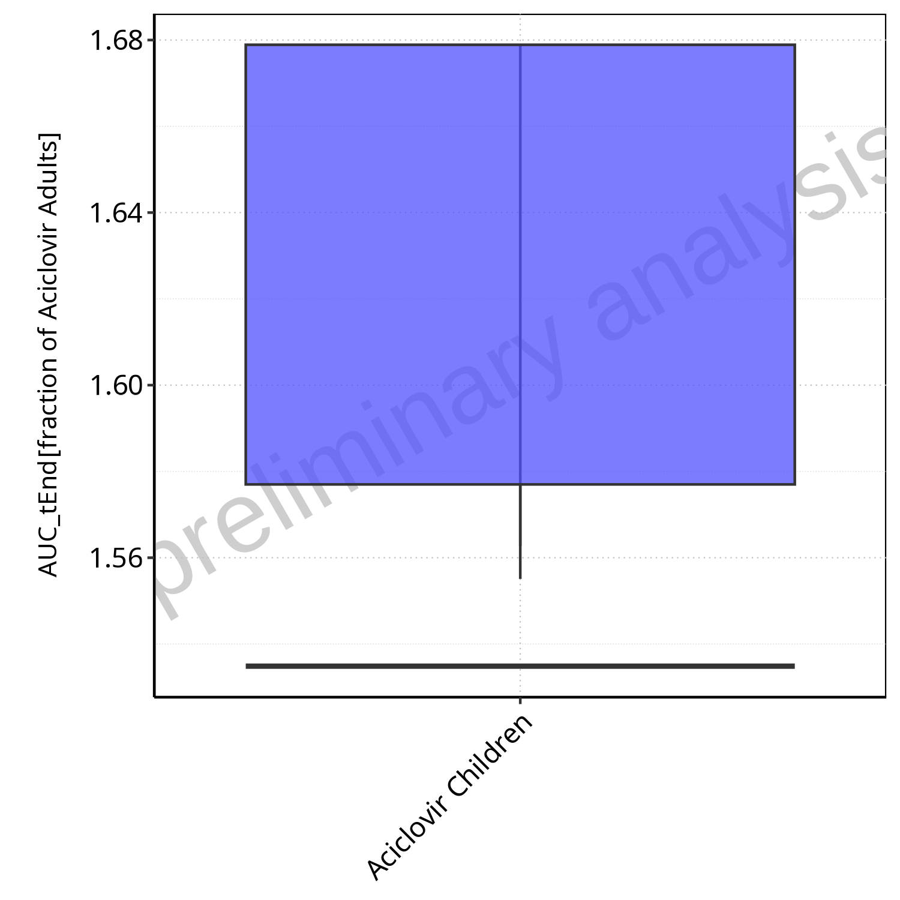

**Figure 2-4: Ratio of population summary statistics of AUC_tEnd of Aciclovir Plasma  for  Aciclovir Children in comparison to Aciclovir Adults shown as box-whisker plot, which indicates ratios of the 5th, 25th, 50th, 75th, 95th percentiles in linear scale.**

 
 

**Table 2-2: Ratio of population summary statistics of AUC_tEnd of Aciclovir Plasma  for  Aciclovir Children in comparison to Aciclovir Adults**

|Population         |N   |5th pctl |25th pctl |50th pctl |75th pctl |95th pctl |Mean |SD   |Geo Mean |Geo SD |
|:------------------|:---|:-------------------|:--------------------|:--------------------|:--------------------|:--------------------|:----|:----|:--------|:------|
|Aciclovir Children |100 |1.56                |1.58                 |1.53                 |1.68                 |1.56                 |1.60 |1.65 |1.59     |1.01   |

 
 

### 2.1.2 Total body clearance/F

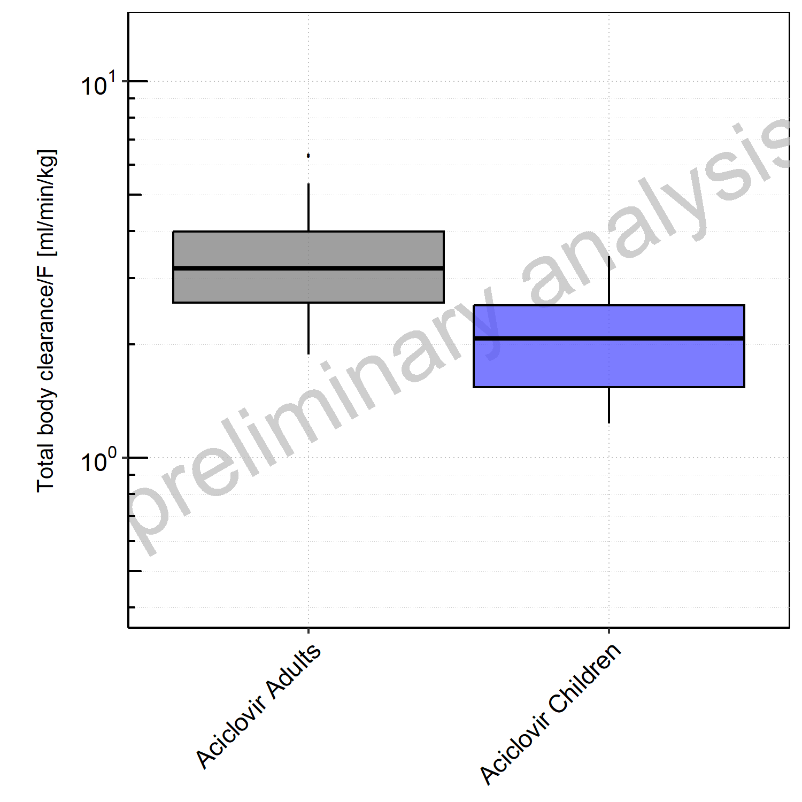

**Figure 2-5: Total body clearance/F of Aciclovir Plasma for Aciclovir Adults, Aciclovir Children shown as box-whisker plot, which indicates  the 5th, 25th, 50th, 75th, 95th percentiles in logarithmic scale.**

 
 

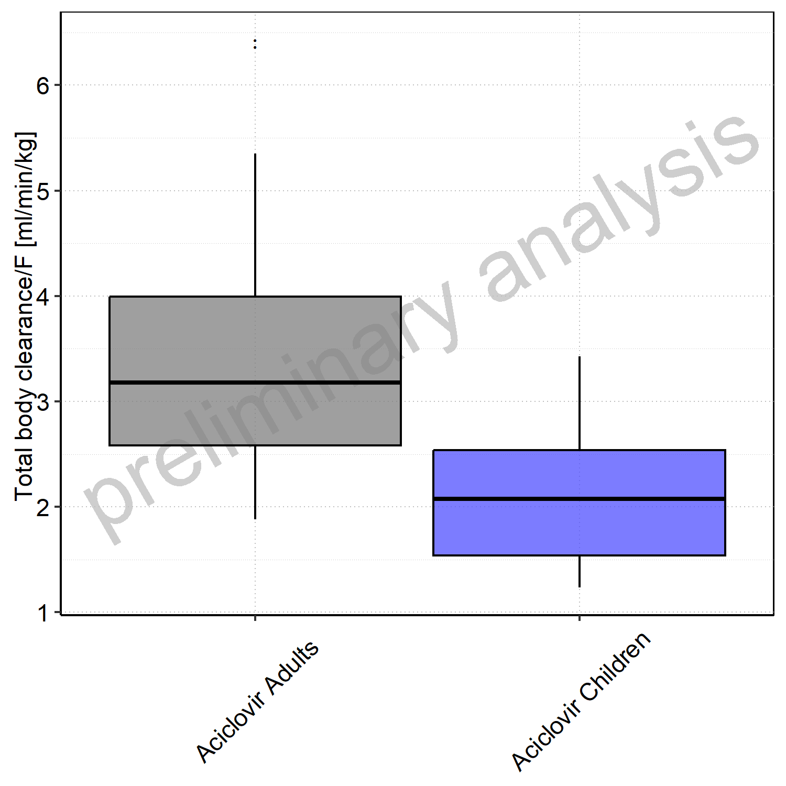

**Figure 2-6: Total body clearance/F of Aciclovir Plasma for Aciclovir Adults, Aciclovir Children shown as box-whisker plot, which indicates  the 5th, 25th, 50th, 75th, 95th percentiles in linear scale.**

 
 

**Table 2-3: Population statistics summarizing Total body clearance/F of Aciclovir Plasma for Aciclovir Adults, Aciclovir Children reported in [ml/min/kg]**

|Population         |N   |5th pctl |25th pctl |50th pctl |75th pctl |95th pctl |Mean |SD   |Geo Mean |Geo SD |
|:------------------|:---|:-------------------|:--------------------|:--------------------|:--------------------|:--------------------|:----|:----|:--------|:------|
|Aciclovir Adults   |100 |1.88                |2.58                 |3.18                 |3.99                 |5.35                 |3.34 |1.09 |3.17     |1.39   |
|Aciclovir Children |100 |1.23                |1.54                 |2.08                 |2.54                 |3.43                 |2.12 |0.68 |2.01     |1.39   |

 
 

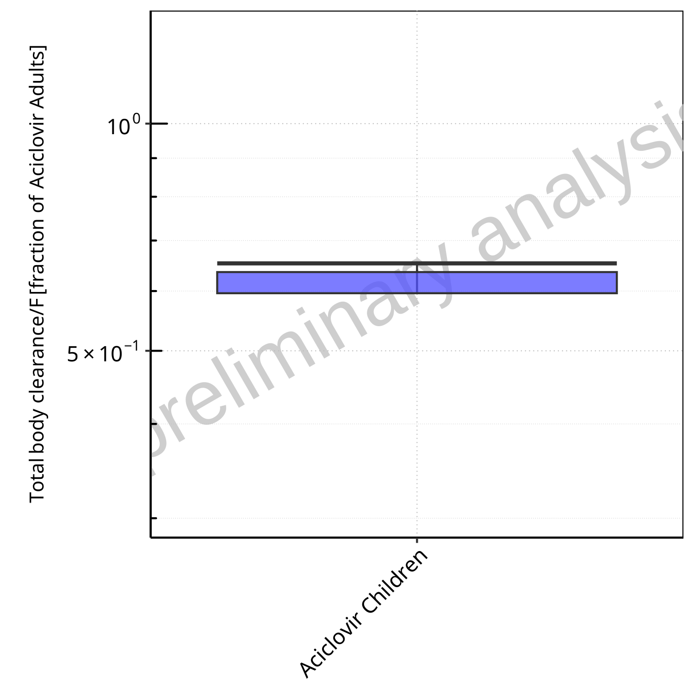

**Figure 2-7: Ratio of population summary statistics of Total body clearance/F of Aciclovir Plasma  for  Aciclovir Children in comparison to Aciclovir Adults shown as box-whisker plot, which indicates ratios of the 5th, 25th, 50th, 75th, 95th percentiles in logarithmic scale.**

 
 

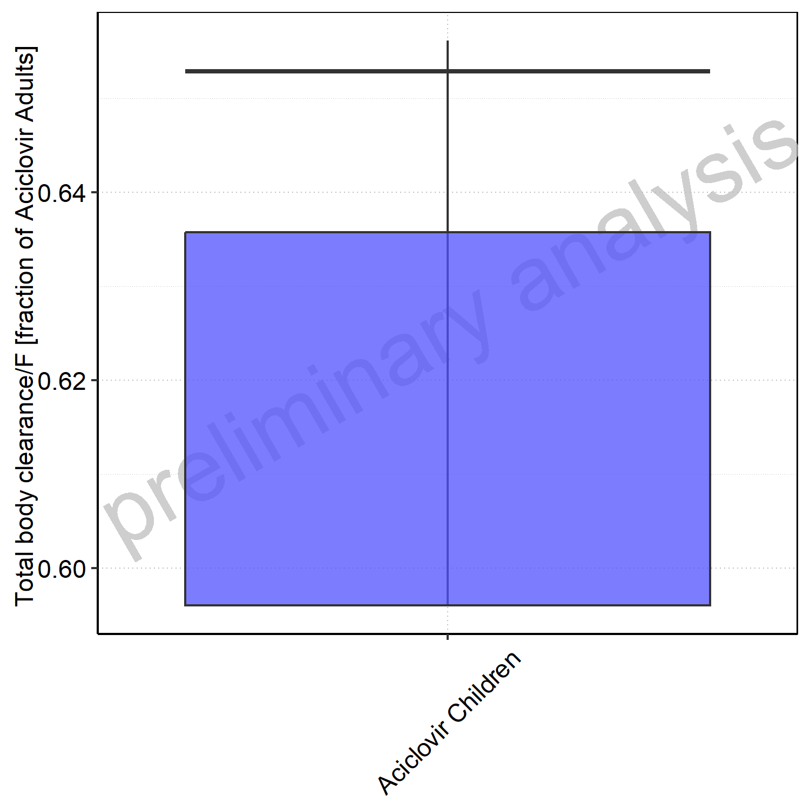

**Figure 2-8: Ratio of population summary statistics of Total body clearance/F of Aciclovir Plasma  for  Aciclovir Children in comparison to Aciclovir Adults shown as box-whisker plot, which indicates ratios of the 5th, 25th, 50th, 75th, 95th percentiles in linear scale.**

 
 

**Table 2-4: Ratio of population summary statistics of Total body clearance/F of Aciclovir Plasma  for  Aciclovir Children in comparison to Aciclovir Adults**

|Population         |N   |5th pctl |25th pctl |50th pctl |75th pctl |95th pctl |Mean |SD   |Geo Mean |Geo SD |
|:------------------|:---|:-------------------|:--------------------|:--------------------|:--------------------|:--------------------|:----|:----|:--------|:------|
|Aciclovir Children |100 |0.66                |0.60                 |0.65                 |0.64                 |0.64                 |0.63 |0.62 |0.63     |1.00   |

 
 

### 2.1.3 Vss (plasma)/F

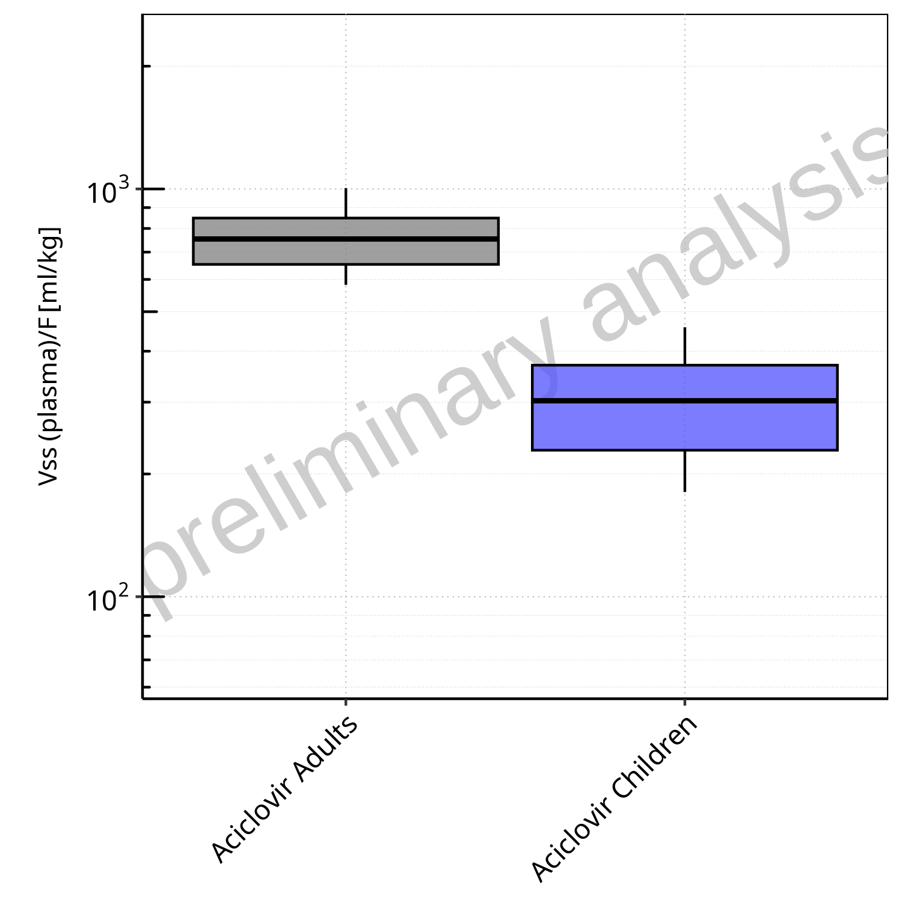

**Figure 2-9: Vss (plasma)/F of Aciclovir Plasma for Aciclovir Adults, Aciclovir Children shown as box-whisker plot, which indicates  the 5th, 25th, 50th, 75th, 95th percentiles in logarithmic scale.**

 
 

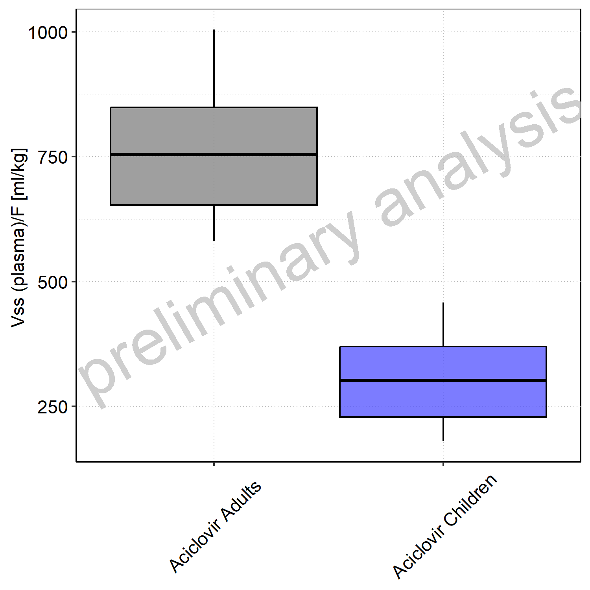

**Figure 2-10: Vss (plasma)/F of Aciclovir Plasma for Aciclovir Adults, Aciclovir Children shown as box-whisker plot, which indicates  the 5th, 25th, 50th, 75th, 95th percentiles in linear scale.**

 
 

**Table 2-5: Population statistics summarizing Vss (plasma)/F of Aciclovir Plasma for Aciclovir Adults, Aciclovir Children reported in [ml/kg]**

|Population         |N   |5th pctl |25th pctl |50th pctl |75th pctl |95th pctl |Mean   |SD     |Geo Mean |Geo SD |
|:------------------|:---|:-------------------|:--------------------|:--------------------|:--------------------|:--------------------|:------|:------|:--------|:------|
|Aciclovir Adults   |100 |581.90              |653.15               |753.84               |848.39               |1004.80              |760.07 |135.65 |748.29   |1.19   |
|Aciclovir Children |100 |180.58              |228.71               |302.41               |369.64               |457.91               |304.05 |88.39  |291.30   |1.35   |

 
 

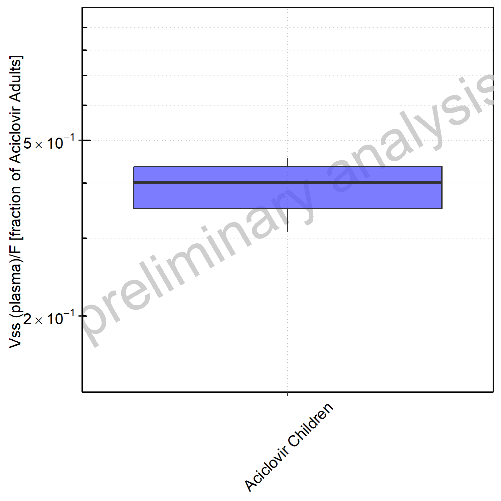

**Figure 2-11: Ratio of population summary statistics of Vss (plasma)/F of Aciclovir Plasma  for  Aciclovir Children in comparison to Aciclovir Adults shown as box-whisker plot, which indicates ratios of the 5th, 25th, 50th, 75th, 95th percentiles in logarithmic scale.**

 
 

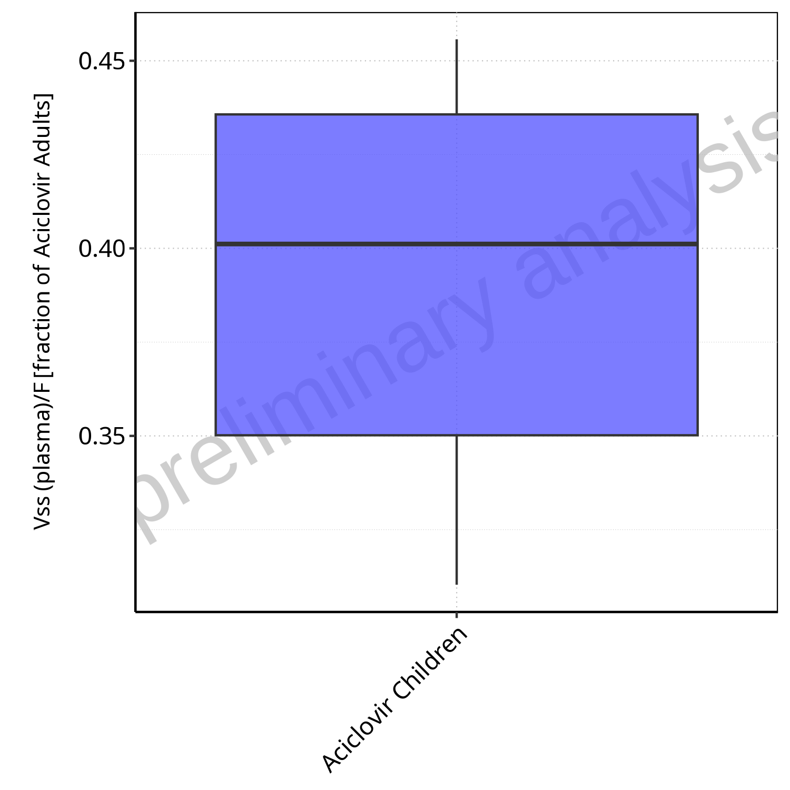

**Figure 2-12: Ratio of population summary statistics of Vss (plasma)/F of Aciclovir Plasma  for  Aciclovir Children in comparison to Aciclovir Adults shown as box-whisker plot, which indicates ratios of the 5th, 25th, 50th, 75th, 95th percentiles in linear scale.**

 
 

**Table 2-6: Ratio of population summary statistics of Vss (plasma)/F of Aciclovir Plasma  for  Aciclovir Children in comparison to Aciclovir Adults**

|Population         |N   |5th pctl |25th pctl |50th pctl |75th pctl |95th pctl |Mean |SD   |Geo Mean |Geo SD |
|:------------------|:---|:-------------------|:--------------------|:--------------------|:--------------------|:--------------------|:----|:----|:--------|:------|
|Aciclovir Children |100 |0.31                |0.35                 |0.40                 |0.44                 |0.46                 |0.40 |0.65 |0.39     |1.13   |

 
 

### 2.1.4 C_max

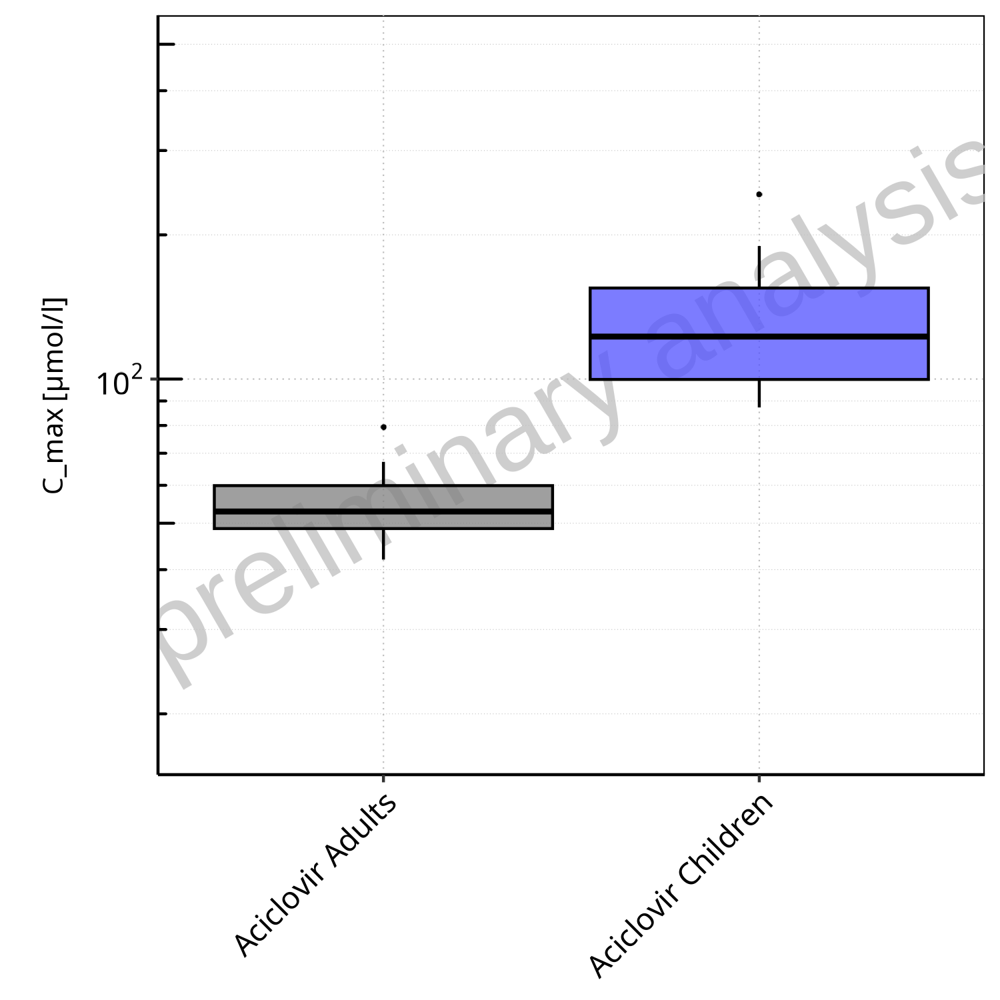

**Figure 2-13: C_max of Aciclovir Plasma for Aciclovir Adults, Aciclovir Children shown as box-whisker plot, which indicates  the 5th, 25th, 50th, 75th, 95th percentiles in logarithmic scale.**

 
 

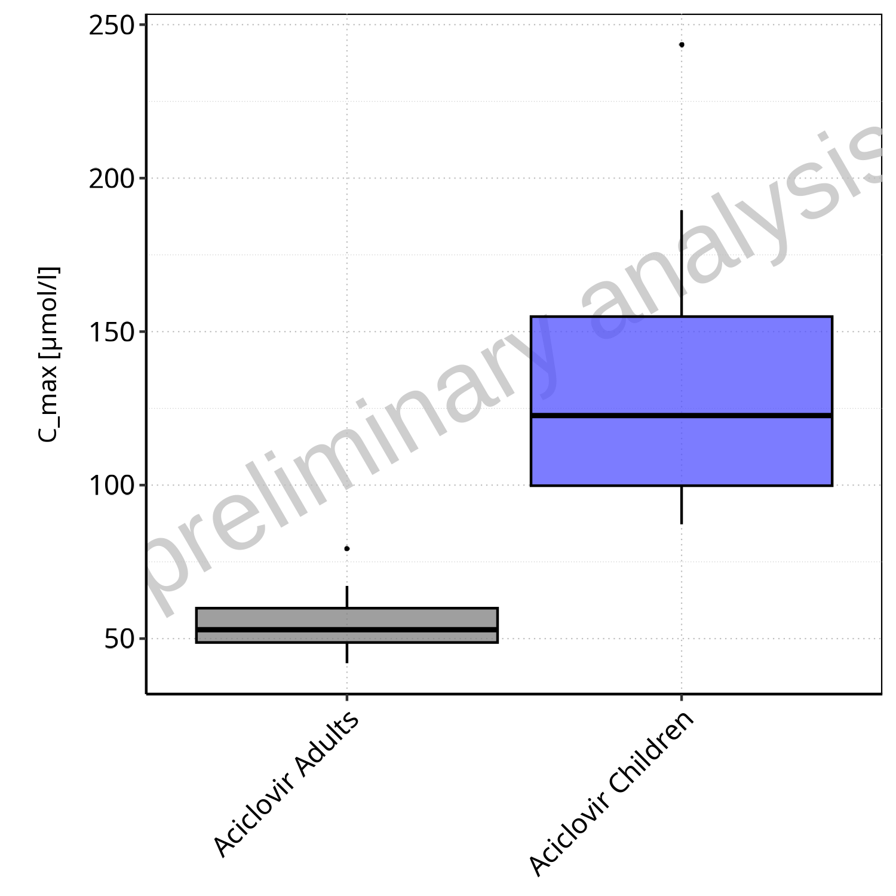

**Figure 2-14: C_max of Aciclovir Plasma for Aciclovir Adults, Aciclovir Children shown as box-whisker plot, which indicates  the 5th, 25th, 50th, 75th, 95th percentiles in linear scale.**

 
 

**Table 2-7: Population statistics summarizing C_max of Aciclovir Plasma for Aciclovir Adults, Aciclovir Children reported in [µmol/l]**

|Population         |N   |5th pctl |25th pctl |50th pctl |75th pctl |95th pctl |Mean   |SD    |Geo Mean |Geo SD |
|:------------------|:---|:-------------------|:--------------------|:--------------------|:--------------------|:--------------------|:------|:-----|:--------|:------|
|Aciclovir Adults   |100 |41.99               |48.73                |52.90                |59.91                |67.16                |54.30  |8.02  |53.72    |1.16   |
|Aciclovir Children |100 |87.24               |99.81                |122.66               |154.90               |189.55               |130.01 |34.15 |125.82   |1.29   |

 
 

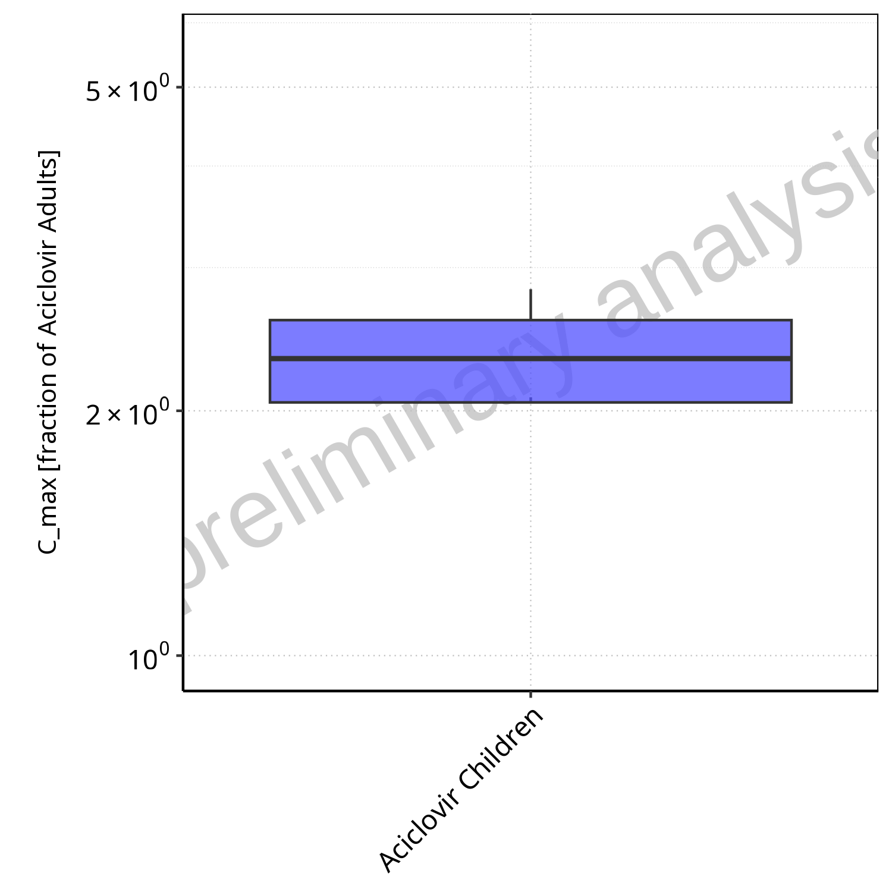

**Figure 2-15: Ratio of population summary statistics of C_max of Aciclovir Plasma  for  Aciclovir Children in comparison to Aciclovir Adults shown as box-whisker plot, which indicates ratios of the 5th, 25th, 50th, 75th, 95th percentiles in logarithmic scale.**

 
 

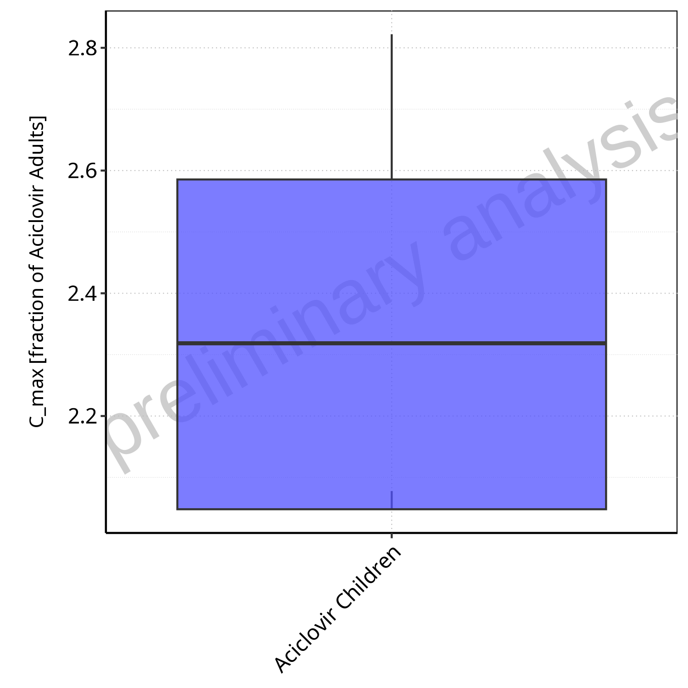

**Figure 2-16: Ratio of population summary statistics of C_max of Aciclovir Plasma  for  Aciclovir Children in comparison to Aciclovir Adults shown as box-whisker plot, which indicates ratios of the 5th, 25th, 50th, 75th, 95th percentiles in linear scale.**

 
 

**Table 2-8: Ratio of population summary statistics of C_max of Aciclovir Plasma  for  Aciclovir Children in comparison to Aciclovir Adults**

|Population         |N   |5th pctl |25th pctl |50th pctl |75th pctl |95th pctl |Mean |SD   |Geo Mean |Geo SD |
|:------------------|:---|:-------------------|:--------------------|:--------------------|:--------------------|:--------------------|:----|:----|:--------|:------|
|Aciclovir Children |100 |2.08                |2.05                 |2.32                 |2.59                 |2.82                 |2.39 |4.26 |2.34     |1.11   |

 
 

# 3 Time profiles and residual plots

## 3.1 Time profiles and residual plots for Aciclovir Adults

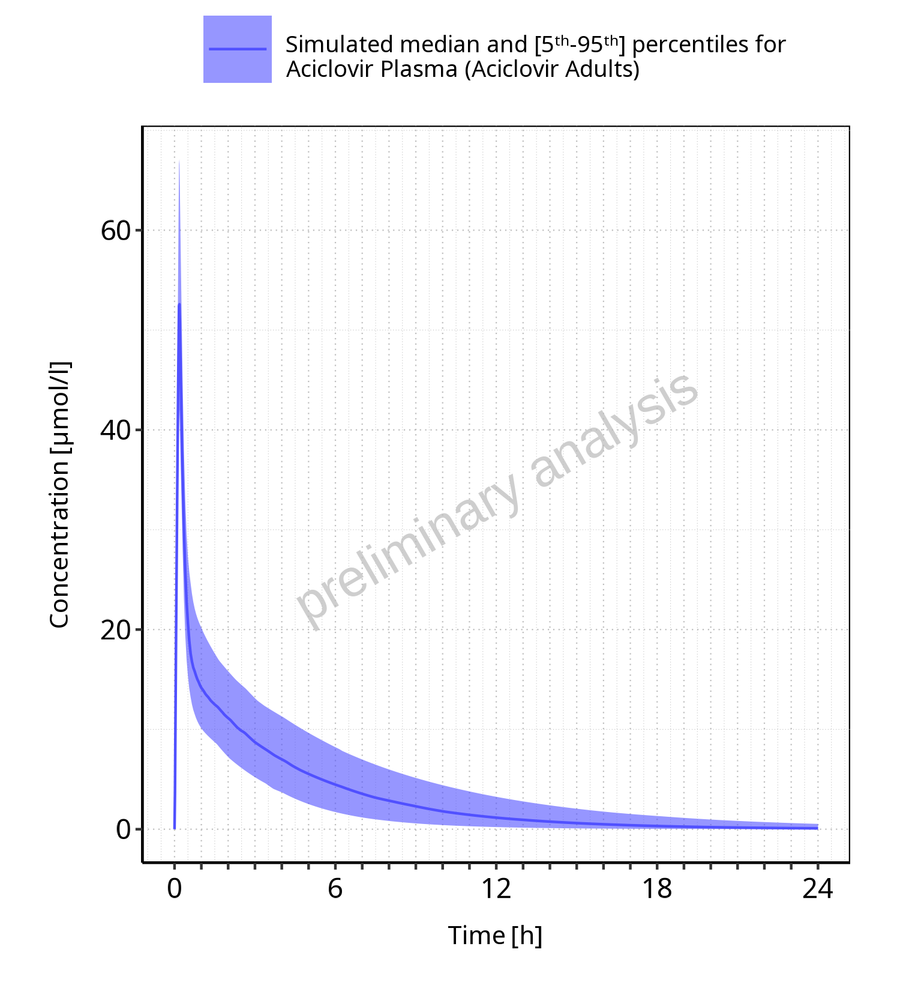

**Figure 3-1: Time profiles for Aciclovir Adults. Time profiles are plotted in a linear scale.**

 
 

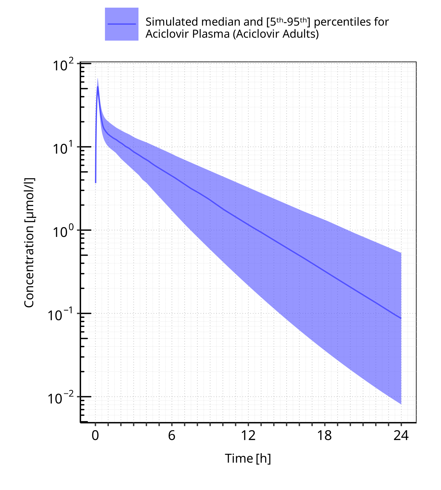

**Figure 3-2: Time profiles for Aciclovir Adults. Time profiles are plotted in a logarithmic scale.**

 
 

## 3.2 Time profiles and residual plots for Aciclovir Children

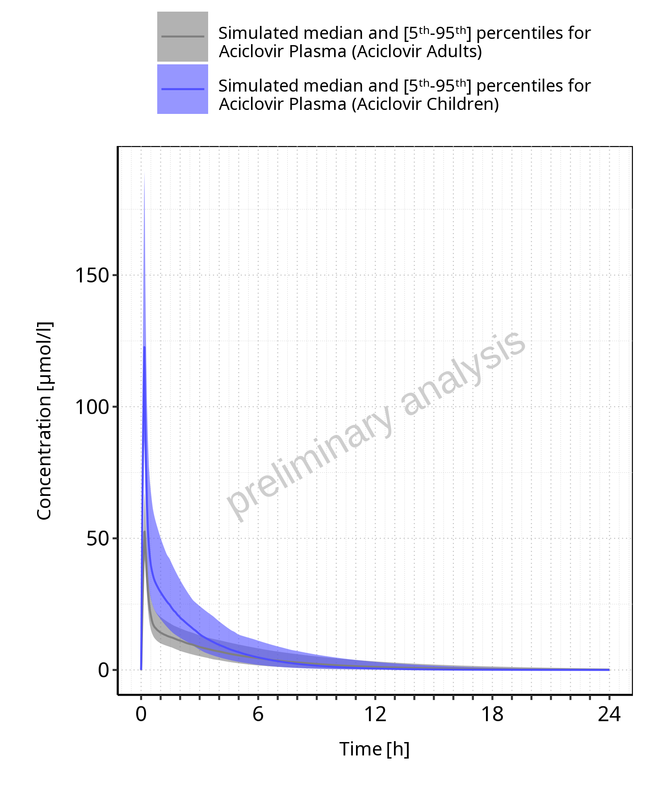

**Figure 3-3: Time profiles for Aciclovir Children. Time profiles are plotted in a linear scale.**

 
 

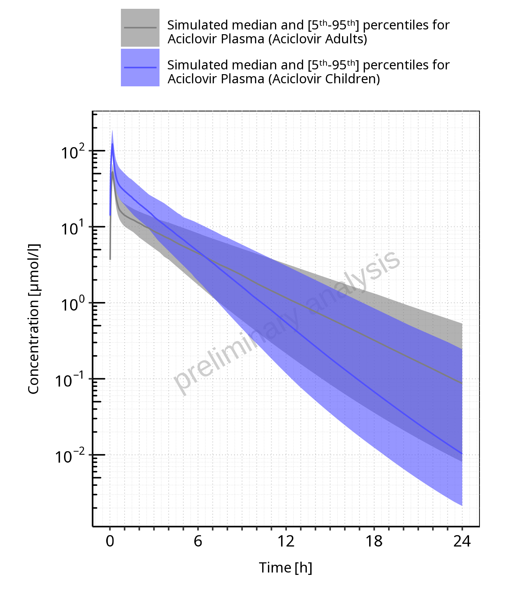

**Figure 3-4: Time profiles for Aciclovir Children. Time profiles are plotted in a logarithmic scale.**

 
 

