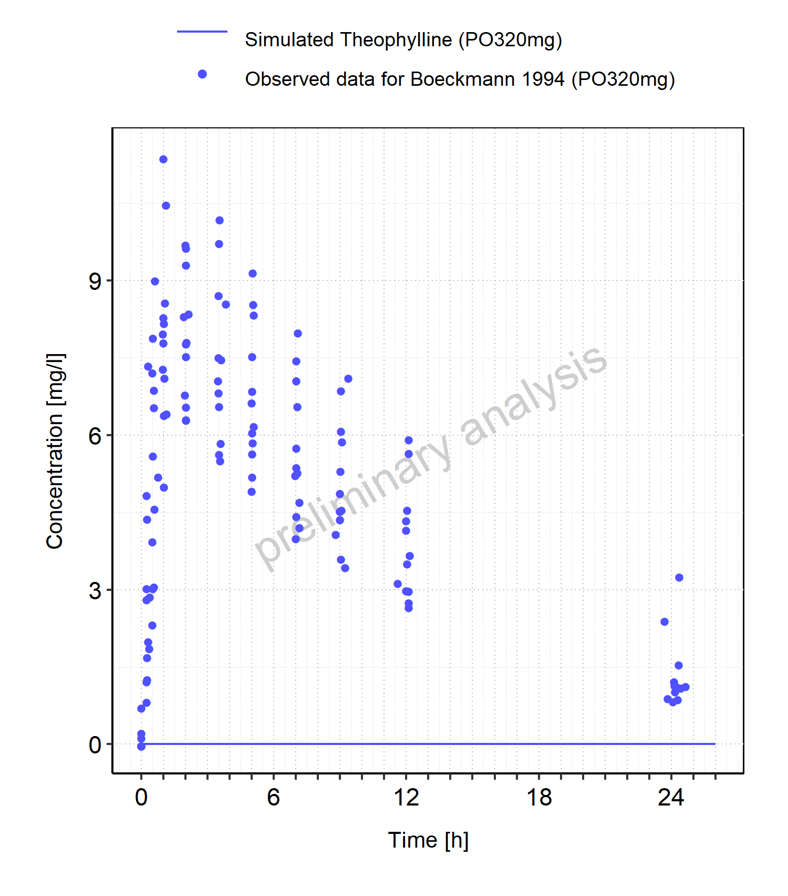
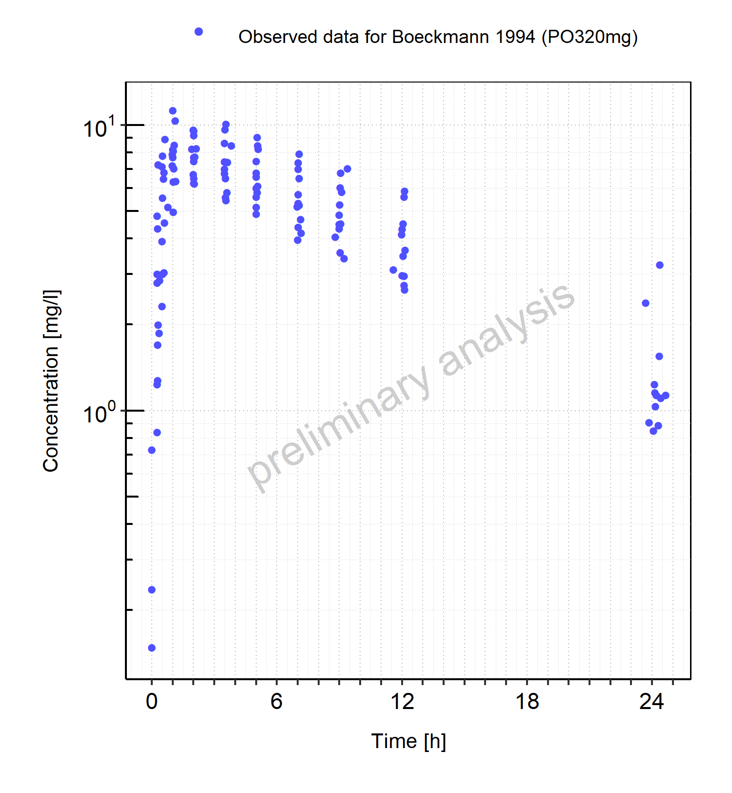

# Report NO7

# Table of Contents

 * [1 PK parameters ](#pk-parameters)
   * [1.1 PK parameters for PO320mg ](#pk-parameters-po320mg)
 * [2 Time profiles and residual plots ](#time-profiles)
   * [2.1 Time profiles and residual plots for PO320mg ](#time-profiles-po320mg)

# 1 PK parameters 

## 1.1 PK parameters for PO320mg 

**Table 1-1: PK parameters for PO320mg**

|Path         |Parameter |Value  |Unit   |
|:------------|:---------|:------|:------|
|Theophylline |C_max     |8.68   |mg/l   |
|Theophylline |t_max     |1.55   |h      |
|Theophylline |C_tEnd    |3.46   |mg/l   |
|Theophylline |AUC_tEnd  |151.57 |mg*h/l |

 
 

# 2 Time profiles and residual plots 

## 2.1 Time profiles and residual plots for PO320mg 

**Figure 2-1: Time profiles for PO320mg. Data source: Boeckmann 1994. Time profiles are plotted in a linear scale.**

 
 

**Figure 2-2: Time profiles for PO320mg. Data source: Boeckmann 1994. Time profiles are plotted in a logarithmic scale.**

 
 

**Figure 2-3: Predicted vs observed for PO320mg. Data source: Boeckmann 1994. Predictions and observations are plotted in a linear scale.**

 
 

**Figure 2-4: Predicted vs observed for PO320mg. Data source: Boeckmann 1994. Predictions and observations are plotted in a logarithmic scale.**

 
 

**Figure 2-5: Logarithmic residuals vs predicted values for PO320mg. Data source: Boeckmann 1994.**

 
 

**Figure 2-6: Logarithmic residuals vs time values for PO320mg. Data source: Boeckmann 1994.**

 
 

**Figure 2-7: Logarithmic residuals distribution (stacked) for PO320mg. Data source: Boeckmann 1994.**

 
 

**Figure 2-8: Logarithmic residuals for PO320mg as quantile-quantile plot. Data source: Boeckmann 1994.**

 
 

