# Report NO9

# Table of Contents

 * [1 PK parameters](#pk-parameters)
   * [1.1 PK Parameters of C1 plasma](#1_pk_parameters_organism_peripheralvenousblood_c1_plasma__peripheral_venous_blood_)
     * [1.1.1 AUC_tEnd](#2_pk_parameters_organism_peripheralvenousblood_c1_plasma__peripheral_venous_blood__auc_tend)
     * [1.1.2 C_max](#5_pk_parameters_organism_peripheralvenousblood_c1_plasma__peripheral_venous_blood__c_max)
     * [1.1.3 C_tEnd](#8_pk_parameters_organism_peripheralvenousblood_c1_plasma__peripheral_venous_blood__c_tend)
     * [1.1.4 t_max](#11_pk_parameters_organism_peripheralvenousblood_c1_plasma__peripheral_venous_blood__t_max)
     * [1.1.5 Total body clearance/F](#14_pk_parameters_organism_peripheralvenousblood_c1_plasma__peripheral_venous_blood__cl)
     * [1.1.6 Vss (plasma)/F](#17_pk_parameters_organism_peripheralvenousblood_c1_plasma__peripheral_venous_blood__vss)
 * [2 Time profiles and residual plots](#time-profiles)
   * [2.1 Time profiles and residual plots for single IV administration](#time-profiles-single_iv_administration)
   * [2.2 Time profiles and residual plots for children_0_3y](#time-profiles-children_0_3y)
   * [2.3 Time profiles and residual plots for children_3_6y](#time-profiles-children_3_6y)
   * [2.4 Time profiles and residual plots for children_6_9y](#time-profiles-children_6_9y)

# 1 PK parameters

## 1.1 PK Parameters of C1 plasma

### 1.1.1 AUC_tEnd

**Figure 1-1: AUC_tEnd of C1 plasma for single IV administration, children_0_3y, children_3_6y, children_6_9y shown as box-whisker plot, which indicates  the 5th, 25th, 50th, 75th, 95th percentiles in logarithmic scale.**

 
 

**Figure 1-2: AUC_tEnd of C1 plasma for single IV administration, children_0_3y, children_3_6y, children_6_9y shown as box-whisker plot, which indicates  the 5th, 25th, 50th, 75th, 95th percentiles in linear scale.**

 
 

**Table 1-1: Population statistics summarizing AUC_tEnd of C1 plasma for single IV administration, children_0_3y, children_3_6y, children_6_9y reported in [µg*h/l]**

|Population               |N  |5th pctl |25th pctl |50th pctl |75th pctl |95th pctl |Mean     |SD      |Geo Mean |Geo SD |
|:------------------------|:--|:-------------------|:--------------------|:--------------------|:--------------------|:--------------------|:--------|:-------|:--------|:------|
|single IV administration |10 |8843.16             |9408.69              |11804.59             |13514.22             |16208.15             |11945.12 |2899.61 |11645.31 |1.27   |
|children_0_3y            |5  |10180.61            |11060.57             |12511.74             |16127.16             |16812.38             |13328.76 |3096.21 |13043.50 |1.26   |
|children_3_6y            |5  |12619.16            |12676.50             |12862.73             |16120.44             |17498.06             |14421.39 |2416.84 |14267.25 |1.18   |
|children_6_9y            |5  |11633.07            |13294.59             |16361.30             |16819.53             |17066.94             |14964.38 |2593.43 |14770.23 |1.20   |

 
 

### 1.1.2 C_max

**Figure 1-3: C_max of C1 plasma for single IV administration, children_0_3y, children_3_6y, children_6_9y shown as box-whisker plot, which indicates  the 5th, 25th, 50th, 75th, 95th percentiles in logarithmic scale.**

 
 

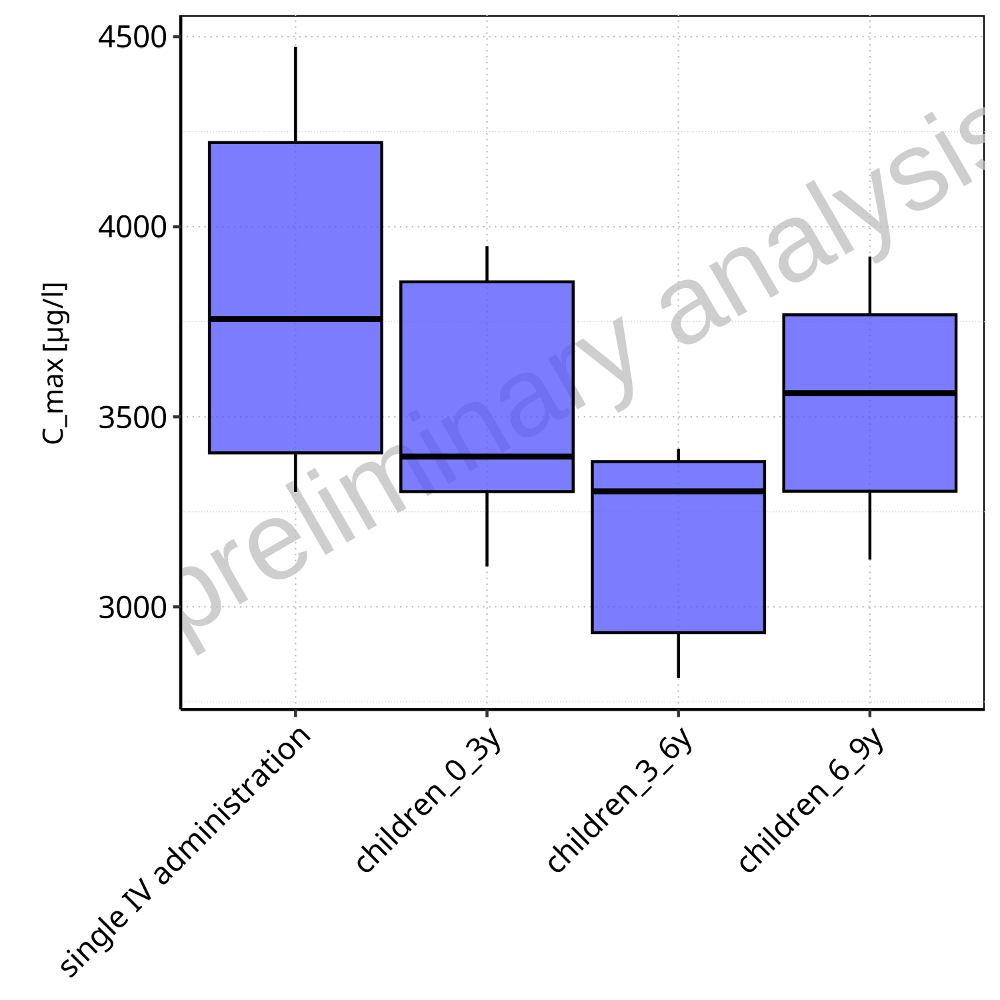

**Figure 1-4: C_max of C1 plasma for single IV administration, children_0_3y, children_3_6y, children_6_9y shown as box-whisker plot, which indicates  the 5th, 25th, 50th, 75th, 95th percentiles in linear scale.**

 
 

**Table 1-2: Population statistics summarizing C_max of C1 plasma for single IV administration, children_0_3y, children_3_6y, children_6_9y reported in [µg/l]**

|Population               |N  |5th pctl |25th pctl |50th pctl |75th pctl |95th pctl |Mean    |SD     |Geo Mean |Geo SD |
|:------------------------|:--|:-------------------|:--------------------|:--------------------|:--------------------|:--------------------|:-------|:------|:--------|:------|
|single IV administration |10 |3302.16             |3405.09              |3757.09              |4221.53              |4473.51              |3821.55 |470.40 |3795.86  |1.13   |
|children_0_3y            |5  |3106.38             |3303.05              |3395.22              |3855.09              |3948.88              |3516.58 |385.24 |3499.75  |1.12   |
|children_3_6y            |5  |2812.86             |2932.02              |3303.99              |3382.07              |3415.62              |3165.03 |288.82 |3154.20  |1.10   |
|children_6_9y            |5  |3124.12             |3304.15              |3562.26              |3768.33              |3921.70              |3534.78 |352.48 |3520.56  |1.11   |

 
 

### 1.1.3 C_tEnd

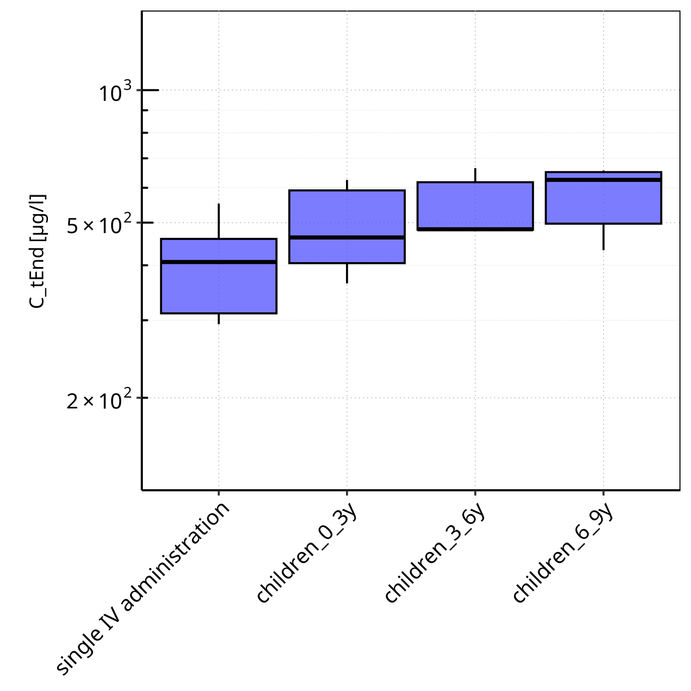

**Figure 1-5: C_tEnd of C1 plasma for single IV administration, children_0_3y, children_3_6y, children_6_9y shown as box-whisker plot, which indicates  the 5th, 25th, 50th, 75th, 95th percentiles in logarithmic scale.**

 
 

**Figure 1-6: C_tEnd of C1 plasma for single IV administration, children_0_3y, children_3_6y, children_6_9y shown as box-whisker plot, which indicates  the 5th, 25th, 50th, 75th, 95th percentiles in linear scale.**

 
 

**Table 1-3: Population statistics summarizing C_tEnd of C1 plasma for single IV administration, children_0_3y, children_3_6y, children_6_9y reported in [µg/l]**

|Population               |N  |5th pctl |25th pctl |50th pctl |75th pctl |95th pctl |Mean   |SD     |Geo Mean |Geo SD |
|:------------------------|:--|:-------------------|:--------------------|:--------------------|:--------------------|:--------------------|:------|:------|:--------|:------|
|single IV administration |10 |293.81              |311.03               |406.87               |459.20               |552.40               |404.54 |102.70 |393.41   |1.28   |
|children_0_3y            |5  |363.81              |404.48               |462.65               |591.82               |624.99               |489.18 |119.95 |477.42   |1.28   |
|children_3_6y            |5  |479.32              |481.84               |482.89               |617.71               |664.82               |547.54 |93.29  |541.48   |1.18   |
|children_6_9y            |5  |432.81              |497.25               |625.43               |651.28               |656.48               |569.69 |107.44 |560.90   |1.22   |

 
 

### 1.1.4 t_max

**Figure 1-7: t_max of C1 plasma for single IV administration, children_0_3y, children_3_6y, children_6_9y shown as box-whisker plot, which indicates  the 5th, 25th, 50th, 75th, 95th percentiles in logarithmic scale.**

 
 

**Figure 1-8: t_max of C1 plasma for single IV administration, children_0_3y, children_3_6y, children_6_9y shown as box-whisker plot, which indicates  the 5th, 25th, 50th, 75th, 95th percentiles in linear scale.**

 
 

**Table 1-4: Population statistics summarizing t_max of C1 plasma for single IV administration, children_0_3y, children_3_6y, children_6_9y reported in [h]**

|Population               |N  |5th pctl |25th pctl |50th pctl |75th pctl |95th pctl |Mean |SD |Geo Mean |Geo SD |
|:------------------------|:--|:-------------------|:--------------------|:--------------------|:--------------------|:--------------------|:----|:--|:--------|:------|
|single IV administration |10 |0.05                |0.05                 |0.05                 |0.05                 |0.05                 |0.05 |0  |0.05     |1      |
|children_0_3y            |5  |0.05                |0.05                 |0.05                 |0.05                 |0.05                 |0.05 |0  |0.05     |1      |
|children_3_6y            |5  |0.05                |0.05                 |0.05                 |0.05                 |0.05                 |0.05 |0  |0.05     |1      |
|children_6_9y            |5  |0.05                |0.05                 |0.05                 |0.05                 |0.05                 |0.05 |0  |0.05     |1      |

 
 

### 1.1.5 Total body clearance/F

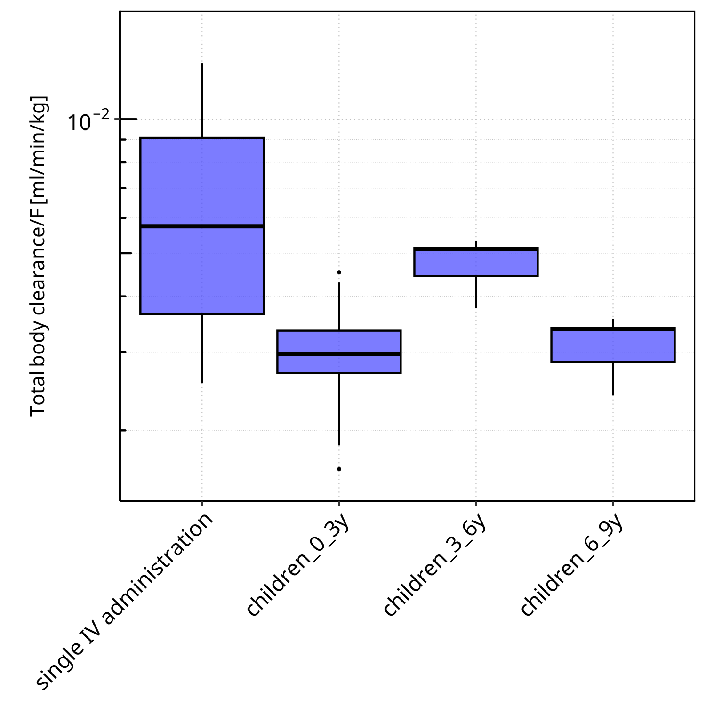

**Figure 1-9: Total body clearance/F of C1 plasma for single IV administration, children_0_3y, children_3_6y, children_6_9y shown as box-whisker plot, which indicates  the 5th, 25th, 50th, 75th, 95th percentiles in logarithmic scale.**

 
 

**Figure 1-10: Total body clearance/F of C1 plasma for single IV administration, children_0_3y, children_3_6y, children_6_9y shown as box-whisker plot, which indicates  the 5th, 25th, 50th, 75th, 95th percentiles in linear scale.**

 
 

**Table 1-5: Population statistics summarizing Total body clearance/F of C1 plasma for single IV administration, children_0_3y, children_3_6y, children_6_9y reported in [ml/min/kg]**

|Population               |N  |5th pctl |25th pctl |50th pctl |75th pctl |95th pctl |Mean |SD   |Geo Mean |Geo SD |
|:------------------------|:--|:-------------------|:--------------------|:--------------------|:--------------------|:--------------------|:----|:----|:--------|:------|
|single IV administration |10 |0.00                |0.00                 |0.01                 |0.01                 |0.01                 |0.01 |0.00 |0.01     |1.87   |
|children_0_3y            |5  |0.00                |0.00                 |0.00                 |0.00                 |0.00                 |0.00 |0.00 |0.00     |1.45   |
|children_3_6y            |5  |0.00                |0.00                 |0.01                 |0.01                 |0.01                 |0.00 |0.00 |0.00     |1.18   |
|children_6_9y            |5  |0.00                |0.00                 |0.00                 |0.00                 |0.00                 |0.00 |0.00 |0.00     |1.20   |

 
 

### 1.1.6 Vss (plasma)/F

**Figure 1-11: Vss (plasma)/F of C1 plasma for single IV administration, children_0_3y, children_3_6y, children_6_9y shown as box-whisker plot, which indicates  the 5th, 25th, 50th, 75th, 95th percentiles in logarithmic scale.**

 
 

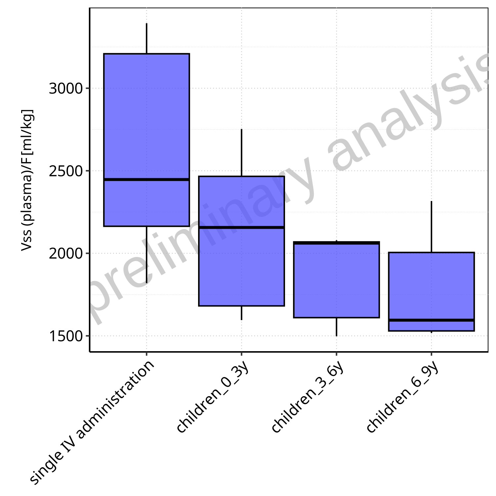

**Figure 1-12: Vss (plasma)/F of C1 plasma for single IV administration, children_0_3y, children_3_6y, children_6_9y shown as box-whisker plot, which indicates  the 5th, 25th, 50th, 75th, 95th percentiles in linear scale.**

 
 

**Table 1-6: Population statistics summarizing Vss (plasma)/F of C1 plasma for single IV administration, children_0_3y, children_3_6y, children_6_9y reported in [ml/kg]**

|Population               |N  |5th pctl |25th pctl |50th pctl |75th pctl |95th pctl |Mean    |SD     |Geo Mean |Geo SD |
|:------------------------|:--|:-------------------|:--------------------|:--------------------|:--------------------|:--------------------|:-------|:------|:--------|:------|
|single IV administration |10 |1819.01             |2163.69              |2446.94              |3208.77              |3393.87              |2596.60 |628.35 |2526.43  |1.28   |
|children_0_3y            |5  |1595.31             |1681.41              |2156.59              |2466.16              |2752.86              |2140.50 |525.87 |2088.68  |1.28   |
|children_3_6y            |5  |1497.40             |1610.20              |2061.71              |2069.03              |2078.95              |1858.31 |295.18 |1838.50  |1.18   |
|children_6_9y            |5  |1517.33             |1529.82              |1595.02              |2005.10              |2316.77              |1807.77 |384.74 |1777.44  |1.22   |

 
 

# 2 Time profiles and residual plots

## 2.1 Time profiles and residual plots for single IV administration

**Figure 2-1: Time profiles for single IV administration. Time profiles are plotted in a linear scale.**

 
 

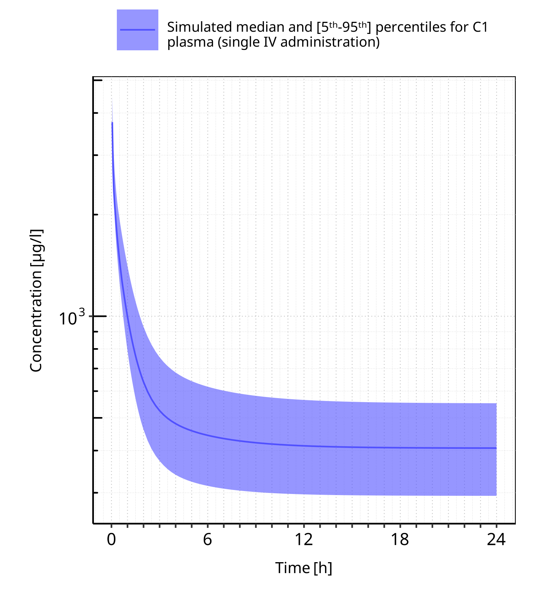

**Figure 2-2: Time profiles for single IV administration. Time profiles are plotted in a logarithmic scale.**

 
 

## 2.2 Time profiles and residual plots for children_0_3y

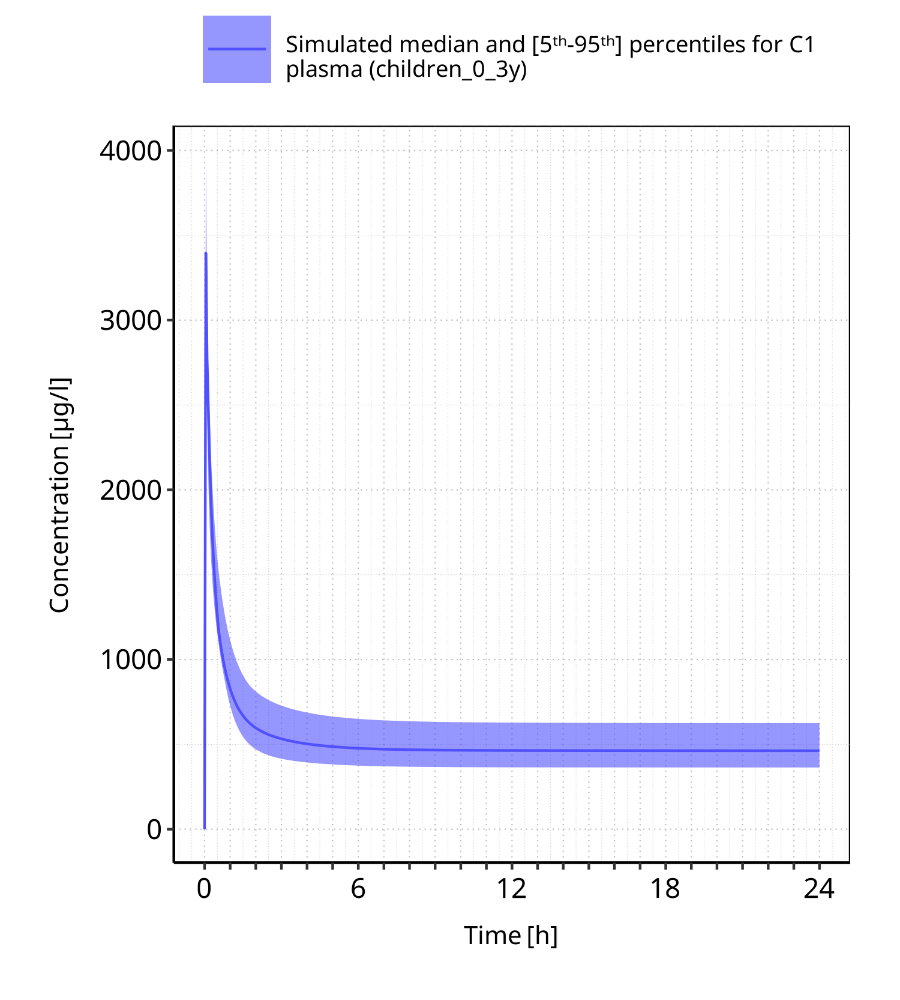

**Figure 2-3: Time profiles for children_0_3y. Time profiles are plotted in a linear scale.**

 
 

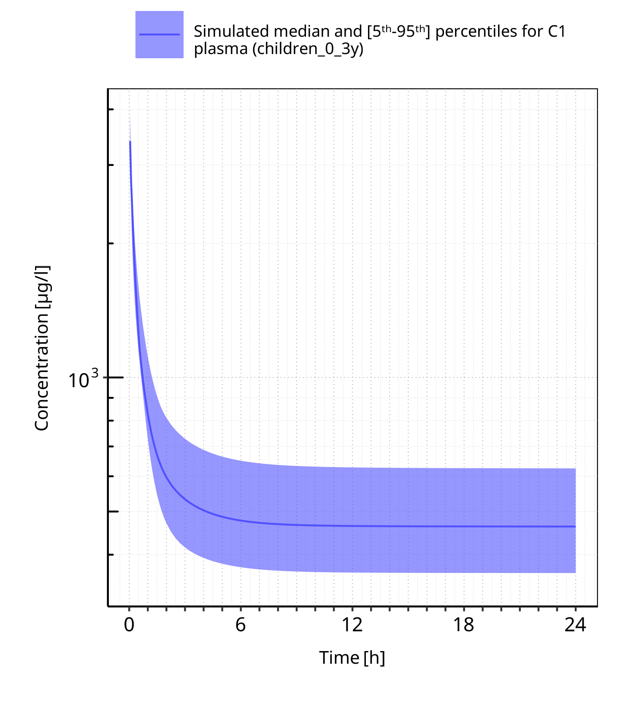

**Figure 2-4: Time profiles for children_0_3y. Time profiles are plotted in a logarithmic scale.**

 
 

## 2.3 Time profiles and residual plots for children_3_6y

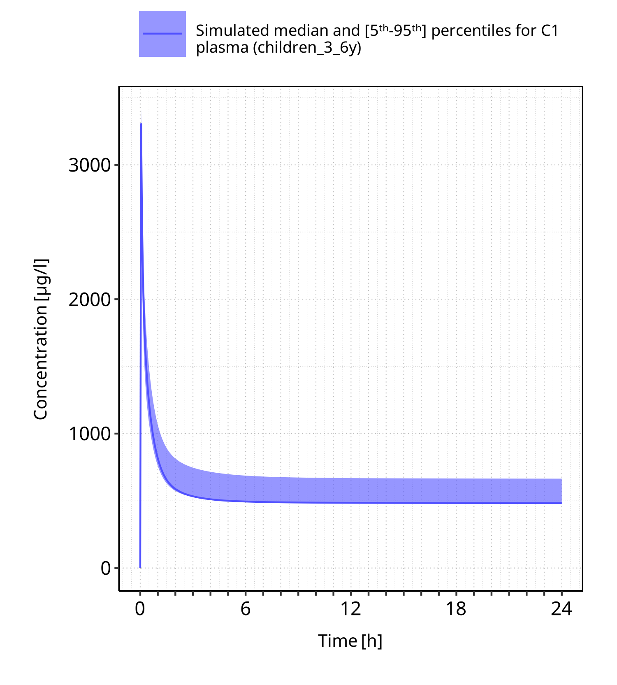

**Figure 2-5: Time profiles for children_3_6y. Time profiles are plotted in a linear scale.**

 
 

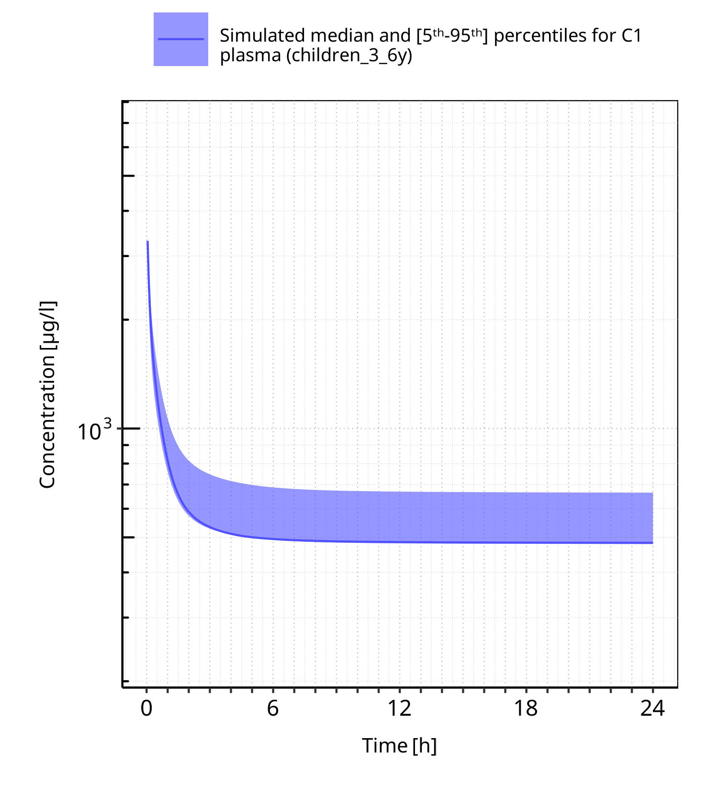

**Figure 2-6: Time profiles for children_3_6y. Time profiles are plotted in a logarithmic scale.**

 
 

## 2.4 Time profiles and residual plots for children_6_9y

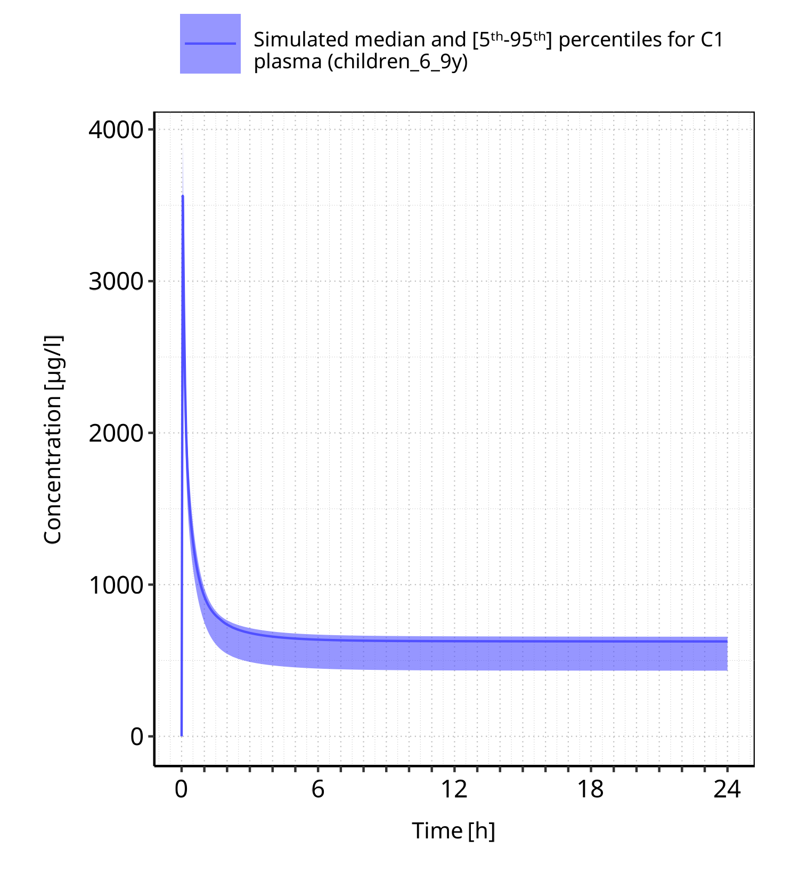

**Figure 2-7: Time profiles for children_6_9y. Time profiles are plotted in a linear scale.**

 
 

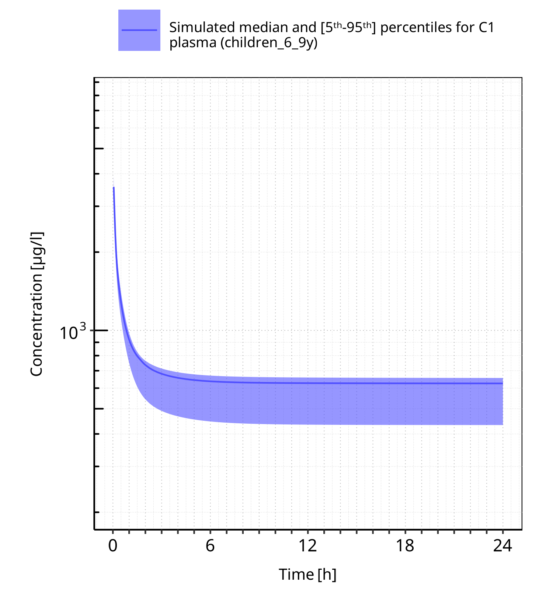

**Figure 2-8: Time profiles for children_6_9y. Time profiles are plotted in a logarithmic scale.**

 
 

