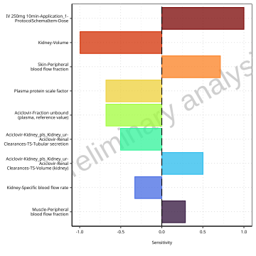
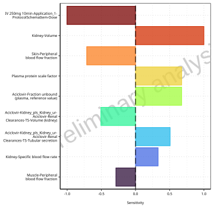
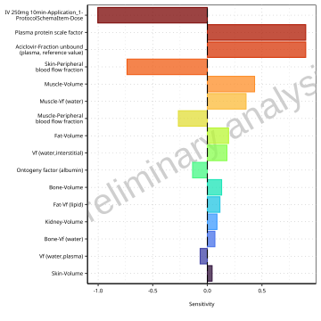
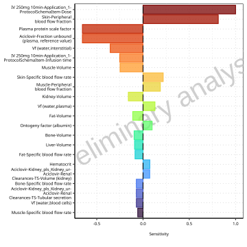
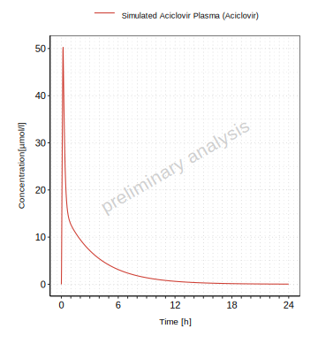

# Aciclovir Mean Model Report

# Table of Contents

 * [1 Sensitivity Analysis](#sensitivity-analysis)
   * [1.1 Sensitivity Analysis for Aciclovir](#sensitivity-analysis-aciclovir)
 * [2 PK parameters](#pk-parameters)
   * [2.1 PK parameters for Aciclovir](#pk-parameters-aciclovir)
 * [3 Time profiles and residual plots](#time-profiles)
   * [3.1 Time profiles and residual plots for Aciclovir](#time-profiles-aciclovir)

# 1 Sensitivity Analysis

## 1.1 Sensitivity Analysis for Aciclovir

**Figure 1-1: Most sensitive parameters for AUC_tEnd of Aciclovir Plasma.**

 
 

**Figure 1-2: Most sensitive parameters for Total body clearance/F of Aciclovir Plasma.**

 
 

**Figure 1-3: Most sensitive parameters for Vss (plasma)/F of Aciclovir Plasma.**

 
 

**Figure 1-4: Most sensitive parameters for C_max of Aciclovir Plasma.**

 
 

# 2 PK parameters

## 2.1 PK parameters for Aciclovir

**Table 2-1: PK parameters for Aciclovir**

|Path             |Parameter              |Value   |Unit       |
|:----------------|:----------------------|:-------|:----------|
|Aciclovir Plasma |AUC_tEnd               |4064.12 |µmol*min/l |
|Aciclovir Plasma |Total body clearance/F |4.02    |ml/min/kg  |
|Aciclovir Plasma |Vss (plasma)/F         |777.83  |ml/kg      |
|Aciclovir Plasma |C_max                  |50.25   |µmol/l     |

 
 

# 3 Time profiles and residual plots

## 3.1 Time profiles and residual plots for Aciclovir

**Figure 3-1: Time profiles for Aciclovir. Time profiles are plotted in a linear scale.**

 
 

**Figure 3-2: Time profiles for Aciclovir. Time profiles are plotted in a logarithmic scale.**

 
 

