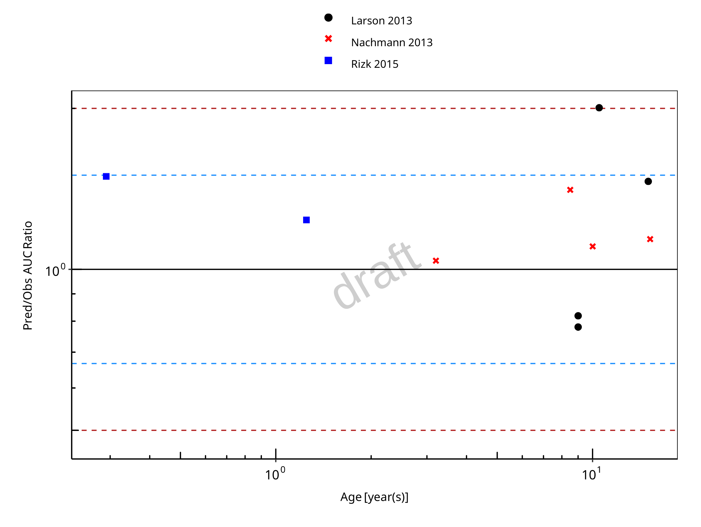

# Pediatric Qualification Package: UGT1A1 Ontogeny

| Version                         | 1.0-OSP11.0                                                   |
| ------------------------------- | ------------------------------------------------------------ |
| Qualification Plan Release      | [https://github.com/Open-Systems-Pharmacology/Pediatric_Qualification_Package_UGT1A1_Ontogeny/releases/tag/v1.0](https://github.com/Open-Systems-Pharmacology/Pediatric_Qualification_Package_UGT1A1_Ontogeny/releases/tag/v1.0) |
| OSP Version                     | 11.0                                                          |
| Qualification Framework Version | 3.0                                                          |

This qualification report is filed at:

[https://github.com/Open-Systems-Pharmacology/OSP-Qualification-Reports](https://github.com/Open-Systems-Pharmacology/OSP-Qualification-Reports)

# Table of Contents

 * [1 Introduction to Pediatric Translation and UGT1A1 Ontogeny Qualification ](#introduction)
 * [2 Pediatric translation qualification ](#results)
   * [2.1 Raltegravir PK Ratio tables and Figures ](#raltegravir_children)
   * [2.2 Raltegravir Concentration-Time profiles in Children ](#timeprofiles)
 * [3 References ](#references)

# 1 Introduction to Pediatric Translation and UGT1A1 Ontogeny Qualification 

The presented qualification report evaluates the predictive performance of the OSP suite to predict uridine 5'-diphospho-glucuronosyltransferase 1A1 (UGT1A1)-mediated drug clearance in children.

Therefore, PBPK models of specific *in vivo* probe substances covering children aged below 6 months up to adolescents were built and evaluated. All models are whole-body PBPK models, allowing for dynamic pediatric translation in organs expressing UGT1A1. The qualification report demonstrates the level of confidence of the OSP suite with regard to reliable PBPK predictions of age-related UGT1A1-mediated drug clearance during model-informed drug development. The presented PBPK models as well as the respective qualification plan and qualification report are provided open-source and transparently documented ([https://github.com/Open-Systems-Pharmacology/Pediatric_Qualification_Package_UGT1A1_Ontogeny](https://github.com/Open-Systems-Pharmacology/Pediatric_Qualification_Package_UGT1A1_Ontogeny)). 

## Translation of Adult PBPK to Children

Using a developed and validated (adult) PBPK model for an *in vivo* probe substance, a pediatric PBPK model can be established for children by translating physiology, clearance processes (as parameterized in the adult model) and age-dependent protein binding including the variability therein.[[Maharaj 2013](#References)] 

The PBPK models are developed with clinical data of healthy adult subjects obtained from the literature, covering available dosing ranges for e.g. intravenous as well as oral administration, to capture both systemic clearance as well as gut-wall metabolic clearance processes. For orally administered drugs, the same formulations that are used in children should ideally be included in the model for adults. Plasma concentrations following multiple dose application, mass balance information and other clinical measurements need to be included for model development, if available. During model translation from adults to children for a specific substance, uncertainties in data-quality caused by impact of disease or the target study population, inaccurate in vitro assay-techniques regarding mass balance, as well as study differences may cause not being able to adequately predict the PK in children for all reported studies. 

Prediction performance of the PBPK model for these probe substances in children are then shown by means of e.g. predicted versus observed area under the plasma concentration (AUC)-ratio plots, of which the results support an adequate prediction of the ontogeny function for the application of PBPK model translation of adult PBPK to children.

For qualification purpose, during the translation of adult PBPK to children the following assumptions and considerations were made: 

- when translating an adult model to children, it was assumed that the metabolism and excretion pathways are qualitatively the same in children and in adults.
- no further changes to input parameters other than those for the physiology and protein binding. All other parameters (e.g. lipophilicity, intestinal permeability, solubility) were kept unchanged.

## Anthropometric and Physiological Information 

The age-dependencies of the relevant anthropometric (height, weight) and physiological parameters (e.g. blood flows, organ volumes, binding protein concentrations, hematocrit, cardiac output) in children was gathered from the literature and has been previously summarized [[Edginton 2006](#References)]. The information was incorporated into PK-Sim® and was used as default values for the simulations in children.

The  applied ontogeny and variability of plasma proteins and active processes that are integrated into PK-Sim® for translation to children are described in the publicly available ‘PK-Sim® Ontogeny Database Version 7.3' [[Ontogeny Database](#References)] or otherwise referenced for the specific process.

### Qualification of **UGT1A1 enzyme ontogeny**

To qualify the OSP suite for the pediatric translation of the pharmacokinetics of drugs that are metabolized by UGT1A1, the following probe substance was included:

- Raltegravir [[Raltegravir-Model](#References)]

# 2 Pediatric translation qualification 

## Evaluation of Pediatric translation

All pediatric translations are pure retrospective predictions, no pediatric pharmacokinetic studies were used to inform model parameters. All parameters necessary to model the pediatric populations, such as demographics (age, weight, height), as well as dosing formulation information were taken from the respective pediatrics studies from literature in order to evaluate their predictive performance. 

The models were evaluated by ratio plots of area under the plasma concentration-time curve (AUC), or clearance (CL) values resulting from our predictions to the values observed during clinical studies, and by comparison of concentration-time profiles if available. As a quantitative measure of the descriptive and predictive performance of each model, the geometric mean fold error was calculated according to Eq. 1:

$$
{\Huge GMFE = 10^{\frac{\sum(|log(\frac{Pred}{Obs})|)}{n}}} \tag{Eq.1}
$$

with `GMFE` = **geometric mean fold error** of all AUC or CL predictions of the respective model, `Pred` PK parameter = **predicted AUC or CL**, `Obs` PK parameter = **observed AUC or CL**, and `n` = **number of observed values**.

The ratios of predicted over observed mean AUC or CL values from all compound were also plotted across all age groups in the figure below. As illustrated, most of the prediction were within the 0.5 to 2.0 range (2-fold error). 

In the next sections the demographics as well as the evaluation results of the predictive performance of the specific compound PBPK models in children can be found.  

## 2.1 Raltegravir PK Ratio tables and Figures 

### Raltegravir model

Raltegravir PBPK predictions in children were evaluated using pharmacokinetic (PK) data reported in the following studies: 

- Larson KB, King JR, Acosta EP. Raltegravir for HIV-1 infected children and adolescents: efficacy, safety, and pharmacokinetics.Adolesc Health Med Ther. 2013 Aug 27;4:79-87. doi: 10.2147/AHMT.S29462. eCollection 2013.[[Larson 2013](#References)]

- Nachman S, Zheng N, Acosta EP, Teppler H, Homony B, Graham B, Fenton T, Xu X, Wenning L, Spector SA, Frenkel LM, Alvero C, Worrell C, Handelsman E, Wiznia A, International Maternal Pediatric Adolescent AIDS Clinical Trials (IMPAACT) P1066 Study Team. Pharmacokinetics, safety, and 48-week efficacy of oral raltegravir in HIV-1-infected children aged 2 through 18 years. Clin Infect Dis. 2014 Feb;58(3):413-22. doi: 10.1093/cid/cit696. Epub 2013 Oct 21.[[Nachman 2013](#References)]

- Rizk ML, Du L, Bennetto-Hood C, Wenning L, Teppler L, Homony B, Graham B, Fry C, Nachman S, Wiznia A, Worrell C, Smith B, Acosta EP. Population pharmacokinetic analysis of raltegravir pediatric formulations in HIV-infected children 4 weeks to 18 years of age. J Clin Pharmacol. 2015 Jul;55(7):748-56. doi: 10.1002/jcph.493. Epub 2015 Apr 13. [[Rizk 2015](#References)]

  

The pediatric PBPK model predicted the clearance values of raltegravir observed in pediatric studies reasonably across all available age groups, ranging from 3.5 month to 15.2 years old. The ratios of mean predicted over observed area under the observed plasma concentrations (AUC) are illustrated in the table below as well as in the predicted versus observed AUC ratio plot, showing that most predictions in children were within 2-fold error of observed values.

**Figure 2-1: Overall predictivity of the raltegravir PBPK model. Open circles represent mean ratios of PBPK predicted AUC over observed AUC of raltegravir in children 3.5 months to 15.2 years old. Blue dashed lines and red dotted lines represent the 1.5-fold and 2-fold error, respectively.**

 
 

**Table 2-1: Measure of Overall predictivity of the raltegravir PBPK model. Open circles represent mean ratios of PBPK predicted AUC over observed AUC of raltegravir in children 3.5 months to 15.2 years old. Blue dashed lines and red dotted lines represent the 1.5-fold and 2-fold error, respectively.**

|                       |Number |Ratio [%] |
|:----------------------|:------|:---------|
|Points total           |10     |-        |
|Points within 1.5 fold |9      |90        |
|Points within 2 fold   |9      |90        |

 
 

**Table 2-2: GMFE for Overall predictivity of the raltegravir PBPK model. Open circles represent mean ratios of PBPK predicted AUC over observed AUC of raltegravir in children 3.5 months to 15.2 years old. Blue dashed lines and red dotted lines represent the 1.5-fold and 2-fold error, respectively.**

|Parameter |GMFE |
|:---------|:----|
|AUC       |1.32 |

 
 

**Table 2-3: Overall predictivity of the raltegravir PBPK model. Open circles represent mean ratios of PBPK predicted AUC over observed AUC of raltegravir in children 3.5 months to 15.2 years old. Blue dashed lines and red dotted lines represent the 1.5-fold and 2-fold error, respectively.**

|Study ID      |Age [year(s)] |Body Weight [kg] |Predicted AUC [µg*h/l] |Observed AUC [µg*h/l] |Pred/Obs AUC Ratio |
|:-------------|:-------------|:----------------|:----------------------|:---------------------|:------------------|
|Rizk 2015     |0.29          |5.50             |14324.87               |9599.39               |1.49               |
|Rizk 2015     |1.25          |8.50             |10883.48               |8799.44               |1.24               |
|Nachmann 2013 |3.20          |14.20            |9848.67                |9500.00               |1.04               |
|Nachmann 2013 |8.50          |36.40            |14770.69               |10500.00              |1.41               |
|Nachmann 2013 |10.00         |31.50            |14775.15               |13400.00              |1.10               |
|Nachmann 2013 |15.20         |56.23            |11605.30               |10200.00              |1.14               |
|Larson 2013   |9.00          |29.40            |6563.90                |7999.49               |0.82               |
|Larson 2013   |9.00          |29.40            |7846.80                |10043.81              |0.78               |
|Larson 2013   |10.50         |34.40            |14113.21               |7021.78               |2.01               |
|Larson 2013   |15.00         |56.00            |10213.41               |6977.34               |1.46               |

 
 

## 2.2 Raltegravir Concentration-Time profiles in Children 

#### Concentration-Time Profiles

Predicted versus observed plasma concentration-time profiles are listed below. Only simulations where observed data was available for comparison are shown.  Depending if the observed data were individual data or aggregated data, individual predictions or population predictions including variability are shown, respectively.

**Figure 2-2: Time Profile Analysis**

 
 

**Figure 2-3: Time Profile Analysis 1**

 
 

# 3 References 

**Edginton 2006** Edginton AN, Schmitt W, Willmann S. Development and evaluation of a generic physiologically based pharmacokinetic model for children. Clin Pharmacokinet. 2006;45(10):1013-34.

**Larson 2013** Larson KB, King JR, Acosta EP. Raltegravir for HIV-1 infected children and adolescents: efficacy, safety, and pharmacokinetics.Adolesc Health Med Ther. 2013 Aug 27;4:79-87. doi: 10.2147/AHMT.S29462. eCollection 2013.

**Maharaj 2013** Maharaj AR, Barrett JS, Edginton AN. A workflow example of PBPK modeling to support pediatric research and development: case study with lorazepam. The AAPS journal. 2013;15(2): 455-464.

**Nachman 2013** Nachman S, Zheng N, Acosta EP, Teppler H, Homony B, Graham B, Fenton T, Xu X, Wenning L, Spector SA, Frenkel LM, Alvero C, Worrell C, Handelsman E, Wiznia A, International Maternal Pediatric Adolescent AIDS Clinical Trials (IMPAACT) P1066 Study Team. Pharmacokinetics, safety, and 48-week efficacy of oral raltegravir in HIV-1-infected children aged 2 through 18 years. Clin Infect Dis. 2014 Feb;58(3):413-22. doi: 10.1093/cid/cit696. Epub 2013 Oct 21.

**Ontogeny Database** OSPSuite.Documentation/PK-Sim Ontogeny Database Version 7.3.pdf ([https://github.com/Open-Systems-Pharmacology/OSPSuite.Documentation/blob/38cf71b384cfc25cfa0ce4d2f3addfd32757e13b/PK-Sim%20Ontogeny%20Database%20Version%207.3.pdf](https://github.com/Open-Systems-Pharmacology/OSPSuite.Documentation/blob/38cf71b384cfc25cfa0ce4d2f3addfd32757e13b/PK-Sim%20Ontogeny%20Database%20Version%207.3.pdf))

**Raltegravir-Model** Raltegravir-Model, Whole-body PBPK model of Raltegravir. ([https://github.com/Open-Systems-Pharmacology/Raltegravir-Model](https://github.com/Open-Systems-Pharmacology/Raltegravir-Model))

**Rizk 2015** Rizk ML, Du L, Bennetto-Hood C, Wenning L, Teppler L, Homony B, Graham B, Fry C, Nachman S, Wiznia A, Worrell C, Smith B, Acosta EP. Population pharmacokinetic analysis of raltegravir pediatric formulations in HIV-infected children 4 weeks to 18 years of age. J Clin Pharmacol. 2015 Jul;55(7):748-56. doi: 10.1002/jcph.493. Epub 2015 Apr 13.

