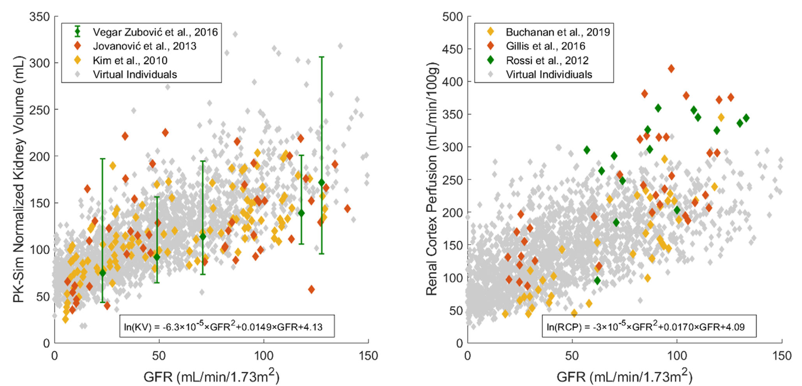
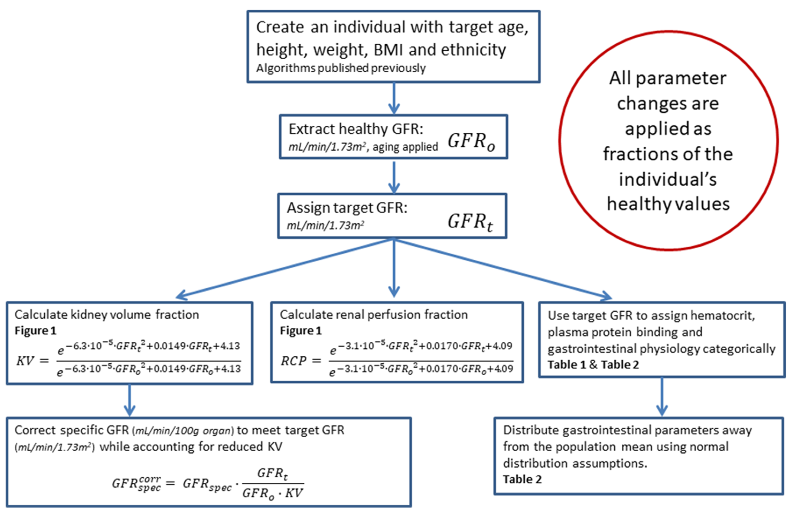

In order to generate a virtual population of subjects with CKD, the user must specify a target range for glomerular filtration rate (GFR) (minimum to maximum). PK-Sim will first generate a healthy population using the standard algorithm2 - including the effects of aging as appropriate - and modify the physiological parameters of the simulated individuals to replicate a realistic CKD phenotype. The details of this process are outlined in **Figure 2-2**, with references to **Figure 2-1**, **Table 2-1** and **Table 2-2**. For a complete description, see Malik et al.1

||
|:-:|
|       *Figure 2-1: Simulated kidney volumes (left) and simulated renal cortex perfusion rates (right) in a population of adults aged 30-70 years with varying degrees of renal impairment compared with observed data from the literature.3-8 Diamonds represent individual data, whereas error bars represent the range in a study. In order to assign realistic physiological parameters to virtual individuals, quadratic equations for kidney volume and renal cortex perfusion rates were optimized to log-transformed data.*         |

||
|:-:|
|       *Figure 2-2: Algorithm for generation of virtual individuals with CKD while accounting for the effects of aging*         |

**Table 2-1. Hematocrit in Patients With Chronic Kidney Disease9, 10, 11**

| **Creatinine Clearance (mL/min/1.73 m2)**    | **Men HCT (%)**  | **Women HCT (%)** |
|---------------------------------------------------------|------------------|-------------------|
| Healthy                                                 | 45.5             | 40                |
| 60<CrCl≤70                                              | 45.2             | 39.9              |
| 50<CrCl≤60                                              | 44.8             | 39.6              |
| 40<CrCl≤50                                              | 43.3             | 39.7              |
| 30<CrCl≤40                                              | 42.6             | 38.4              |
| 20<CrCl≤30                                              | 41.7             | 37.4              |
| CrCl≤20                                                 | 34.3             | 33.5              |
| Hemodialysis                                            | 31               | 29                |

**Table 2-2. Fraction of Healthy Values (Normal Coefficient of Variation % ) in Chronic Kidney Disease Patients by Stage**

|Parameter                     |    Stage 3 (30-60 mL/min/1.73 m2)   |    Stage 4 (15-30 mL/min/1.73 m2)  |    Stage 5 (<15 mL/min/1.73 m2)   |   Dialysis   |
| :--------------------------- | :-------------------: | :---------------------: | :--------------------------: | :-------------------------: |
|Fraction unbound in plasma    |   1.0712   |    1.1612    |       1.5512      |      1.5512     |
|Gastric emptying time         |          1.0          |  1.6 (25%)14 |   1.6 (25%)13,14  |  1.6 (30%)15-18 |
|Small intestinal transit time |          1.0          |  1.4 (25%)14 |    1.4 (25%)14    |   1.8 (30%)19   |
|Colonic transit time          |          1.0          |           1.0           |             1.0              |   1.8 (50%)20   |
