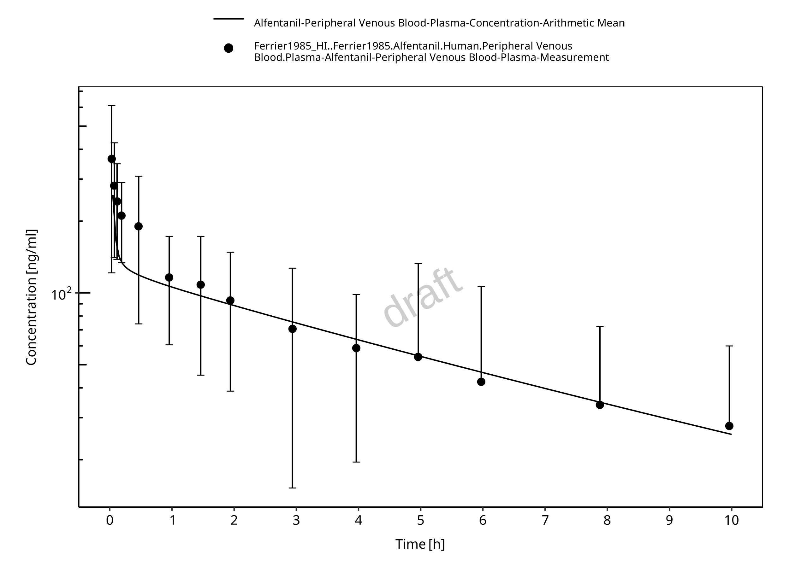
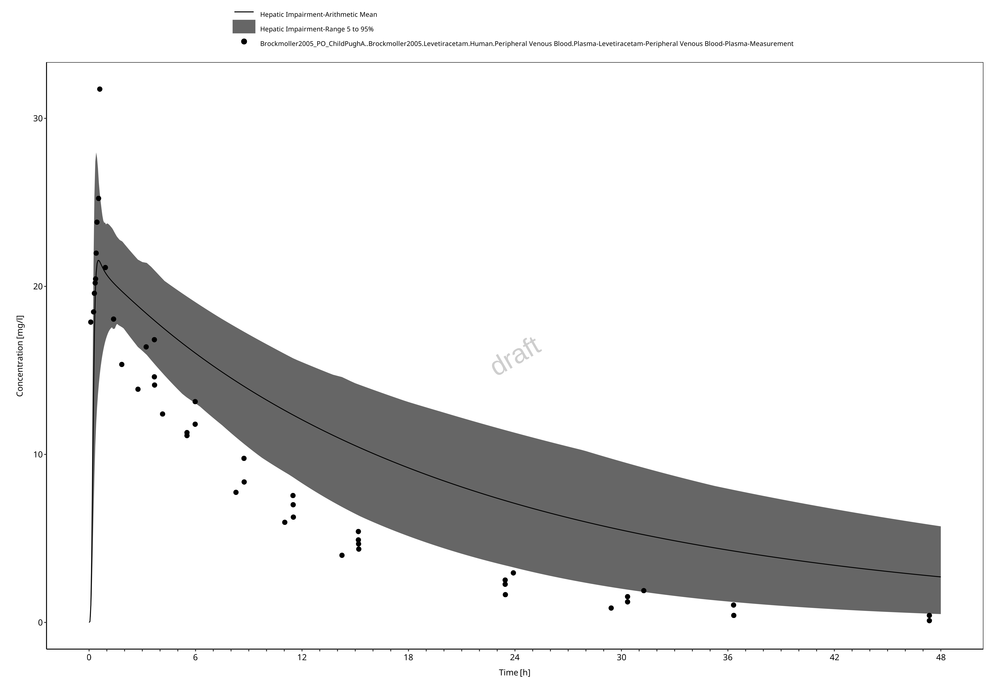
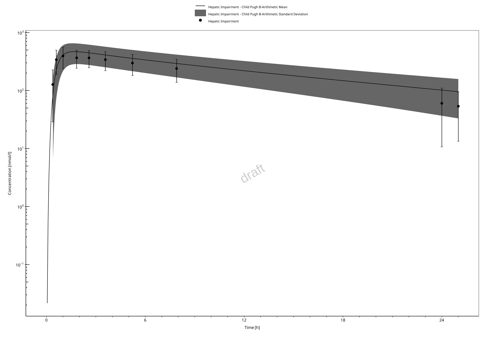
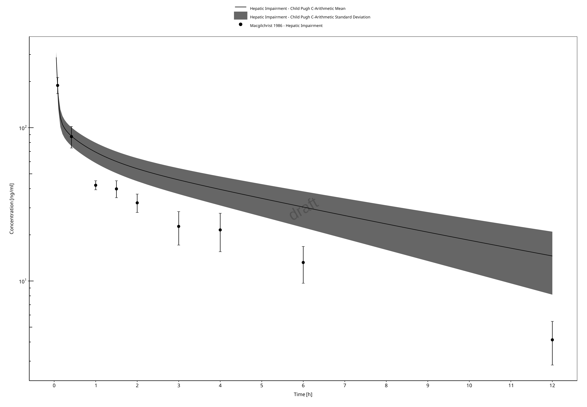
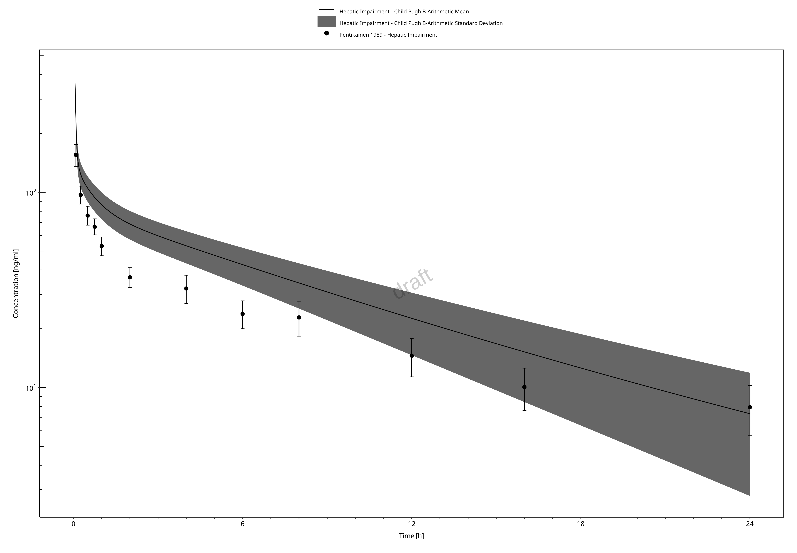
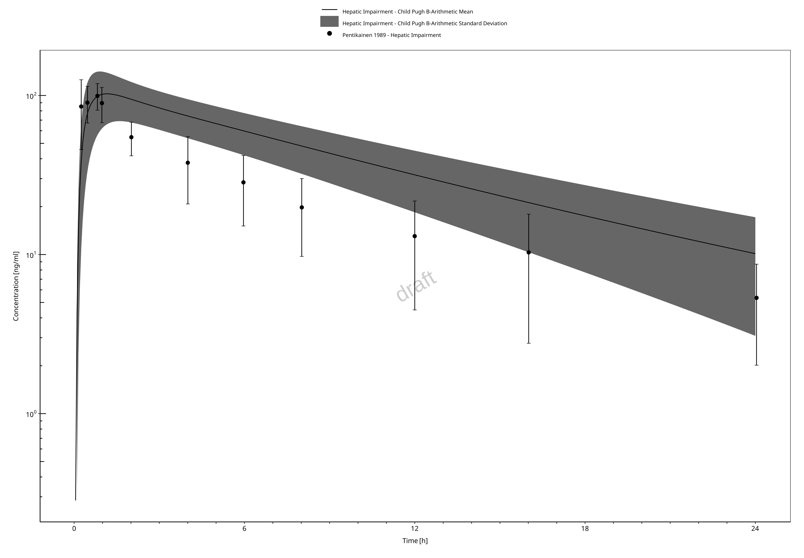
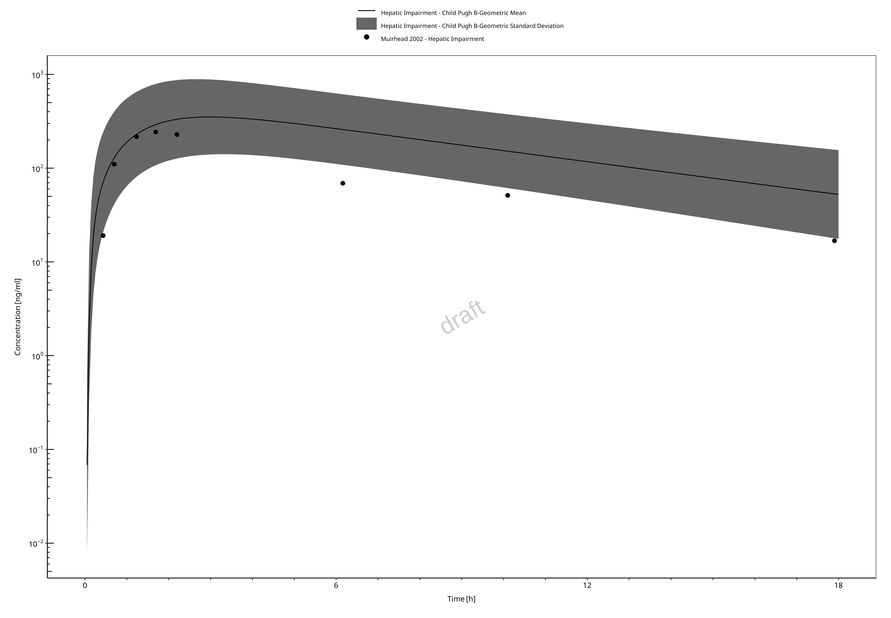

# Qualification of HI Populations

| Version                                         | 1.0-OSP12.3                                                   |
| ----------------------------------------------- | ------------------------------------------------------------ |
| OSP Version                                     | 12.3                                                          |
| Qualification Framework Version                 | 3.2                                                          |

This qualification report and the corresponding PK-Sim project file are filed at:

https://github.com/Open-Systems-Pharmacology/Qualification-HI

# Table of Contents

 * [1 Introduction](#undefined-section-1)
 * [2 HI Population Development](#undefined-section-2)
 * [3 Compounds](#undefined-section-3)
   * [3.1 Alfentanil](#undefined-section-4)
     * [3.1.1 Alfentanil in a Healthy Population - IV](#alfentanil_healthy)
     * [3.1.2 Alfentanil in a HI Population - IV](#alfentanil_hi)
   * [3.2 Levetiracetam](#undefined-section-7)
     * [3.2.1 Levetiracetam in a Healthy Population - Oral](#levetiracetam_healthy)
     * [3.2.2 Levetiracetam in a HI Population - Oral](#levetiracetam_hi)
   * [3.3 Metoprolol](#undefined-section-10)
     * [3.3.1 Metoprolol in a Healthy Population](#metoprolol_healthy)
     * [3.3.2 Metoprolol in a HI Population](#metoprolol_hi)
   * [3.4 Midazolam](#undefined-section-13)
     * [3.4.1 Midazolam in a Healthy Population – IV/PO](#midazolam_healthy)
     * [3.4.2 Midazolam in a HI Population](#midazolam_hi)
   * [3.5 Sildenafil](#undefined-section-16)
     * [3.5.1 Sildenafil in a Healthy Population - PO](#sildenafil_healthy)
     * [3.5.2 Sildenafil in a HI Population - PO](#sildenafil_hi)
   * [3.6 Theophylline](#undefined-section-19)
     * [3.6.1 Theophylline in a Healthy Population - IV](#theophylline_healthy)
     * [3.6.2 Theophylline in a HI Population - IV](#theophylline_hi)
   * [3.7 Lidocaine](#undefined-section-22)
     * [3.7.1 Lidocaine in a Healthy Population - IV](#lidocaine_healthy)
     * [3.7.2 Lidocaine in a HI Population - IV](#lidocaine_hi)
 * [4 References](#undefined-section-25)

# 1 Introduction<a id="undefined-section-1"></a>

The presented qualification report performs simulations of drug disposition and pharmacokinetics in subjects with hepatic impairment (HI) to qualify the parameterization of the foundational anatomy and physiology parameters for virtual populations with HI in the Open Systems Pharmacology (OSP) Suite.

The liver is an important biotransformation site that serves key roles in the metabolism and clearance of drugs and toxins. HI is defined by a loss of functional hepatocytes which leads to connective tissue and nodule formation in the liver. The resulting pathophysiology of hepatic impairment is multifactorial; however, several outcomes are apparent. Hepatic impairment is often associated with shunting of blood around the cirrhotic liver which can lead to encephalopathy, decreased drug protein binding, hyperbilirubinemia, and the development of ascites and varices. To describe the disease progression (severity) and estimated prognosis with these factors in consideration, the Child-Pugh score was developed. The Child-Pugh score is designated as A (Mild: 5-6), B (Moderate: 7-9), or C (Severe: ≥10). It is calculated from summing the scores derived from the table shown below.

**Table 1. Child-Pugh scoring determined by factors affected by HI** <a id="table_1">

| **Factor**             | **1**    | **2**    | **3**    |
|------------------------|----------|----------|----------|
| Bilirubin (M)          | <34      | 34-51    | >51      | 
| Albumin (g/dL)         | >3.5     | 3-3.5    | <3       |
| Prothrombin time (INR) | <1.7     | 1.7-2.3  | >2.3     |
| Ascites                | None     | Slight   | Moderate |
| Encephalopathy         | None     | Minimal  | Advanced |

Quantitative anatomical and physiological changes observed in hepatically impaired individuals have an impact on drug pharmacokinetics. These modifications include changes in blood flows (decreased portal and renal blood flow, and increased hepatic arterial blood flow), cardiac output (increased), plasma binding protein concentrations (decreased), hematocrit (decreased), hepatic intrinsic clearance, and renal intrinsic clearance. With respect to hepatic intrinsic clearance, several enzymes, CYP3A4, CYP1A2, and CYP2E1 are known to be affected in the disease process.

This report builds upon the work by Edginton and Willmann (1) and Johnson, Boussery (2) to qualify the parameterization of a HI population implemented in PK-Sim. Section 2 describes the generation of HI populations. Section 3 evaluates the predicted effects of HI on the pharmacokinetics of eight compounds: alfentanil, levetiractam, metoprolol, midazolam, omeprazole, sildenafil, theophylline and lidocaine. Evaluation for each compound is split into two steps: an initial model calibration against a healthy population, followed by an extension to populations of subjects with relevant severities of HI.

# 2 HI Population Development<a id="undefined-section-2"></a>

HI population development followed the physiological scaling methods by Edginton and Willmann (1) and Johnson, Boussery (2) and the set of modified parameters are presented in [Table 2](#table_2). The values for each Child-Pugh score and parameter are considered "disease factors", which are multiplied by a healthy adult to produce the HI state.

**Table 2. HI disease factors for each HI parameter across Child-Pugh scores**<a id="table_2">

| **Parameter**                                 | **Child-Pugh A** | **Child-Pugh B** | **Child-Pugh C** |
|-----------------------------------------------|------------------|------------------|------------------|
| Blood flow: Portal                            | 0.4              | 0.36             | 0.04             |
| Blood flow: Hepatic arterial                  | 1.3              | 2.3              | 3.4              |
| Blood flow: Renal                             | 0.88             | 0.65             | 0.48             |
| Blood flow: Other organs*                     | 1.75             | 2.25             | 2.75             |
| Cardiac Index                                 | 1.11             | 1.27             | 1.36             |
| Plasma binding protein: Albumin               | 0.81             | 0.68             | 0.5              |
| Plasma binding protein: α1-acid-glycoprotein  | 0.6              | 0.56             | 0.3              |
| Hematocrit                                    | 0.92             | 0.88             | 0.83             |
| Hepatic intrinsic CL: CYP3A4                  | 1                | 0.4              | 0.4              |
| Hepatic intrinsic CL: CYP1A2                  | 1                | 0.1              | 0.1              |
| Hepatic intrinsic CL: CYP2E1                  | 1                | 0.83             | 0.83             |
| Hepatic intrinsic CL: CYP2A6                  | 0.89             | 0.62             | 0.32             |
| Hepatic intrinsic CL: CYP2B6                  | 1                | 0.9              | 0.8              |
| Hepatic intrinsic CL: CYP2C8                  | 0.69             | 0.52             | 0.32             |
| Hepatic intrinsic CL: CYP2C9                  | 0.69             | 0.51             | 0.33             |
| Hepatic intrinsic CL: CYP2C18                 | 0.32             | 0.26             | 0.12             |
| Hepatic intrinsic CL: CYP2C19                 | 0.32             | 0.26             | 0.12             |
| Hepatic intrinsic CL: CYP2D6                  | 0.76             | 0.33             | 0.11             |
| Glomerular filtration rate (GFR)              | 1                | 0.7              | 0.36             |

*Values from Edginton and Willmann (1); however, this evaluation report uses the method presented in [https://github.com/Open-Systems-Pharmacology/Forum/discussions/1341](https://github.com/Open-Systems-Pharmacology/Forum/discussions/1341), and thus the "other organs" blood flow varies slightly across individuals.

## Blood flow scaling

Portal, hepatic arterial, and renal blood flows were scaled according to the scaling factor reported for each Child-Pugh severity ([Table 2](#table_2)). All three blood flow processes were adjusted in PK-Sim by defining Individual > Anatomy & Physiology > Physiology > Flow Rates > Blood flow rates. For portal blood flow, the Portal Vein specific blood flow rate times the disease factor. Hepatic arterial blood flow was adjusted from applying the functional liver mass disease factor (Anatomy > Organ Volumes > Liver) and adjusting the specific blood flow rate of the liver to attain the result of applying the hepatic arterial disease factor to liver blood flow rate. To account for the increase in hepatic arterial blood flow, scaling factors were applied to reach the absolute blood flow values (L/min) for a typical male as done by Johnson, Boussery (2). 

Renal blood flow was adjusted via application of the disease factor to kidney specific blood flow rate. The blood flow of other organs was adjusted based on the cardiac index, defined as cardiac output divided by body surface area, reported in Table 2. The methods reported in [https://github.com/Open-Systems-Pharmacology/Forum/discussions/1341](https://github.com/Open-Systems-Pharmacology/Forum/discussions/1341) were applied with the following equation:

```
Disease Factorcardiac index = (Qother x Disease Factorother + Qrest x Disease Factorrest + Qbrain)/ (Qother + Qrest + Qbrain)
```

## Plasma binding proteins and hematocrit scaling

The fraction unbound in the HI state was determined using methods by Edginton and Willmann (1). The albumin/plasma or α1-acid glycoprotein/plasma partition coefficient of the compound was defined as K_protein. First, K_protein was determined for healthy individuals by rearranging: fu_healthy = 1 / [(1-f_protein_healthy) + (f_protein_healthy)*K_protein]. Where, fu_healthy represents the fraction of unbound drug in a healthy individual, and f_protein_healthy represents the volume fraction of plasma binding protein in healthy (albumin 0.022 and α1-acid glycoprotein 0.0004). Next, fu_diseased was calculated from the equation with the calculated K_protein and f_protein_diseased values presented in [Table 2](#table_2). To incorporate the changes in protein binding within the hepatic impairment populations, the ontogeny factors were adjusted for each respective protein as per [Table 2](#table_2).

Hematocrit values from Individual > Anatomy & Physiology > Physiology > Tissue and body fluid physiology > Hematocrit, were adjusted with the following scaling factors: 0.866, 0.822 and 0.778 for Child-Pugh A, B, and C, respectively ([Table 2](#table_2)). 

## Hepatic intrinsic clearance scaling

Reduction in an enzyme’s specific clearance was attributed to decreased fraction of functional liver volume and fraction of enzyme-specific activity per unit of protein in livers. With the former already adjusted in liver organ size, the latter was accounted for by multiplying the disease factor ([Table 2](#table_2)) by the enzyme reference concentration. This report expands on the work by Edginton and Willmann (1) through incorporating additional enzymes accounted for by Johnson, Boussery (2).

## Renal intrinsic clearance scaling

The disease factor ([Table 2](#table_2) was applied to Glomerular filtration within the individual building block (Individual > Physiology> GFR (Specific). 

# 3 Compounds<a id="undefined-section-3"></a>

The method to generate virtual populations with HI was qualified by testing its predictive performance when used in combination with PBPK models for healthy subjects in order to predict the pharmacokinetics of drugs in patients with HI from literature.

The method was evaluated using eight compounds and considers subjects with HI with a range of Child-Pugh score severities and modes of administration (all severities: caffeine PO, levetiracetam PO, omeprazole IV and PO; A and B only: sildenafil PO; and B and C only: alfentanil IV, metoprolol IV and PO, midazolam IV and PO, and theophylline IV; A and C only: lidocaine IV). IV and PO administrations were developed and evaluated only if their respective plasma concentration-time profiles in the HI population were published in the literature. The objective was to determine success of the population generation method by comparing the predicted pharmacokinetics in HI to clinical pharmacokinetic data from literature.

Each subsection that follows will contain an introduction to the test compound, a description of the healthy PBPK model development, and the subsequent translation to a population with HI.

## 3.1 Alfentanil<a id="undefined-section-4"></a>

Alfentanil is a potent, synthetic opioid used to provide analgesia for various surgical procedures and in patients admitted within intensive care units. Alfentanil is typically administered intravenously and offers several advantages to alternative analgesics due to its potency at the opioid receptor and quick onset of effect (3).

In this section, the general ADME ([Table 3](#table_3)), the healthy PBPK model source, and translation to a population with HI for alfentanil are described.

**Table 3. General ADME of alfentanil (4, 5)** <a id="table_3">

| BCS classification | N/A |
| -- | -- | 
| Linear kinetics    | Potentially exhibiting non-linear kinetics at very high doses (6) |
| Plasma half-life   | IV: 1.59 hours (6) |
| fe,unchanged       | Urine: <1% (7) |
| Bioavailability    | N/A |
| Distribution       | Average volume of distribution in patients receiving analgesia with alfentanil is 0.75 L/h/kg (5). Highly protein bound (90%). IV: 27.2 L (6). |
| Metabolism         | Metabolized exclusively by CYP3A4 (8) |
| Clearance          | Not a substrate for P-gp (9). IV: 14.3 L/h (6). |

The alfentanil healthy PBPK model was based on the development by Hanke, Frechen (5) with an application of CYP3A4 metabolism and glomerular filtration. The model developed in healthy adults serves as the foundation when applying physiological changes endured with hepatic impairment to simulate the pharmacokinetics of alfentanil across the disease spectrum. 

### 3.1.1 Alfentanil in a Healthy Population - IV<a id="alfentanil_healthy"></a>

Alfentanil physicochemical properties and ADME parameters were incorporated from the model developed by Hanke et al. [5] [Table 4](#table_4) presents the drug specific parameters of alfentanil and the values used within the healthy adult intravenous model.

The healthy PBPK model development was based on eight single dose IV PK studies described in the alfentanil report (4). These doses consisted of 0.015 mg/kg, 0.02 mg/kg, 0.05 mg/kg, and 1 mg.    

**Table 4. Physicochemical properties and ADME of alfentanil for the final IV model** <a id="table_4">

| **Physicochemical properties**    |                                      |
|--|--|
| Octanol:water coefficient (logP)           | 1.85 Log Units |
| Fraction unbound in plasma (f<sub>u</sub>) | 0.1 |
| Molecular weight (MW)                      | 416.42 g/mol |
| pKa                                        | 6.5 |
| Water solubility                           | 992 mg/mL |
| **ADME**                                   |                             |
| Partition coefficient                      | Rodgers and Rowland |
| Cell permeability                          | PK-Sim Standard |
| CYP3A4 concentration                       | 4.32 µM |
| CYP3A4 specific clearance                  | 0.34 1/min |
| GFR fraction                               | 0.06 |

### 3.1.2 Alfentanil in a HI Population - IV<a id="alfentanil_hi"></a>

Levetiracetam is an antiepileptic used for the treatment of patients with partial seizures, with or without secondary generalization (11, 12). The mechanism of antiseizure activity has not been fully elucidated, however animal models have shown that levetiracetam binds to synaptic vesicle proteins SV2A modulating neurotransmitter release (13). 

In this section, the general ADME (Table 6.), the healthy PBPK model source, and translation to a population with HI for levetiracetam are described.

[Table 5](#table_5).

**Table 5. HI population demographics for alfentanil IV administration** <a id="table_5">

| **Study** | **Dose and administration** | **Cohort (sample size)** | **Age (years)** | **Weight (kg)** |
|--|--|--|--|--|
| Ferrier, Marty (10) | 0.05 mg/kg IV bolus	| HI population: European with estimated Child-Pugh B and C based on reported information (plasma albumin concentrations and total bilirubin)   (45% female, n = 11) | 	56 [39-69]	| 60 [43-73] | 
|Ferrier, Marty (10) | 0.05 mg/kg IV bolus | Control population: European (n = 10)	| 45 [24-66] | 59 [34-84] |

Simulated pharmacokinetics of alfentanil after a single IV bolus dose of 0.05 mg/kg in Child-Pugh B and Child-Pugh C are presented in Figure 3.1 and 3.2, respectively. Simulations of the average healthy control are included in each figure for visualization. 

<a id="figure-3-1"></a>



**Figure 3-1: Ferrier 1985, Alfentanil IV 0.05 mg/kg: Simulation of the pharmacokinetics of alfentanil after a single intravenous bolus dose of 0.05 mg/kg in patients with hepatic impairment classified as Child-Pugh score B. Observed data (circles) presented as mean and standard deviation from the study by Ferrier et al [10].**

<br>
<br>

<a id="figure-3-2"></a>


**Figure 3-2: Ferrier 1985, Alfentanil IV 0.05 mg/kg: Simulation of the pharmacokinetics of alfentanil after a single intravenous bolus dose of 0.05 mg/kg in patients with hepatic impairment classified as Child-Pugh score C. Observed data (circles) presented as mean and standard deviation from the study by Ferrier et al [10].**

<br>
<br>

## 3.2 Levetiracetam<a id="undefined-section-7"></a>

Levetiracetam is an antiepileptic used for the treatment of patients with partial seizures, with or without secondary generalization (11, 12). The mechanism of antiseizure activity has not been fully elucidated, however animal models have shown that levetiracetam binds to synaptic vesicle proteins SV2A modulating neurotransmitter release (13). 

In this section, the general ADME ([Table 6](#table_6)), the healthy PBPK model source, and translation to a population with HI for levetiracetam are described.

**Table 6. General ADME of levetiracetam (14)** <a id="table_6">

| BCS classification | I |
| -- | -- | 
| Linear kinetics    | Linear up to a dose of 5,000 mg (26) |
| Plasma half-life   | 6-8 hours |
| fe,unchanged       | Urine: 66% (22, 27) |
| Bioavailability    | >95% (28) |
| Distribution       | Volume of distribution in healthy individuals is 0.5-0.7 L/kg. Almost exclusively unbound in plasma (97%) (22) |
| Metabolism         | Does not involve the cytochrome P450 system, as the major metabolic pathway involves enzymatic hydrolysis within the blood (12, 17) |
| Clearance          | Renal excretion (12) |

The levetiracetam healthy PBPK model was based on the development by Sinha, Karatza (11) with an application of esterase activity in blood and glomerular filtration. The model developed in healthy adults serves as the foundation when applying physiological changes endured with hepatic impairment to simulate the pharmacokinetics of levetiracetam across the disease spectrum. 

### 3.2.1 Levetiracetam in a Healthy Population - Oral<a id="levetiracetam_healthy"></a>

Levetiracetam physicochemical properties and ADME parameters were incorporated from the model developed by Sinha, Karatza (14). [Table 7](#table_7) presents the drug specific parameters of levetiracetam and the values used within the healthy adult model.

The healthy PBPK model development was based on two single dose IV PK studies (1000 and 2000 mg) and two single dose oral PK studies (500 and 1000 mg) described in Sinha, Karatza (14). 

**Table 7. Physicochemical properties and ADME of caffeine for the final IV/PO model** <a id="table_7">

| **Physicochemical properties**    |                                      |
|--|--|
| Octanol:water coefficient (logP)           | -0.64 Log Units |
| Fraction unbound in plasma (f<sub>u</sub>) | 0.97 |
| Molecular weight (MW)                      | 170.21 g/mol |
| pKa                                        | Neutral |
| Water solubility                           | 1,040 mg/mL |
| **ADME**                                   |                             |
| Partition coefficient                      | Rodgers and Rowland |
| Cell permeability                          | PK-Sim Standard |
| RBC esterase concentration                 | 1 µM |
| RBC esterase K<sub>M</sub>                 | 439 µM |
| RBC esterase V<sub>max</sub>               | 8,000 pmol/min/mL |
| GFR fraction                               | 0.4 |
| Specific intestinal permeability (transcellular) | 1.84E-3 cm/min |
| **Oral absorption parameters**             |                             |
| Formulation: Tablet T<sub>50%</sub>, T<sub>90%</sub>, T<sub>100%</sub> | 5 min, 10 min, 15 min |
T<sub>50%</sub>, T<sub>90%</sub>, T<sub>100%</sub>: Time to dissolve 50%, 90%, and 100% tablet strength (14).

### 3.2.2 Levetiracetam in a HI Population - Oral<a id="levetiracetam_hi"></a>

With the drug-specific parameters fixed, the healthy PBPK model was translated to a HI-PBPK model. Stages of HI used within the simulations were defined by the Child-Pugh Score. A population with Child-Pugh A, B and C was created according to the patient demographics of the population enrolled in the studies by Brockmöller, Thomsen (18) ([Table 8](#table_8)).

**Table 8. HI population demographics for levetiracetam oral administration** <a id="table_8">

| **Study** | **Dose and administration** | **Cohort** | **N** | **Age (years)** | **Weight (kg)** |
|--|--|--|--|--|--|
| Brockmöller, Thomsen (29) | 1000 mg single dose PO | European male patients Child-Pugh A | 5 | 50 ± 8 | 89 ± 16 |
| Brockmöller, Thomsen (29) | 1000 mg single dose PO | European male patients Child-Pugh B | 6 | 53 ± 5 | 87 ± 12 |
| Brockmöller, Thomsen (29) | 1000 mg single dose PO | European male patients Child-Pugh C | 5 | 51 ± 6 | 74 ± 3 |

Simulated population HI-PBPK models of levetiracetam administered as 1000 mg oral single dose in patients with Child-Pugh A, B, C are presented in Figure 3.3,  3.4 and 3.5. 

<a id="figure-3-3"></a>



**Figure 3-3: Brockmoller 2005, Levetiracetam PO 1000mg: Simulation of the pharmacokinetics of levetiracetam after a single oral dose of 1000 mg in patients with hepatic impairment classified as Child-Pugh score A. Observed data (circles) presented as the individual concentration time profiles of participants enrolled in the study by Brockmoller et al (18). The solid line represents the arithmetic mean and the shaded region represents the 5th-95th percentile of the hepatic impairment population.**

<br>
<br>

<a id="figure-3-4"></a>


**Figure 3-4: Brockmoller 2005, Levetiracetam PO 1000mg: Simulation of the pharmacokinetics of levetiracetam after a single oral dose of 1000 mg in patients with hepatic impairment classified as Child-Pugh score B. Observed data (circles) presented as the individual concentration time profiles of participants enrolled in the study by Brockmoller et al (18). The solid line represents the arithmetic mean and the shaded region represents the 5th-95th percentile of the hepatic impairment population.**

<br>
<br>

<a id="figure-3-5"></a>


**Figure 3-5: Brockmoller 2005, Levetiracetam PO 1000mg: Simulation of the pharmacokinetics of levetiracetam after a single oral dose of 1000 mg in patients with hepatic impairment classified as Child-Pugh score C. Observed data (circles) presented as the individual concentration time profiles of participants enrolled in the study by Brockmoller et al (18). The solid line represents the arithmetic mean and the shaded region represents the 5th-95th percentile of the hepatic impairment population.**

<br>
<br>

## 3.3 Metoprolol<a id="undefined-section-10"></a>

Metoprolol is a cardioselective beta-1-adregenic receptor inhibitor that competitively inhibits beta1-receptors specific to cardiac cells. It is approved for the treatment of angina, heart failure, myocardial infarction, atrial fibrillation/flutter, and hypertension. 

In this section, the general ADME ([Table 9](#table_9)), the healthy PBPK model source, and translation to a population with HI for metoprolol are described.

**Table 9. General ADME of metoprolol (19, 20)** <a id="table_9">

| BCS classification | I |
| -- | -- | 
| Linear kinetics    | Plasma concentrations in patients with angina pectoris were linearly related to oral doses of 50-400 mg. |
| Plasma half-life   | 3-7 hours |
| fe,unchanged       | >95% of oral dose recovered in urine as unchanged drug and metabolites. Urine IV: 10%; PO: 5%. |
| Bioavailability    | Absorbed over a large part of the gastrointestinal tract. F is normally 100%, but can reduce to 40% in CYP2D6 poor metabolizers (21). |
| Distribution       | Distributes rapidly between blood and extravascular with 1-2% of total drug amount localized in blood at apparent distribution equilibrium. 12% are bound to plasma proteins (22). |
| Metabolism         | Extensively metabolized by CYP2D6 as the primary enzyme. |
| Clearance          | Mainly excreted by the kidneys, 0.8 L/min (23) |

The metoprolol healthy PBPK model was based on the development by Rüdesheim, Wojtyniak (20) with an application of CYP2D6 metabolism and glomerular filtration. The model developed in healthy adults serves as the foundation when applying physiological changes endured with hepatic impairment to simulate the pharmacokinetics of metoprolol across the disease spectrum. 

### 3.3.1 Metoprolol in a Healthy Population<a id="metoprolol_healthy"></a>

#### IV model

Metoprolol physicochemical properties and ADME parameters were incorporated from the model developed by Rüdesheim, Wojtyniak (20). [Table 10](#table_10). presents the drug specific parameters of metoprolol and the values used within the healthy adult IV model.

The healthy PBPK model development was based on multiple IV PK studies described in the metoprolol report (30) and Rüdesheim, Wojtyniak (20).    

**Table 10. Physicochemical properties and ADME of metoprolol for the final IV model (19, 20)** <a id="table_10">

| **Physicochemical properties**    |                                      |
|--|--|
| Octanol:water coefficient (logP) | 	1.77 Log Units |
| Fraction unbound in plasma (fu) |	0.88 | 
| Molecular weight (MW)	| 267.36 g/mol | 
| pKa	| 9.7 (base) | 
| Water solubility | 	1 g/mL (pH 7.4 tartrate) | 
| **ADME** 	| | 
| Partition coefficient	 |Rodgers and Rowland | 
| Cell permeability |	PK-Sim Standard | 
| CYP2D6 concentration	|Log-normally distributed with mean 0.40 µmol/L | 
| CYP2D6 KM, R-Metoprolol	| 8.82 µmol/L | 
| CYP2D6 Kcat, R-Metoprolol	| 9.87 1/min | 
| CYP2D6 KM, S-Metoprolol 	| 12.431/min | 
| CYP2D5 Kcat, S-Metoprolol |	8.21 1/min | 
| GFR	| 1 | 
| Specific intestinal permeability (transcellular)	4.14E-5 cm/min | 
| **Formulation** | |	
| Metoprolol tartrate (Weibull) | |		
| Dissolution time (50% dissolved)	| 12.31 min | 
| Lag time	| 0 min | 
| Dissolution shape	| 0.72 | 

#### Oral model

The healthy PBPK model development was based on multiple oral PK studies described in the metoprolol report (19) and Rüdesheim, Wojtyniak (20).  Absorption parameters in the oral model included metoprolol tartrate tablet described by a Weibull distribution with dissolution half-time of 12.31 min and shape 0.72. 

### 3.3.2 Metoprolol in a HI Population<a id="metoprolol_hi"></a>

#### IV model

With the drug-specific parameters fixed, the healthy PBPK model was translated to a HI-PBPK model. Stages of HI used within the simulations were defined by the Child-Pugh Score. A population with Child-Pugh B and C were created according to the patient demographics of the population enrolled in the study by Regårdh, Jordö (24) ([Table 11](#table_11)). 

Child-Pugh prognostication was not documented within this study, and limited clinical variables were reported to fully assess Child-Pugh status. Based on the clinical variables that were reported (i.e., total bilirubin, albumin), the study population likely consisted of patients being classified as Child-Pugh A and B. Therefore, the population HI-PBPK model simulations for both intravenous and oral consisted of Child-Pugh A and B. Additionally, predicted AUC∞ was compared to observed AUC∞ ([Table 12](#table_12)).

**Table 11. Pharmacokinetic data sets used for evaluation of the metoprolol HI-PBPK model.** <a id="table_11">

| **Study** | **Dose and administration** | **Cohort** | **N** | **Age (years)** | **Weight (kg)** |
|--|--|--|--|--|--|
| Regårdh, Jordö (35) | 20 mg IV bolus | European females 50%) and males, based on clinical observations (ascites, albumin,serum creatinine levels, etc.) Child-Pugh A and B | 10 | 50 ± 8 | 89 ± 16 |

**Table 12. Evaluation of predicted versus observed clearance within the intravenous metoprolol population HI-PBPK model for patients enrolled in the study by Regårdh et al.(24).** <a id="table_12">

| **Virtual Population** | **Predicted AUC<sub>∞</sub> (nmol•h/L)** | **Observed AUC<sub>∞</sub> (nmol•h/L)** | **Fold-error** |
|--|--|--|--|
| Child-Pugh A | 2896.09 ± 1080.16 | 2606 ± 504 | 1.11 |
| Child-Pugh B | 3977.05 ± 1479.34 | 2606 ± 504 | 1.52 |

### Oral model

**Table 13.Evaluation of predicted versus observed clearance within the oral metoprolol population HI-PBPK model for patients enrolled in the study by Regårdh et al.(24).** <a id="table_13">

| **Virtual Population** | **Predicted AUC<sub>∞</sub> (nmol•h/L)** | **Observed AUC<sub>∞</sub> (nmol•h/L)** | **Fold-error** |
|--|--|--|--|
| Child-Pugh A |4937.36 ± 2733.19 |5347 ± 1236 | 0.92 |
| Child-Pugh B | 7652.99 ± 3913.61 |5347 ± 1236 | 1.43 |

<a id="figure-3-6"></a>


**Figure 3-6: Regardh 1981, Metoprolol tartrate PO 50mg: Simulation of the pharmacokinetics of metoprolol tartrate after a single oral dose of 50 mg in patients with hepatic impairment classified as Child-Pugh score A. Observed data (circles) presented as the mean concentration time profiles with standard deviation of participants enrolled in the study by Regårdh, Jordö (24). The solid line represents the arithmetic mean and the shaded region represents the standard deviation of the hepatic impairment population.**

<br>
<br>

<a id="figure-3-7"></a>



**Figure 3-7: Regardh 1981, Metoprolol tartrate PO 50mg: Simulation of the pharmacokinetics of metoprolol tartrate after a single oral dose of 50 mg in patients with hepatic impairment classified as Child-Pugh score B. Observed data (circles) presented as the mean concentration time profiles with standard deviation of participants enrolled in the study by Regårdh, Jordö (24). The solid line represents the arithmetic mean and the shaded region represents the standard deviation of the hepatic impairment population.**

<br>
<br>

## 3.4 Midazolam<a id="undefined-section-13"></a>

Midazolam is a benzodiazepine used to induce drowsiness and anxiety relief before surgery and certain procedures. The drug is also indicated for the management of acute seizures. Midazolam acts through increasing the activity of GABA to produce sedative effects.

In this section, the general ADME ([Table 13](#table_13)), the healthy PBPK model source, and translation to a population with HI for midazolam are described.

**Table 13. General ADME of midazolam (5, 25, 26)** <a id="table_13">

| BCS classification | I |
| -- | -- | 
| Linear kinetics    | Yes, between 0.15 mg/kg and 0.3 mg/kg IV doses; non-linear at 0.45 mg/kg and 0.6mg/kg doses. |
| Plasma half-life   | 3 hours [Range: 1.8-6.4 hours] |
| fe,unchanged       | Urine: 0.011-0.028% (27) |
| Bioavailability    | >90% determined from IM administration |
| Distribution       | 94% protein bound. Volume of distribution ranges from 1-3.1 L/kg |
| Metabolism         | Metabolized by CYP3A4 and UGT1A4 |
| Clearance          | 0.25-0.54 L/h/kg |

The midazolam healthy PBPK model was based on the development by Hanke, Frechen (5) with an application of CYP3A4 and UGT1A4 metabolism and glomerular filtration. The model developed in healthy adults serves as the foundation when applying physiological changes endured with hepatic impairment to simulate the pharmacokinetics of midazolam across the disease spectrum. 

### 3.4.1 Midazolam in a Healthy Population – IV/PO<a id="midazolam_healthy"></a>

Midazolam physicochemical properties and ADME parameters were incorporated from the model developed by Hanke, Frechen (5). Table 14. presents the drug specific parameters of midazolam and the values used within the healthy adult model.

The healthy PBPK model development by Hanke, Frechen (5) was based on PK studies by Hohmann, Kocheise (28), Hyland, Osborne (29), and Thummel, O'Shea (30).    .    

**Table 14. Physicochemical properties and ADME of Midazolam for the final model**

| **Physicochemical properties**    |                                      |
|--|--|
| Octanol:water coefficient (logP) | 2.90 Log Units |
| Fraction unbound in plasma (fu) | 0.03  |
| Molecular weight (MW) | 325.78 g/mol |
| Effective molecular weight | 286.78 g/mol |
| pKa base | 6.20  |
| pKa acid | 10.95 | 
| Water solubility | 0.13 mg/mL |
| **ADME** | |  
| Partition coefficient | Rogers and Rowland |
| Cell permeability | PK-Sim Standard  |
| CYP3A4 concentration | Log-normally distributed with mean 4.32 µmol/L |
| CYP3A4 KM | 4.0 µmol/L |
| CYP3A4 kcat  | 8.76 1/min |
| UGT1A4 concentration | Log-normally distributed with mean 2.32 µmol/L |
| UGT1A4 KM | 37.80 µmol/L |
| UGT1A4 kcat | 3.59 1/min |
| GFR fraction | 0.64 |
| Specific intestinal permeability (transcellular)  | 1.55E-4 cm/min |
| **Formulation** | | | 
| Tablet (Weibull) |  |
| Dissolution time (50% dissolved) | 0.0107 min  |
| Lag time | 0 min |
| Dissolution shape | 4.38  |

### 3.4.2 Midazolam in a HI Population<a id="midazolam_hi"></a>

#### IV model

##### MacGilchrist et al. 
Drug specific parameters were fixed within from the healthy midazolam PBPK model. Physiological alterations within hepatic impairment were applied to the model and simulations were conducted for virtual patients with stages of liver impairment classified as Child-Pugh A to C, corresponding to the patient demographics in the study by MacGilchrist, Birnie (31). Child-Pugh prognostication was not documented within this study, and limited clinical variables were reported to fully assess Child-Pugh status. Based on the clinical variables that were reported (i.e., total bilirubin, albumin), the study population likely consisted of patients representing each Child-Pugh classification. Therefore, for the population HI-PBPK model simulations for intravenous midazolam each Child-Pugh score was evaluated against observed data. Additionally, predicted clearance (mL/min/kg) and elimination half-life (h) was compared to control subjects. Participant demographics included within the study by MacGilchrist, Birnie (31) used for population PBPK simulations may be found in [Table 15](#table_15). 

**Table 15. HI population demographics for midazolam IV administration** <a id="table_15">

| Study	| Dose and administration |	Cohort (sample size)	| Age (years)	| Weight (kg) |
|--|--|--|--|--|
|MacGilchrist, Birnie (31)| 0.075 mg/kg IV bolus	| N= 7 patients with liver cirrhosis	| 39-54	| 71.3±4.3

Simulated population HI-PBPK models of intravenous midazolam administered to patients with Child-Pugh A-B within the study by MacGilchrist, Birnie (31) are presented in Figure 3.8 - Figure 3.10. Evaluation of pharmacokinetic parameters may be found in [Table 16](#table_16). 

**Table 16. Evaluation of midazolam IV HI-PBPK model-predicted vs observed PK parameters from Macgilchrist, Birnie (42)** <a id="table_16">

| Virtual Population | Predicted Clearance (mL/min/kg) | Observed Clearance (mL/min/kg) | Fold-Error | Predicted Half-life (h) | Observed Half-life (h) | Fold-Error | 
|--|--|--|--|--|--|--|
| Control | 6.30 | 10.4±1.3 | 0.61 | 2.67 | 1.6±0.3 | 1.67 | 
| Child-Pugh A | 4.28±3.15 | 5.4±1.0 | 0.79 | 3.97±2.35 | 3.9±0.8 | 1.02  |
| Child-Pugh B | 2.38±1.69 | 5.4±1.0 | 0.44 | 5.94±4.14 | 3.9±0.8 | 1.52  |
| Child-Pugh C | 2.33±1.72 | 5.4±1.0 | 0.34 | 5.95±4.11 | 3.9±0.8 | 1.53 |

#### Pentikainen et al. 

Similarly, a population HI-PBPK model was developed and evaluated against observed data from the pharmacokinetic study conducted by Pentikäinen, Välisalmi (32). Those with cirrhosis within this study were not prognosticated using the Child-Pugh classification criteria. As a result, estimations were made based on the report clinical characteristics (i.e., total bilirubin, albumin and presence/absence of ascites). Patients within this study were likely classified as Child-Pugh B or C using the aforementioned clinical characteristics alone. As a result, population HI-PBPK simulations of midazolam were conducted for both Child-Pugh B and Child-Pugh C. Additionally, predicted AUC∞ and clearance (mL/min/kg) were compared against the observed values from patients within the study. Study participants demographics used for creation of the population HI-PBPK simulations may be found in [Table 17](#table_17). 

**Table 17. HI population demographics for midazolam IV administration** <a id="table_17">

| Study | Dose and administration | Cohort (sample size) | Age (years) | Weight (kg)
|--|--|--|--|--|
| Pentikäinen, Välisalmi (32) | 7.5 mg IV bolus | N= 7 patients with liver cirrhosis | 48 ± 13.9 [30-67] | 85.1 ± 12.2 [71-108] | 

Simulated population HI-PBPK models of intravenous midazolam administered to patients with Child-Pugh B and C in the study by Pentikäinen, Välisalmi (32) are presented in Figure 3.11 -Figure 3.12 Evaluation of PK parameters are found in [Table 18](#table_18). 

**Table 18. Evaluation of predicted versus observed PK parameters by the intravenous midazolam population HI-PBPK model for patients enrolled in the study by Pentikäinen, Välisalmi (32)**

| Virtual Population | Predicted AUC∞ (µg∙h/L) | Observed AUC∞ (µg∙h/L) | Fold- Error | Predicted Clearance (mL/min/kg) | Observed Clearance (mL/min/kg) | Fold-Error | 
|--|--|--|--|--|--|--|
| Control | 296.61 | 298±25 | 0.99 | 5.81 | 5.63±0.43 | 1.04|
| Child-Pugh B | 847.46±585.33 | 543±93 | 1.56 | 2.01±1.48 | 3.34±0.6 | 0.61|
| Child-Pugh C | 829.76±574.98 | 543±93 | 1.53 | 2.05±1.55 | 3.34±0.6 | 0.61|

#### Oral model

#### Pentikainen et al. 
Study participants within the study by Pentikäinen, Välisalmi (32) were given an oral dose of midazolam (15 mg) three days after receiving the bolus injection. As described above, virtual individuals with hepatic impairment as described by Child-Pugh B and C were created within an oral midazolam population HI-PBPK model. The resulting concentration-time profiles are found in Figure 3.13 and Figure 3.14, respectively. Study participants included within this study underwent a three-day washout period after IV administration prior to receiving oral midazolam. As a result, patient demographics included within the oral midazolam population HI-PBPK model may be found in [Table 19](#table_19). 

Additionally, model evaluation was assessed by determining the fold-error between predicted and observed AUC∞ and maximum concentration (Cmax). The comparison of simulated versus observed values within the study by Pentikäinen, Välisalmi (32) are found in [Table 19](#table_19). 

**Table 19. Evaluation of predicted versus observed PK parameters by the oral midazolam population HI-PBPK model for patients enrolled in the study by Pentikäinen, Välisalmi (32)** <a id="table_19">

| Virtual Population | Predicted AUC∞ (µg∙h/L) | Observed AUC∞ (µg∙h/L) | Fold- Error | Predicted Cmax (µg/L) | Observed Cmax (µg/L) | Fold-Error  |
|--|--|--|--|--|--|--|
| Control | 260.90 | 362±61 | 0.72 | 70.69 | 90±14 | 0.79 |
| Child-Pugh B | 1070.64±614.33 | 576±89 | 1.86 | 102.46±68.97 | 129±24 | 0.79 |
| Child-Pugh C | 1039.23±637.71 | 576±89 | 1.80 | 115.14±69.33 | 129±24 | 0.89 |

<a id="figure-3-8"></a>


**Figure 3-8: Macgilchrist 1986, Midazolam IV 0.075 mg/kg: Simulation of the pharmacokinetics of midazolam after a single intravenous dose of 0.075 mg/kg in patients with hepatic impairment classified as Child-Pugh score A. Observed data (circles) presented as the mean concentration time profiles with standard deviations of participants enrolled in the study by MacGilchrist, Birnie (31). The solid line represents the arithmetic mean and the shaded region represents the standard deviation of the hepatic impairment population.**

<br>
<br>

<a id="figure-3-9"></a>


**Figure 3-9: Macgilchrist 1986, Midazolam IV 0.075 mg/kg: Simulation of the pharmacokinetics of midazolam after a single intravenous dose of 0.075 mg/kg in patients with hepatic impairment classified as Child-Pugh score B. Observed data (circles) presented as the mean concentration time profiles with standard deviations of participants enrolled in the study by MacGilchrist, Birnie (31). The solid line represents the arithmetic mean and the shaded region represents the standard deviation of the hepatic impairment population.**

<br>
<br>

<a id="figure-3-10"></a>



**Figure 3-10: Macgilchrist 1986, Midazolam IV 0.075 mg/kg: Simulation of the pharmacokinetics of midazolam after a single intravenous dose of 0.075 mg/kg in patients with hepatic impairment classified as Child-Pugh score C. Observed data (circles) presented as the mean concentration time profiles with standard deviations of participants enrolled in the study by MacGilchrist, Birnie (31). The solid line represents the arithmetic mean and the shaded region represents the standard deviation of the hepatic impairment population.**

<br>
<br>

<a id="figure-3-11"></a>



**Figure 3-11: Pentikainen 1989, Midazolam IV 7.5 mg: Simulation of the pharmacokinetics of midazolam after a single intravenous dose of 7.5 mg in patients with hepatic impairment classified as Child-Pugh score B. Observed data (circles) presented as the mean concentration time profiles with standard deviations of participants enrolled in the study by Pentikäinen, Välisalmi (32). The solid line represents the arithmetic mean and the shaded region represents the standard deviation of the hepatic impairment population.**

<br>
<br>

<a id="figure-3-12"></a>


**Figure 3-12: Pentikainen 1989, Midazolam IV 7.5 mg: Simulation of the pharmacokinetics of midazolam after a single intravenous dose of 7.5 mg in patients with hepatic impairment classified as Child-Pugh score C. Observed data (circles) presented as the mean concentration time profiles with standard deviations of participants enrolled in the study by Pentikäinen, Välisalmi (32). The solid line represents the arithmetic mean and the shaded region represents the standard deviation of the hepatic impairment population.**

<br>
<br>

<a id="figure-3-13"></a>



**Figure 3-13: Pentikainen 1989, Midazolam PO 15 mg: Simulation of the pharmacokinetics of midazolam after a single oral dose of 15 mg in patients with hepatic impairment classified as Child-Pugh score B. Observed data (circles) presented as the mean concentration time profiles with standard deviations of participants enrolled in the study by Pentikäinen, Välisalmi (32). The solid line represents the arithmetic mean and the shaded region represents the standard deviation of the hepatic impairment population.**

<br>
<br>

<a id="figure-3-14"></a>


**Figure 3-14: Pentikainen 1989, Midazolam PO 15 mg: Simulation of the pharmacokinetics of midazolam after a single oral dose of 15 mg in patients with hepatic impairment classified as Child-Pugh score C. Observed data (circles) presented as the mean concentration time profiles with standard deviations of participants enrolled in the study by Pentikäinen, Välisalmi (32). The solid line represents the arithmetic mean and the shaded region represents the standard deviation of the hepatic impairment population.**

<br>
<br>

## 3.5 Sildenafil<a id="undefined-section-16"></a>

Sildenafil is a phosphodiesterase 5 (PDE5) inhibitor, approved for use in the treatment of erectile dysfunction and pulmonary hypertension. It exhibits its vasodilatory effects by promoting the accumulation of intracellular cGMP, resulting in the enhancement of nitric-oxide mediated vasodilation (33, 34).

In this section, the general ADME [Table 20](#table_20), the healthy PBPK model source, and translation to a population with HI for sildenafil are described.

**Table 20. General ADME of sildenafil (35, 36)** <a id="table_20">

| BCS Classification | II |
|--|--|
| Linear kinetics | Yes
| Plasma half-life | IV: 3.92 (35) PO: 4.07 (35) 
| fe,unchanged | 13% (36)
| Bioavailability | 0.41 (35)
| Distribution | 234 L (35), >99% protein bound, Protein binding partner: AAG |
| Metabolism | CYP3A4, CYP2C9 and CYP2C19 |
| Clearance | 40.8 L/h (35) |

The sildenafil healthy PBPK model was based on the development by Open Systems Pharmacology (37)  with an application of CYP3A4, CYP2C9 and CYP2C19 mediated clearance. The model developed in healthy adults serves as the foundation when applying physiological changes endured with hepatic impairment to simulate the pharmacokinetics of sildenafil across the disease spectrum. 

### 3.5.1 Sildenafil in a Healthy Population - PO<a id="sildenafil_healthy"></a>

Sildenafil physicochemical properties and ADME parameters were incorporated from the model developed by Open-System Pharmacology (37). [Table 21](#table_21). presents the drug specific parameters of sildenafil and the values used within the healthy adult model.

The clinical data used to develop the sildenafil PBPK model may be found within the Open-System Pharmacology Evaluation Report. 

**Table 21. Physicochemical properties and ADME of sildenafil for the final oral model**

| **Physicochemical properties** | -|   	
| -- | -- | 	
| Octanol:water coefficient (logP) | 2.84 Log Units |
| Fraction unbound in plasma (fu) | 0.04 |
| Molecular weight (MW) | 474.58 g/mol |
| pKa | 5.97 |
| Water |  solubility 100 mg/L  |
| **ADME**| |
| Partition coefficient | Rodgers and Rowland |
| Cell permeability | PK-Sim Standard |
| CYP3A4 concentration | Log-normally distributed with mean 4.32 µmol/L  |
| CYP3A4 KM | 23.1 µmol/L  |
| CYP3A4 kcat | 1.78 1/min  |
| CYP2C9 concentration | Log-normally distributed with mean 3.84 µmol/L |
| CYP2C9 KM | 9.60 µmol/L |
| CYP2C9 kcat | 3.52 1/min |
| CYP2C19 concentration | Log-normally distributed with mean 0.76 µmol/L |
| CYP2C19 KM | 23.10 µmol/L |
| CYP2C19 kcat  | 1.78 1/min |
| Renal clearance | 2.46 E-03 1/min |
| Specific intestinal permeability (transcellular) |  4.48E-4 cm/min |
| **Formulation**| | 
| Tablet (Weibull)| |
| Dissolution time (50% dissolved) | 4.16 min |
| Lag time | 0 min |
| Dissolution shape | 1.37 |

### 3.5.2 Sildenafil in a HI Population - PO<a id="sildenafil_hi"></a>

Sildenafil was included within the HI-PBPK model evaluation as a representative substrate of CYP219, CYP2C9, along with CYP3A4. The healthy model as developed by OSP (37) was altered with physiological parameters seen with liver disease. The population HI-PBPK model was evaluated with the pharmacokinetic study conducted by Muirhead, Wilner (38). This study included participants with biopsy confirmed hepatic cirrhosis, classified with Child-Pugh A and B. Twelve participants were enrolled within the pharmacokinetic analysis, 7 being Child-Pugh A and 5 being Child-Pugh B. Study participant demographics used for the population simulations may be found in [Table 22](#table_22). 

**Table 22. HI population demographics for sildenafil PO administration** <a id="table_22">

| Study | Dose and administration | Cohort (sample size) | Age (years) | Weight (kg) |
|--|--|--|--|--|
| Muirhead, Wilner (38) | 50 mg by mouth as a single dose | N= 12 patients with liver cirrhosis Child-Pugh A: 7/12 Child-Pugh B: 5/12 | 32-63 | NR

The developed sildenafil population HI-PBPK model was assessed against the average concentration-time profiles of study participants. Model simulations for Child-Pugh A and Child-Pugh B may be found in Figure 3.15 and Figure 3.16, respectively. Additionally, predicted versus observed AUC∞ and Cmax was evaluated. These results, along with the evaluations for control subjects may be found in [Table 23](#table_23). 

**Table 23. Evaluation of predicted versus observed pharmacokinetic parameters within the oral sildenafil population HI-PBPK model for patients enrolled in the study by Muirhead, Wilner (38).** <a id="table_23"> 

| Virtual Population | Predicted AUC∞ (ng∙h/mL) | Observed AUC∞ (ng∙h/mL) | Fold- Error | Predicted Cmax (ng/mL) | Observed Cmax (ng/mL) | Fold-Error |
|--|--|--|--|--|--|--|
| Control | 708.73 | 664±254 | 1.07 | 149.78 | 155±56 | 0.97 |
| Child-Pugh A | 1661.52±624.36 | 1225±296 | 1.35 | 218.74±80.64 | 228±131 | 0.93 |
| Child-Pugh B | 3597.18±1379.66 | 1225±296 | 2.93 | 351.58±140.83 | 228±131 | 1.54 |

<a id="figure-3-15"></a>


**Figure 3-15: Muirhead 2002, Sildenafil PO 50 mg: Simulation of the pharmacokinetics of sildenafil after a single oral dose of 50 mg in patients with hepatic impairment classified as Child-Pugh score A. Observed data (circles) presented as the mean concentration time profiles with standard deviations of participants enrolled in the study by Muirhead, Wilner (38). The solid line represents the arithmetic mean and the shaded region represents the standard deviation of the hepatic impairment population.**

<br>
<br>

<a id="figure-3-16"></a>



**Figure 3-16: Muirhead 2002, Sildenafil PO 50 mg: Simulation of the pharmacokinetics of sildenafil after a single oral dose of 50 mg in patients with hepatic impairment classified as Child-Pugh score B. Observed data (circles) presented as the mean concentration time profiles with standard deviations of participants enrolled in the study by Muirhead, Wilner (38). The solid line represents the arithmetic mean and the shaded region represents the standard deviation of the hepatic impairment population.**

<br>
<br>

## 3.6 Theophylline<a id="undefined-section-19"></a>

Theophylline is a methylxanthine that is administer either orally or intravenously for the management of asthma or chronic obstructive pulmonary disease (COPD) (39). Theophylline induces its bronchodilatory effects through antagonism and inhibition of the adenosine and phosphodiesterase pathways, respectively (40, 41).

In this section, the general ADME ([Table 24](#table_24)), the healthy PBPK model source, and translation to a population with HI for theophylline are described.

**Table 24. General ADME of theophylline (12, 42)** <a id="table_24">

| BCS classification | N/A |
|--|--|
| Linear kinetics | Potentially exhibiting non-linear kinetics only at very high doses (43) |
| Plasma half-life | IV: 4.8-6.7 hours (44)| 
| fe,unchanged | Urine: 14-17% (44)|
| Bioavailability | 0.96-0.99 (44)|
| Distribution | Average volume of distribution in patients receiving analgesia with alfentanil is 0.5 L/h/kg (44). Fraction unbound: 0.28 (45)|
| Metabolism | Metabolized by CYP1A2 and CYP 2E1 (46)|
| Clearance | IV: 0.057-0.072 L/h/kg (44) |

The following theophylline PBPK model is based on that developed by Britz, Hanke (12) applying CYP1A2 and CYP2E1 metabolism, and renal clearance by glomerular filtration. The model developed in healthy adults will serve as the base model when adjusting physiological parameters endured within hepatic impairment. Simulations of the pharmacokinetics of theophylline in patients with various disease severity was conducted. 

### 3.6.1 Theophylline in a Healthy Population - IV<a id="theophylline_healthy"></a>

Theophylline physicochemical properties and absorption, distribution, metabolism and elimination parameters were incorporated from the model developed by Britz, Hanke (12). [Table 25](#table_)25. presents the drug specific drug parameters of theophylline and the values used within the healthy adult intravenous model. 

**Table 25. Physicochemical properties and ADME of theophylline for the final intravenous model** <a id="table_25">

| **Physicochemical properties**    |                                      |
|--|--|
|Octanol:water coefficient (logP)| 0.41 Log Units|
|Fraction unbound in plasma (fu)| 0.28|
|Molecular weight (MW)| 180.17 g/mol|
|pKa| 8.77 (acid), 11.50 (base), 13.50 (base)|
|Water solubility|8.33 mg/mL|
|**ADME**| |
|Partition coefficient|PK-Sim standard|
|Cell permeability|PK-Sim Standard|
|CYP1A2 Concentration|Log-normally distributed with mean 1.8 µmol/L|
|CYP1A2 KM|0.23 mmol/L|
|CYP1A2 kcat |103.40 1/min|
|CYPA2E1 Concentration|Log-normally distributed with mean 1.96 µmol/L|
|CYP2E1 KM|15.30 mmol/L|
|CYP2E1 kcat|103.40 1/min|
|GFR Fraction|0.22|

### 3.6.2 Theophylline in a HI Population - IV<a id="theophylline_hi"></a>

Drug specific parameters were fixed from the healthy theophylline PBPK model. Physiological alterations within hepatic impairment were applied to the model and simulations were conducted for virtual patients with classified as Child-Pugh B and Child-Pugh C.  Virtual populations with liver disease were created according to the patient demographics of study participants within the study conducted by Froomes, Morgan (46). Study participant weight was not recorded within the study by Froomes, Morgan (46) therefore average height, weight, and BMI we incorporated by PK-Sim based on the corresponding age. [Table 26](#table_26) provides the patient demographics of participants incorporated within the study by Froomes, Morgan (46) used to developed the virtual hepatic impairment populations.

To evaluate the theophylline HI-PBPK model, predicted clearance (mL/min) and half-life (h) were compared to the observed values for Child-Pugh B and Child-Pugh C. As no observed data was available from study participants, a simulated concentration vs. time profile for each Child-Pugh stage is not shown. Evaluations were conducted on the PK parameters previously stated. The comparisons may be found in [Table 26](#table_26). 

**Table 26. HI population demographics for theophylline IV administration** <a id="table_26">

| Study | Dose and administration | Cohort (sample size) | Age (years) | Weight (kg)
|--|--|--|--|--|
| Froomes, Morgan (46) |3 mg/kg IV administered over 10 minutes | N= 10 patients with liver cirrhosis: Child-Pugh A: 0/10, Child-Pugh B: 3/10, Child-Pugh C: 7/10 | 47.5 [39-64]	| NR

**Table 27. Predicted versus observed values for the theophylline intravenous HI-PBPK model** <a id="table_27">

| Child-Pugh Score | Predicted Theophylline Clearance (mL/min)a,b | Observed Theophylline Clearance (mL/min)a,b | Fold-Error | Predicted Theophylline Half-life (h)a | Observed Theophylline Half-life (h)c | Fold-Error | 
|--|--|--|--|--|--|--|
|B| 13.10 [5.0-24.96]| Child-Pugh B: 19.03 [13.4-23.9] Total: 25.3 [19.8-35]| Child-Pugh B: 0.69 Total: 0.52| 24.40±18.47| Total: 23 ± 10| 1.06
|C| 12.67 [5.70- 22.17]| Child-Pugh C: 27.98 [19.8-35] Total: 25.3 [19.8-35]| Child-Pugh C: 0.45 Total: 0.51| 25.87±19.56| Total: 23 ± 10| 1.12

a: Theophylline clearance presented as arithmetic mean

b: Theophylline clearance presented as range

c: Observed half-life presented as mean ± standard deviation

## 3.7 Lidocaine<a id="undefined-section-22"></a>

Lidocaine is approved for use as a local anaesthetic and as an antiarrhythmic drug. In addition to its anesthetic and antiarrhythmic properties, it may also be used as an analgesic. The analgesic effects of lidocaine are thought to be due to the inhibition of spontaneous impulses generated by the injured nerve fibres. (47) 

In this section, the general ADME ([Table 28](#table_28)), the healthy PBPK model, and translation to a population with HI for lidocaine are described.

**Table 28. General ADME of lidocaine (48)** <a id="table_28">

| BCS classification | N/A |
| -- | -- | 
| Linear kinetics | Potentially exhibiting non-linear kinetics with increased doses (48) 
| Plasma half-life | IV: 1.5-2.0 hours (48)
| fe,unchanged | Urine: ~10% as unchanged drug (48)
| Bioavailability | 1.0 (IV administration) (48)
| Distribution | Average volume of distribution 0.8 to 2.8 L/h/kg (48); Fraction unbound: 0.3 (49)
| Metabolism | Metabolized by CYP1A2 and CYP 3A4 (48, 50)
| Clearance | IV: 10.0 – 18.2 mL/min/kg  (48) 

The following lidocaine PBPK model applies CYP1A2 and CYP3A4 metabolism, in addition to renal clearance via glomerular filtration. The model developed in healthy adults will serve as the base model when adapting the physiological parameters within hepatic impairment. Simulations of the pharmacokinetics of lidocaine in Child-Pugh A and C were conducted.

### 3.7.1 Lidocaine in a Healthy Population - IV<a id="lidocaine_healthy"></a>

Lidocaine physicochemical properties and absorption, distribution, metabolism and elimination parameters used in the healthy PBPK model are shown in [Table 29](#table_29). 

**Table 29. Physicochemical properties and ADME of lidocaine for the final intravenous model** <a id="table_29">

| **Physicochemical properties**    |                                      |
|--|--|
|Octanol:water coefficient (logP) |2.41 Log Units|
|Fraction unbound in plasma (fu)|0.30 |
|Molecular weight (MW)|234.34 g/mol|
| pKa|8.01 (base)|
|Water solubility|4.10 mg/mL|
|**ADME**||
|Partition coefficient|Berezhkovskiy|
|Cell permeability|PK-Sim Standard|
|CYP1A2 Concentration|Log-normally distributed with mean 1.8 µmol/L|
|CYP1A2 KM|1.30 µmol/L|
|CYP1A2 Vmax |2.13 µmol/L/min|
|CYPA3A4 Concentration|Log-normally distributed with mean 4.32 µmol/L|
|CYP2E1 Specific Clearance|0.16 1/min|
|GFR Fraction|1.0|

### 3.7.2 Lidocaine in a HI Population - IV<a id="lidocaine_hi"></a>

Drug specific parameters were fixed from the healthy lidocaine PBPK model. Physiological alterations within hepatic impairment were applied to the model and simulations were conducted for virtual patients with classified as Child-Pugh A and Child-Pugh C.  Virtual populations with liver disease were created according to the patient demographics of study participants within the study conducted by Orlando, Piccoli (50). [Table 30](#table_30). provides the patient demographics of participants incorporated within the study by Orlando, Piccoli (50) used to develop the virtual hepatic impairment populations.

**Table 30. HI population demographics for lidocaine IV administration** <a id="table_30">

| Child-Pugh| Dose and Administration| Cohort (n)| Age (Years)| Weight (kg)| Height (cm)| BMI (kg/m2)
|--|--|--|--|--|--|--|
| A | 1 mg/kg IV administered over 1 minute | 10/20 | 55±7 | 82±10 | 172±6 | 27±2.3| 
| C | 1 mg/kg IV administered over 1 minute | 10/20 | 54±9 | 79±8 | 170±7 | 28±2.7| 

A visual representation of the HI-PBPK lidocaine simulations for Child-Pugh A and C may be found in Figure 3.19 and Figure 3.20, respectively. 

<a id="figure-3-17"></a>


**Figure 3-17: Orlando 2003, Lidocaine IV 1 mg/kg: Simulation of the pharmacokinetics of lidocaine after a single intravenous dose of 1 mg/kg in patients with hepatic impairment classified as Child-Pugh score A. Observed data (circles) presented as the mean concentration time profiles with standard deviations of participants enrolled in the study by Orlando, Piccoli (50). The solid line represents the arithmetic mean and the shaded region represents the standard deviation of the hepatic impairment population.**

<br>
<br>

<a id="figure-3-18"></a>


**Figure 3-18: Orlando 2003, Lidocaine IV 1 mg/kg: Simulation of the pharmacokinetics of lidocaine after a single intravenous dose of 1 mg/kg in patients with hepatic impairment classified as Child-Pugh score C. Observed data (circles) presented as the mean concentration time profiles with standard deviations of participants enrolled in the study by Orlando, Piccoli (50). The solid line represents the arithmetic mean and the shaded region represents the standard deviation of the hepatic impairment population.**

<br>
<br>

# 4 References<a id="undefined-section-25"></a>

1.	Edginton AN, Willmann S. Physiology-based simulations of a pathological condition: prediction of pharmacokinetics in patients with liver cirrhosis. Clin Pharmacokinet. 2008;47(11):743-52.
2.	Johnson TN, Boussery K, Rowland-Yeo K, Tucker GT, Rostami-Hodjegan A. A semi-mechanistic model to predict the effects of liver cirrhosis on drug clearance. Clin Pharmacokinet. 2010;49(3):189-206.
3.	Scholz J, Steinfath M, Schulz M. Clinical pharmacokinetics of alfentanil, fentanyl and sufentanil. An update. Clin Pharmacokinet. 1996;31(4):275-92.
4.	Open Systems Pharmacology - PBPK Model Library - Alfentanil [Internet]. 2020 [cited October 24, 2022]. Available from: [https://github.com/Open-Systems-Pharmacology/Alfentanil-Model](https://github.com/Open-Systems-Pharmacology/Alfentanil-Model).
5.	Hanke N, Frechen S, Moj D, Britz H, Eissing T, Wendl T, et al. PBPK Models for CYP3A4 and P-gp DDI Prediction: A Modeling Network of Rifampicin, Itraconazole, Clarithromycin, Midazolam, Alfentanil, and Digoxin. CPT Pharmacometrics Syst Pharmacol. 2018;7(10):647-59.
6.	Bower S, Hull CJ. Comparative pharmacokinetics of fentanyl and alfentanil. Br J Anaesth. 1982;54(8):871-7.
7.	Meuldermans W, Van Peer A, Hendrickx J, Woestenborghs R, Lauwers W, Heykants J, et al. Alfentanil pharmacokinetics and metabolism in humans. Anesthesiology. 1988;69(4):527-34.
8.	Phimmasone S, Kharasch ED. A pilot evaluation of alfentanil-induced miosis as a noninvasive probe for hepatic cytochrome P450 3A4 (CYP3A4) activity in humans. Clin Pharmacol Ther. 2001;70(6):505-17.
9.	Wandel C, Kim R, Wood M, Wood A. Interaction of morphine, fentanyl, sufentanil, alfentanil, and loperamide with the efflux drug transporter P-glycoprotein. Anesthesiology. 2002;96(4):913-20.
10.	Ferrier C, Marty J, Bouffard Y, Haberer JP, Levron JC, Duvaldestin P. Alfentanil pharmacokinetics in patients with cirrhosis. Anesthesiology. 1985;62(4):480-4.
11.	Patsalos PN. Clinical pharmacokinetics of levetiracetam. Clin Pharmacokinet. 2004;43(11):707-24.
12.	Cereghino JJ, Biton V, Abou-Khalil B, Dreifuss F, Gauer LJ, Leppik I. Levetiracetam for partial seizures: results of a double-blind, randomized clinical trial. Neurology. 2000;55(2):236-42.
13.	Wright C, Downing J, Mungall D, Khan O, Williams A, Fonkem E, et al. Clinical pharmacology and pharmacokinetics of levetiracetam. Front Neurol. 2013;4:192. 
14.	Sinha J, Karatza E, Gonzalez D. Physiologically-based pharmacokinetic modeling of oxcarbazepine and levetiracetam during adjunctive antiepileptic therapy in children and adolescents. CPT Pharmacometrics Syst Pharmacol. 2022;11(2):225-39.
15.	Radtke RA. Pharmacokinetics of Levetiracetam. Epilepsia. 2001;42(s4):24-7.
16.	Patsalos PN. Pharmacokinetic profile of levetiracetam: toward ideal characteristics. Pharmacol Ther. 2000;85(2):77-85.
17.	Coupez R, Nicolas JM, Browne TR. Levetiracetam, a new antiepileptic agent: lack of in vitro and in vivo pharmacokinetic interaction with valproic acid. Epilepsia. 2003;44(2):171-8.
18.	Brockmöller J, Thomsen T, Wittstock M, Coupez R, Lochs H, Roots I. Pharmacokinetics of levetiracetam in patients with moderate to severe liver cirrhosis (Child-Pugh classes A, B, and C): characterization by dynamic liver function tests. Clin Pharmacol Ther. 2005;77(6):529-41.
19.	Open Systems Pharmacology - PBPK Model Library - Metoprolol [Internet]. 2020 [cited October 24, 2022]. Available from: [https://github.com/Open-Systems-Pharmacology/Metoprolol-Model](https://github.com/Open-Systems-Pharmacology/Metoprolol-Model).
20.	Rüdesheim S, Wojtyniak JG, Selzer D, Hanke N, Mahfoud F, Schwab M, et al. Physiologically Based Pharmacokinetic Modeling of Metoprolol Enantiomers and α-Hydroxymetoprolol to Describe CYP2D6 Drug-Gene Interactions. Pharmaceutics. 2020;12(12).
21.	Kirchheiner J, Heesch C, Bauer S, Meisel C, Seringer A, Goldammer M, et al. Impact of the ultrarapid metabolizer genotype of cytochrome P450 2D6 on metoprolol pharmacokinetics and pharmacodynamics. Clin Pharmacol Ther. 2004;76(4):302-12.
22.	Plosker GL, Clissold SP. Controlled release metoprolol formulations. A review of their pharmacodynamic and pharmacokinetic properties, and therapeutic use in hypertension and ischaemic heart disease. Drugs. 1992;43(3):382-414.
23.	Jordö L, Attman PO, Aurell M, Johansson L, Johnsson G, Regårdh CG. Pharmacokinetic and pharmacodynamic properties of metoprolol in patients with impaired renal function. Clin Pharmacokinet. 1980;5(2):169-80.
24.	Regårdh CG, Jordö L, Ervik M, Lundborg P, Olsson R, Rönn O. Pharmacokinetics of metoprolol in patients with hepatic cirrhosis. Clin Pharmacokinet. 1981;6(5):375-88.
25.	Open Systems Pharmacology - PBPK Model Library - Midazolam [Internet]. 2022 [cited October 24, 2022]. Available from: [https://github.com/Open-Systems-Pharmacology/Midazolam-Model](https://github.com/Open-Systems-Pharmacology/Midazolam-Model).
26.	Fresenius Kabi. Midazolam Package Insert. 2017.
27.	Smith MT, Eadie MJ, Brophy TO. The pharmacokinetics of midazolam in man. Eur J Clin Pharmacol. 1981;19(4):271-8.
28.	Hohmann N, Kocheise F, Carls A, Burhenne J, Haefeli WE, Mikus G. Midazolam microdose to determine systemic and pre-systemic metabolic CYP3A activity in humans. Br J Clin Pharmacol. 2015;79(2):278-85.
29.	Hyland R, Osborne T, Payne A, Kempshall S, Logan YR, Ezzeddine K, et al. In vitro and in vivo glucuronidation of midazolam in humans. Br J Clin Pharmacol. 2009;67(4):445-54.
30.	Thummel KE, O'Shea D, Paine MF, Shen DD, Kunze KL, Perkins JD, et al. Oral first-pass elimination of midazolam involves both gastrointestinal and hepatic CYP3A-mediated metabolism. Clin Pharmacol Ther. 1996;59(5):491-502.
31.	MacGilchrist AJ, Birnie GG, Cook A, Scobie G, Murray T, Watkinson G, et al. Pharmacokinetics and pharmacodynamics of intravenous midazolam in patients with severe alcoholic cirrhosis. Gut. 1986;27(2):190-5.
32.	Pentikäinen PJ, Välisalmi L, Himberg JJ, Crevoisier C. Pharmacokinetics of midazolam following intravenous and oral administration in patients with chronic liver disease and in healthy subjects. J Clin Pharmacol. 1989;29(3):272-7.
33.	Galiè N, Ghofrani HA, Torbicki A, Barst RJ, Rubin LJ, Badesch D, et al. Sildenafil citrate therapy for pulmonary arterial hypertension. N Engl J Med. 2005;353(20):2148-57.
34.	Tantini B, Manes A, Fiumana E, Pignatti C, Guarnieri C, Zannoli R, et al. Antiproliferative effect of sildenafil on human pulmonary artery smooth muscle cells. Basic Res Cardiol. 2005;100(2):131-8.
35.	Nichols DJ, Muirhead GJ, Harness JA. Pharmacokinetics of sildenafil after single oral doses in healthy male subjects: absolute bioavailability, food effects and dose proportionality. Br J Clin Pharmacol. 2002;53 Suppl 1(Suppl 1):5s-12s.
36.	Pfizer. Revatio Product Monograph - Sildenafil Oral Suspension. 2014.
37.	Open Systems Pharmacology - PBPK Model Library - Sildenafil [Internet]. 2022 [cited October 24, 2022]. Available from: [https://github.com/Open-Systems-Pharmacology/Sildenafil-Model](https://github.com/Open-Systems-Pharmacology/Sildenafil-Model).
38.	Muirhead GJ, Wilner K, Colburn W, Haug-Pihale G, Rouviex B. The effects of age and renal and hepatic impairment on the pharmacokinetics of sildenafil. Br J Clin Pharmacol. 2002;53 Suppl 1(Suppl 1):21s-30s.
39.	Barnes PJ. Theophylline. Am J Respir Crit Care Med. 2013;188(8):901-6.
40.	Rabe KF, Magnussen H, Dent G. Theophylline and selective PDE inhibitors as bronchodilators and smooth muscle relaxants. Eur Respir J. 1995;8(4):637-42.
41.	Polosa R, Blackburn MR. Adenosine receptors as targets for therapeutic intervention in asthma and chronic obstructive pulmonary disease. Trends Pharmacol Sci. 2009;30(10):528-35.
42.	Open Systems Pharmacology - PBPK Model Library - Theophylline [Internet]. 2019 [cited October 24, 2022]. Available from: [https://github.com/Open-Systems-Pharmacology/Theophylline-Model](https://github.com/Open-Systems-Pharmacology/Theophylline-Model).
43.	Butts JD, Secrest B, Berger R. Nonlinear theophylline pharmacokinetics. A preventable cause of iatrogenic theophylline toxic reactions. Arch Intern Med. 1991;151(10):2073-7.
44.	Ogilvie RI. Clinical pharmacokinetics of theophylline. Clin Pharmacokinet. 1978;3(4):267-93.
45.	Simons KJ, Simons FE, Briggs CJ, Lo L. Theophylline protein binding in humans. J Pharm Sci. 1979;68(2):252-3.
46.	Froomes PR, Morgan DJ, Smallwood RA, Angus PW. Comparative effects of oxygen supplementation on theophylline and acetaminophen clearance in human cirrhosis. Gastroenterology. 1999;116(4):915-20.
47.	Daykin H. The efficacy and safety of intravenous lidocaine for analgesia in the older adult: a literature review. Br J Pain. 2017;11(1):23-31. doi: 10.1177/2049463716676205. Epub 2016 Oct 
48.	Benowitz NL, Meister W. Clinical pharmacokinetics of lignocaine. Clin Pharmacokinet. 1978; 3(3):177-201. doi: 10.2165/00003088-197803030-00001.
49.	Bailey DN, Briggs JR. The binding of selected therapeutic drugs to human serum alpha-1 acid glycoprotein and to human serum albumin in vitro. Ther Drug Monit. 2004;26(1):40-43. doi: 10.1097/00007691-200402000-00009.
50.	Orlando R, Piccoli P, De Martin S, Padrini R, Floreani M, Palatini P. Cytochrome P450 1A2 is a major determinant of lidocaine metabolism in vivo: effects of liver function. Clin Pharmacol Ther. 2004;75(1):80-88. doi: 10.1016/j.clpt.2003.09.007.

