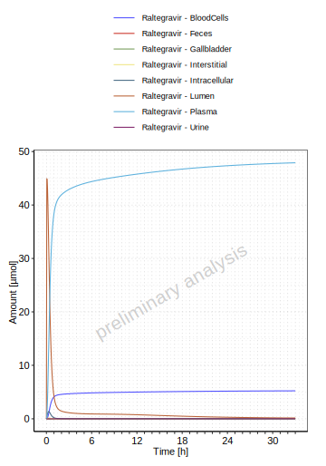
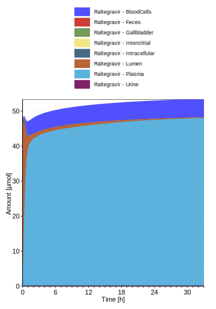
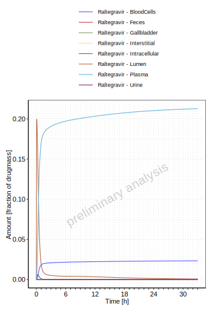
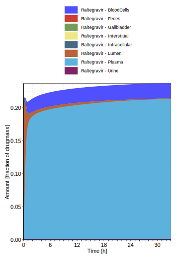
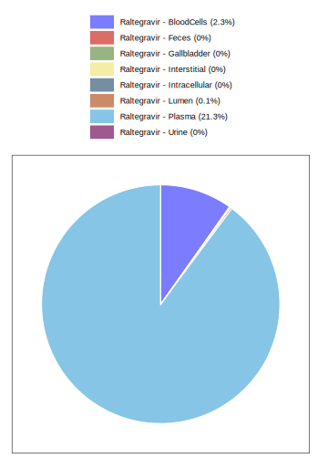
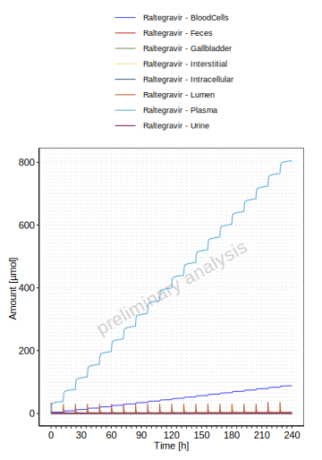
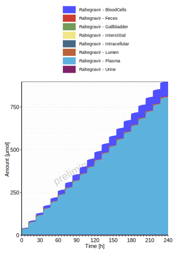
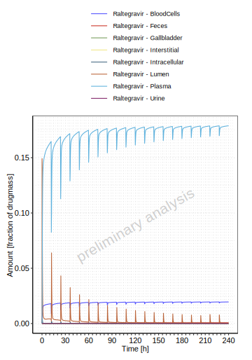
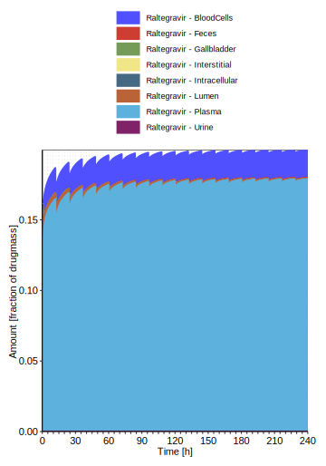
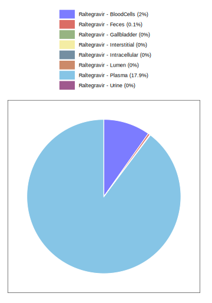

# Raltegravir Mass Balance Report

# Table of Contents

 * [1 Mass Balance ](#mass-balance)
   * [1.1 Mass Balance for Single Dose (100 mg) ](#mass-balance-single_dose__100_mg_)
     * [1.1.1 Mass Balance for Raltegravir ](#1_mass_balance)
   * [1.2 Mass Balance for Multiple Doses (100 mg) ](#mass-balance-multiple_doses__100_mg_)
     * [1.2.1 Mass Balance for Raltegravir ](#1_mass_balance)

# 1 Mass Balance 

## 1.1 Mass Balance for Single Dose (100 mg) 

### 1.1.1 Mass Balance for Raltegravir 

**Figure 1-1: Amount of drug vs time within the different compartments for Raltegravir**

 
 

**Figure 1-2: Cumulated amount of drug vs time within the different compartments for Raltegravir**

 
 

**Figure 1-3: Amount of drug vs time within the different compartments normalized to applicated drugmass for Raltegravir**

 
 

**Figure 1-4: Cumulated amount of drug vs time within the different compartments normalized to applicated drugmass for Raltegravir**

 
 

**Figure 1-5: Fraction of drug within the different compartments at 33.00h for Raltegravir**

 
 

## 1.2 Mass Balance for Multiple Doses (100 mg) 

### 1.2.1 Mass Balance for Raltegravir 

**Figure 1-6: Amount of drug vs time within the different compartments for Raltegravir**

 
 

**Figure 1-7: Cumulated amount of drug vs time within the different compartments for Raltegravir**

 
 

**Figure 1-8: Amount of drug vs time within the different compartments normalized to applicated drugmass for Raltegravir**

 
 

**Figure 1-9: Cumulated amount of drug vs time within the different compartments normalized to applicated drugmass for Raltegravir**

 
 

**Figure 1-10: Fraction of drug within the different compartments at 240.00h for Raltegravir**

 
 

