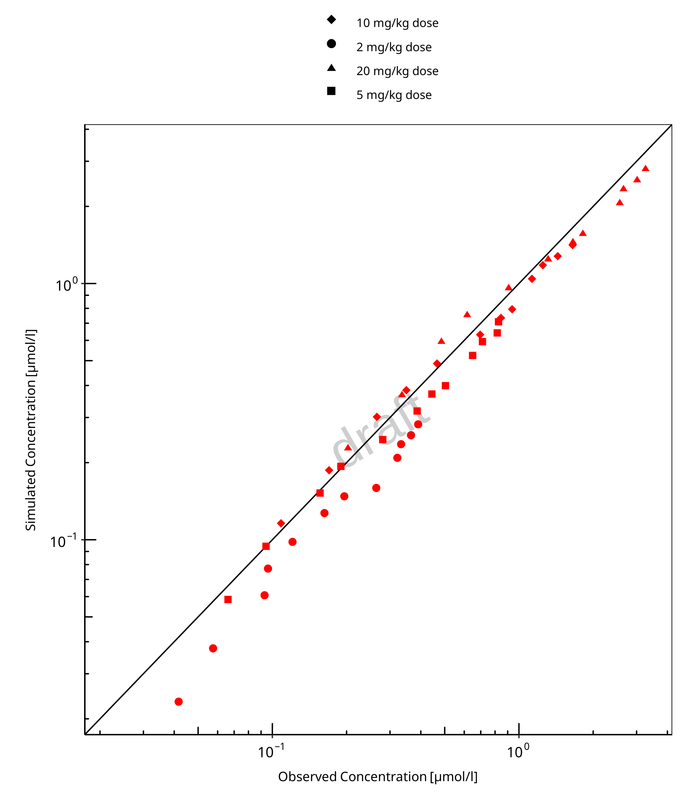
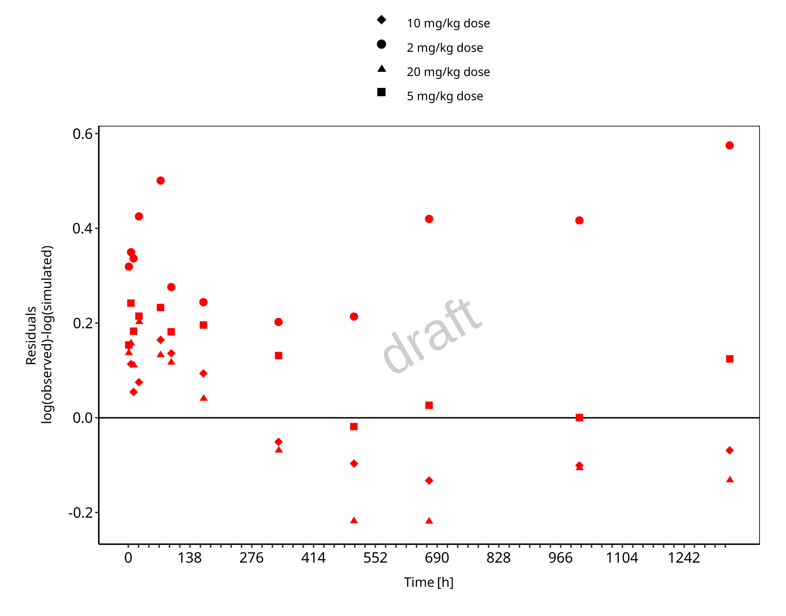
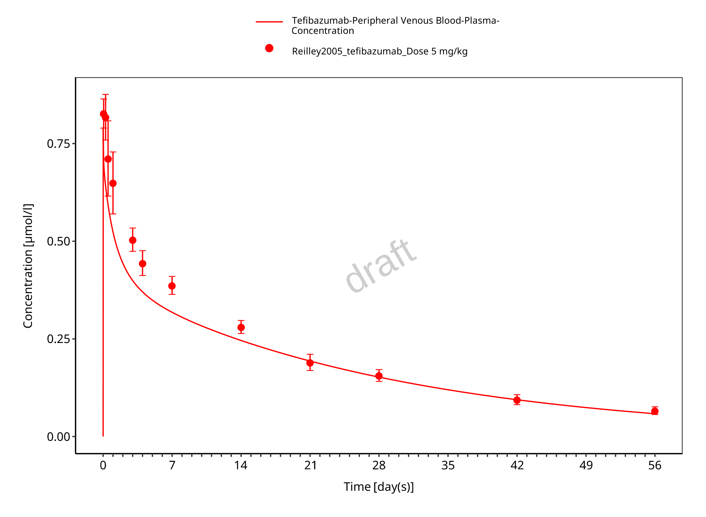
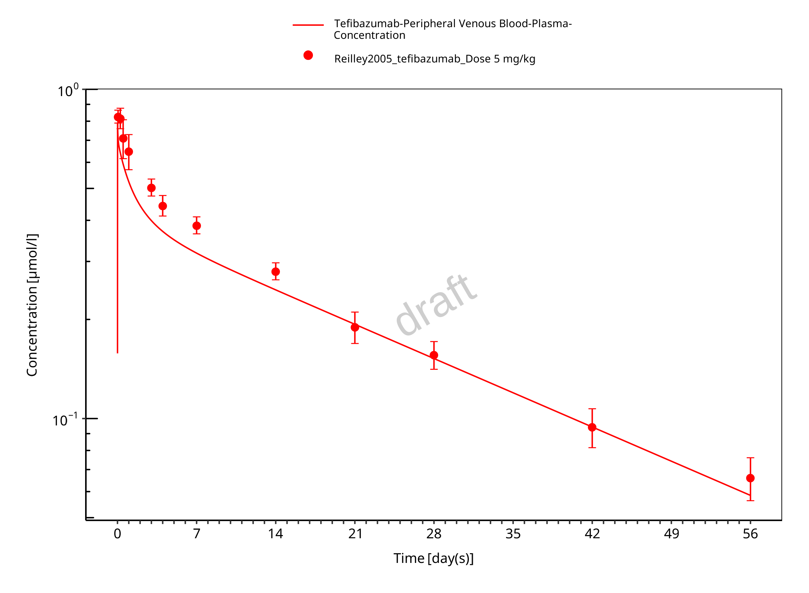
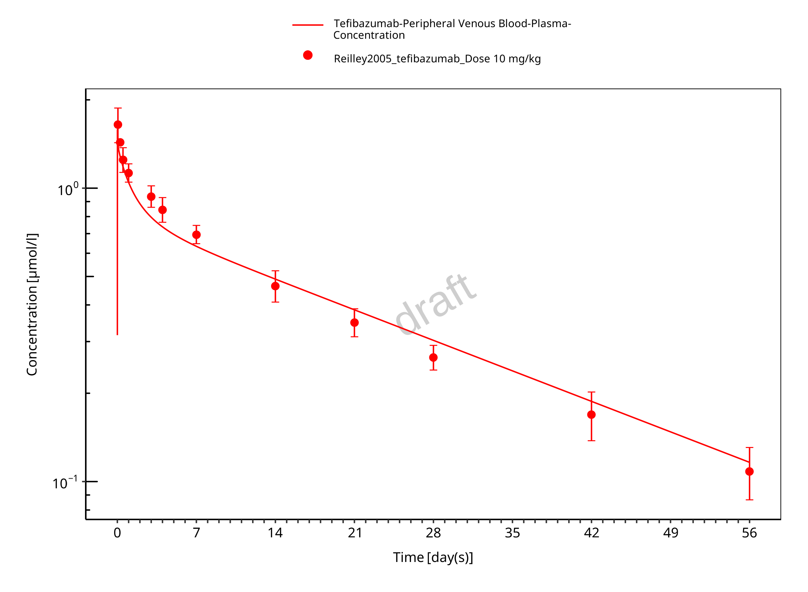
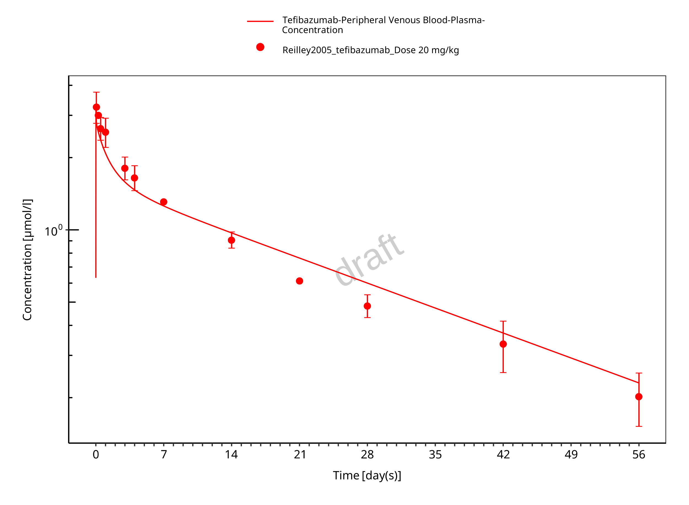

# Building and evaluation of a PBPK model for tefibazumab in healthy adults

| Version                                         | 1.0-OSP11.0                                                   |
| ----------------------------------------------- | ------------------------------------------------------------ |
| based on *Model Snapshot* and *Evaluation Plan* | https://github.com/Open-Systems-Pharmacology/Tefibazumab-Model/releases/tag/v1.0 |
| OSP Version                                     | 11.0                                                          |
| Qualification Framework Version                 | 3.0                                                          |

This evaluation report and the corresponding PK-Sim project file are filed at:

https://github.com/Open-Systems-Pharmacology/OSP-PBPK-Model-Library/

# Table of Contents

 * [1 Introduction](#introduction)
 * [2 Methods](#methods)
   * [2.1 Modeling Strategy](#modeling-strategy)
   * [2.2 Data](#methods-data)
     * [2.2.1 In vitro / physico-chemical Data ](#invitro-and-physico-chemical-data)
     * [2.2.2 PK Data ](#PK-data)
   * [2.3 Model Parameters and Assumptions](#model-parameters-and-assumptions)
     * [2.3.1 Absorption ](#model-parameters-and-assumptions-absorption)
     * [2.3.2 Distribution ](#model-parameters-and-assumptions-distribution)
     * [2.3.3 Metabolism and Elimination ](#model-parameters-and-assumptions-metabolism-and-elimination)
     * [2.3.4 Automated Parameter Identification ](#model-parameters-and-assumptions-parameter-identification)
 * [3 Results and Discussion](#results-and-discussion)
   * [3.1 Final input parameters](#final-input-parameters)
   * [3.2 Diagnostics Plots](#diagnostics-plots)
   * [3.3 Concentration-Time Profiles](#ct-profiles)
 * [4 Conclusion](#conclusion)
 * [5 References](#main-references)

# 1 Introduction

Tefibazumab is a humanized monoclonal antibody (IgG1) against the clumping factor A (ClfA) of *Staphylococcus aureus*. Tefibazumab shows a pharmacokinetic (PK) behavior which is typical for an antibody without endogenous target.  

The herein presented evaluation report evaluates the performance of the physiologically based pharmacokinetic (PBPK) model for tefibazumab in healthy adults. 

The presented Tefibazumab PBPK model as well as the respective evaluation plan and evaluation report are provided open-source (https://github.com/Open-Systems-Pharmacology/Tefibazumab-Model).

# 2 Methods

## 2.1 Modeling Strategy

The development of the large molecule PBPK model in PK-Sim® has previously been described by Niederalt et al. ([Niederalt 2018](#5-references)). In short, the model was built as an extension of the PK-Sim® model for small molecules incorporating (i) the two-pore formalism for drug extravasation from blood plasma to interstitial space, (ii) lymph flow, (iii) endosomal clearance and (iv) protection from endosomal clearance by neonatal Fc receptor (FcRn) mediated recycling. 

For model development and evaluation, PK data were used from compounds with a wide range of solute radii and from different species. The PK data used for parameter estimation were from the following compounds:  antibody–drug conjugate BAY 79-4620 in mice (Bayer in house data),  antibody 7E3 in wild-type and FcRn knockout mice  ([Garg 2007](#5-references), [Garg2009](#5-references)), domain antibody dAb2 in mice ([Sepp 2015](#5-references)), antibodies MEDI-524 and MEDI-524-YTE in monkeys ([Dall'Acqua 2006](#5-references)), and antibody CDA1 in humans ([Taylor 2008](#5-references)). The PK data used for model evaluation were from inulin in rats  ([Tsuji1983](#5-references)) and tefibazumab in humans ([Reilly 2005](#5-references)).  

The PBPK model including the estimated physiological parameters as described by Niederalt et al. ([Niederalt 2018](#5-references)) is available in the Open Systems Pharmacology Suite from version 7.1 onwards.

This evaluation report focuses on the PBPK model for the antibody antibodies tefibazumab.

Details about input data (physicochemical, *in vitro* and PK) can be found in  [Section 2.2](#22-data).

Details about the structural model and its parameters can be found in  [Section 2.3](#23-model-parameters-and-assumptions).

## 2.2 Data

### 2.2.1 In vitro / physico-chemical Data 

A literature search was performed to collect available information on physicochemical properties of tefibazumab. The obtained information from literature is summarized in the table below. 

| **Parameter** | **Unit** | **Value** | Source                       | **Description**                                              |
| :------------ | -------- | --------- | ---------------------------- | ------------------------------------------------------------ |
| MW            | g/mol    | 150000    | [Lobo 2004](#5-references)   | Molecular weight                                             |
| r             | nm       | 5.34      | [Taylor 1984](#5-references) | Hydrodynamic solute radius                                   |
| Kd (FcRn)     | µM       | 0.63      | [Zhou 2003](#5-references)   | Dissociation constant for binding of a human IgG1 antibody to human FcRn at pH 6 |

### 2.2.2 PK Data 

Published clinical PK data on tefibazumab in healthy adults were used.

| Publication                  | Description                                                  |
| :--------------------------- | :----------------------------------------------------------- |
| [Reilly 2005](#5-references) | The plasma concentration–time profiles after single dose 15 min i.v. infusion of 2, 5, 10, or 20 mg/kg body weight in healthy adults were used. |

## 2.3 Model Parameters and Assumptions

### 2.3.1 Absorption 

There is no absorption process since tefibazumab was administered intravenously.

### 2.3.2 Distribution 

The standard lymph and fluid recirculation flow rates and the standard vascular properties of the different tissues (hydraulic conductivity, pore radii, fraction of flow via large pores) from PK-Sim were used ([Niederalt 2018](#5-references)).

### 2.3.3 Metabolism and Elimination 

The FcRn mediated clearance present in the standard PK-Sim model was  used as only clearance process. The standard physiological parameters related to FcRn mediated clearance were used (rate constants for endosomal uptake and recycling, association rate constant for FcRn binding and concentration of FcRn in the endosomal space) ([Niederalt 2018](#5-references)).

### 2.3.4 Automated Parameter Identification 

The Kd(FcRn) was fitted to the experimental plasma concentrations.

| Model Parameter | Optimized Value | Unit |
| --------------- | --------------- | ---- |
| `Kd(FcRn)`      | 0.85            | µM   |

# 3 Results and Discussion

The PBPK model for tefibazumab was evaluated with clinical PK data.

The next sections show:

1. the final model parameters for the building blocks: [Section 3.1](#final-input-parameters).
2. the overall goodness of fit: [Section 3.2](#diagnostics-plots).
3. simulated vs. observed concentration-time profiles for the clinical studies used for model building and for model verification: [Section 3.3](#ct-profiles).

## 3.1 Final input parameters

The compound parameter values of the final PBPK model are illustrated below.

### Compound: Tefibazumab

#### Parameters

Name                                       | Value        | Value Origin                                  | Alternative | Default
------------------------------------------ | ------------ | --------------------------------------------- | ----------- | -------
Solubility at reference pH                 | 9999 mg/l    | Other-/Dummy value not used in the simulation | Measurement | True   
Reference pH                               | 7            | Other-/Dummy value not used in the simulation | Measurement | True   
Lipophilicity                              | -5 Log Units | Other-/Dummy value not used in the simulation | Measurement | True   
Fraction unbound (plasma, reference value) | 1            | Other-Assumption                              | Measurement | True   
Is small molecule                          | No           |                                               |             |        
Molecular weight                           | 150000 g/mol | Publication-Lobo2004                          |             |        
Plasma protein binding partner             | Unknown      |                                               |             |        
Radius (solute)                            | 0.00534 µm   | Publication-Taylor1984                        |             |        
Kd (FcRn) in endosomal space               | 0.85 µmol/l  | Parameter Identification                      |             |        

#### Calculation methods

Name                    | Value          
----------------------- | ---------------
Partition coefficients  | PK-Sim Standard
Cellular permeabilities | PK-Sim Standard

#### Processes

## 3.2 Diagnostics Plots

Below you find the goodness-of-fit visual diagnostic plots for the PBPK model performance of all data used presented in [Section 2.2.2](#PK-data).

The first plot shows observed versus simulated plasma concentration, the second weighted residuals versus time. 

**Table 3-1: GMFE for Goodness of fit plot for concentration in plasma**

|Group         |GMFE |
|:-------------|:----|
|10 mg/kg dose |1.11 |
|2 mg/kg dose  |1.43 |
|20 mg/kg dose |1.15 |
|5 mg/kg dose  |1.15 |
|All           |1.20 |

 
 

**Figure 3-1: Goodness of fit plot for concentration in plasma**

 
 

**Figure 3-2: Goodness of fit plot for concentration in plasma**

 
 

## 3.3 Concentration-Time Profiles

Simulated versus observed concentration-time profiles of all data listed in [Section 2.2.2](#PK-data) are presented below.

**Figure 3-3: Plasma concentration - 2 mg/kg dose (linear scale)**

 
 

**Figure 3-4: Plasma concentration - 2 mg/kg dose (log scale)**

 
 

**Figure 3-5: Plasma concentration - 5 mg/kg dose (linear scale)**

 
 

**Figure 3-6: Plasma concentration - 5 mg/kg dose (log scale)**

 
 

**Figure 3-7: Plasma concentration - 10 mg/kg dose (linear scale)**

 
 

**Figure 3-8: Plasma concentration - 10 mg/kg dose (log scale)**

 
 

**Figure 3-9: Plasma concentration - 20 mg/kg dose (linear scale)**

 
 

**Figure 3-10: Plasma concentration - 20 mg/kg dose (log scale)**

 
 

# 4 Conclusion

The herein presented PBPK model adequately describes the pharmacokinetics of tefibazumab in adults after adjusting the affinity to FcRn except for the lowest dose for which the plasma concentrations are underestimated. The initial plasma concentrations are slightly underestimated also for higher doses.

# 5 References

**Dall'Acqua 2006** Dall’Acqua WF, Kiener PA, Wu H. Properties of human IgG1s engineered for enhanced binding to the neonatal Fc receptor (FcRn). J Biol Chem. 2006 Aug; 281(33):23514-23524. doi: 10.1074/jbc.M604292200.

**Garg 2007** Garg A, Balthasar JP. Physiologically-based pharmacokinetic (PBPK) model to predict IgG tissue kinetics in wild-type and FcRn-knockout mice. J Pharmacokinet Pharmacodyn. 2007 Jul; 34(5):687-709. doi: 10.1007/s10928-007-9065-1. 

**Garg 2009** Garg A, Balthasar J. Investigation of the influence of FcRn on the distribution of IgG to the brain. AAPS J. 2009 July; 11(3):553-557. doi: 10.1208/s12248-009-9129-9. 

**Lobo 2004** Lobo ED, Hansen R J, Balthasar JP.  Antibody pharmacokinetics and pharmacodynamics. J Pharm Sci. 2004 Nov;93(11):2645-2668. doi: 10.1002/jps.20178.

**Niederalt 2018** Niederalt C, Kuepfer L, Solodenko J, Eissing T, Siegmund HU, Block M, Willmann S, Lippert J. A generic whole body physiologically based pharmacokinetic model for therapeutic proteins in PK-Sim. J Pharmacokinet Pharmacodyn. 2018 Apr;45(2):235-257. doi: 10.1007/s10928-017-9559-4.

**Reilly 2005** Reilley S, Wenzel E, Reynolds L, Bennett B, Patti JM, Hetherington S. Open-label, dose escalation study of the safety and pharmacokinetic profile of tefibazumab in healthy volunteers. Antimicrob Agents Chemother. 2005 Mar;49(3):959–962. doi: 10.1128/AAC.49.3.959-962.2005.

**Sepp 2015** Sepp A, Berges A, Sanderson A, Meno-Tetang G. Development of a physiologically based pharmacokinetic model for a domain antibody in mice using the two-pore theory. J Pharmacokinet Pharmacodyn. 2015 Jan;42(2):97-109. doi: 10.1007/s10928-014-9402-0.

**Taylor 1984** Taylor AE, Granger DN. Exchange of macromolecules across the microcirculation. Handbook of Physiology - Cardiovascular System. Microcirculation (Eds. Renkin EM and Michel CC. Bethesda, MD, American Physiological Society). 1984; Vol. 4(Pt 2):467–520.

**Taylor 2008** Taylor CP, Tummala S, Molrine D, Davidson L, Farrell RJ, Lembo A, Hibberd PL, Lowy I, Kelly CP. Open-label, dose escalation phase I study in healthy volunteers to evaluate the safety and pharmacokinetics of a human monoclonal antibody to Clostridium difficile toxin A. Vaccine. 2008 Jun;26(27-28):3404–3409. doi: 10.1016/j.vaccine.2008.04.042.

**Tsuji 1983** Tsuji A, Yoshikawa T, Nishide K, Minami H, Kimura M, Nakashima E, Terasaki T, Miyamoto E, Nightingale CH, Yamana T. Physiologically based pharmacokinetic model for beta-lactam antibiotics I: tissue distribution and elimination in rats. J Pharm Sci. 1983 Nov;72(11):1239-1252. doi: 10.1002/jps.2600721103.

**Zhou 2003** Zhou J, Johnson JE, Ghetie V, Ober RJ, Ward ES. Generation of mutated variants of the human form of the MHC class I-related receptor, FcRn, with increased affinity for mouse immunoglobulin G. J Mol Biol. 2003 Sep;332(4):901-913. doi: 10.1016/s0022-2836(03)00952-5.

