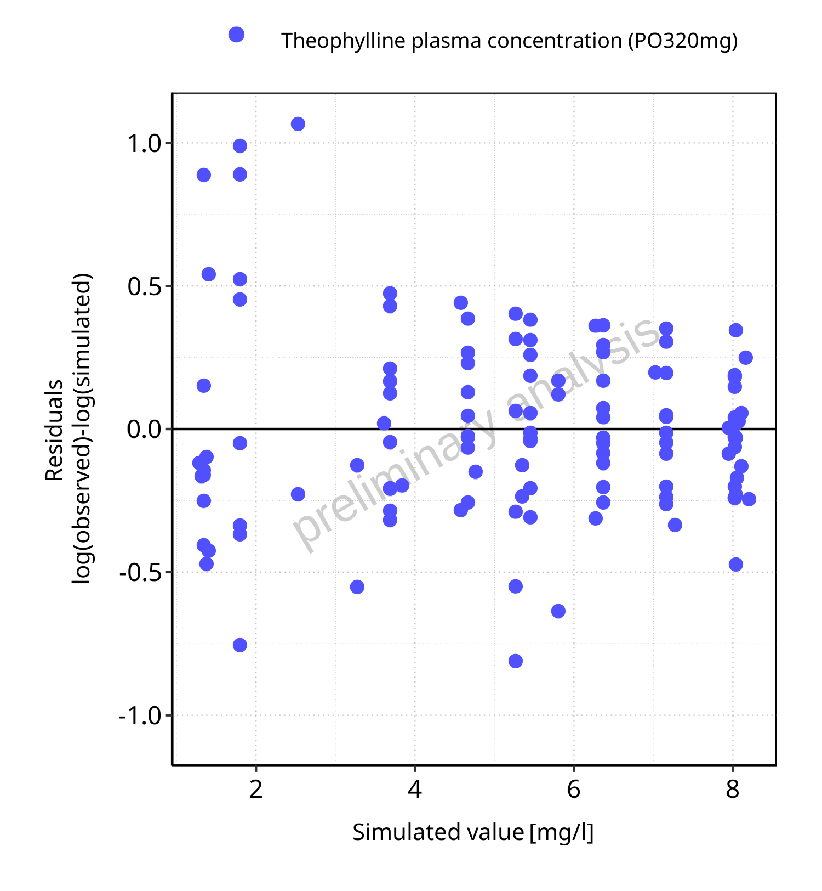
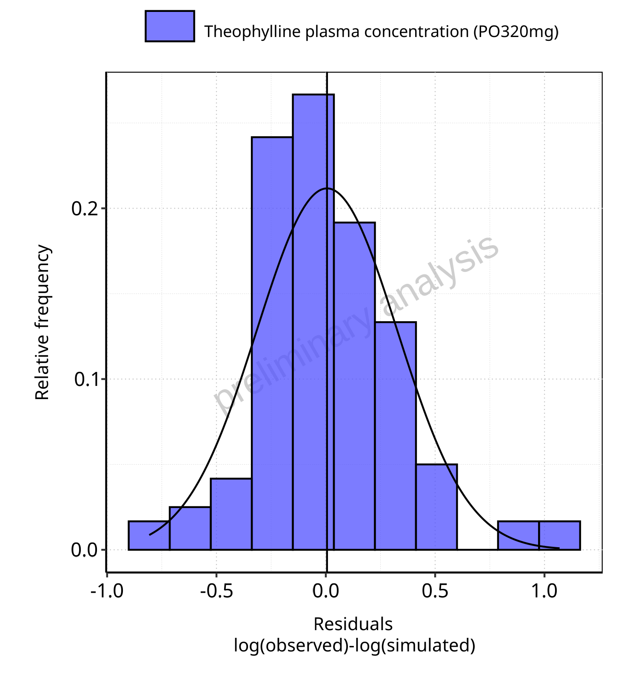

# Report NO11

# Table of Contents

 * [1 PK parameters](#pk-parameters)
   * [1.1 PK parameters for PO320mg](#pk-parameters-po320mg)
 * [2 Time profiles and residual plots](#time-profiles)
   * [2.1 Time profiles and residual plots for PO320mg](#time-profiles-po320mg)

# 1 PK parameters

## 1.1 PK parameters for PO320mg

**Table 1-1: PK parameters for PO320mg**

|Path                              |Parameter              |Value  |Unit      |
|:---------------------------------|:----------------------|:------|:---------|
|Theophylline plasma concentration |C_max                  |8.26   |mg/l      |
|Theophylline plasma concentration |t_max                  |1.35   |h         |
|Theophylline plasma concentration |C_tEnd                 |1.16   |mg/l      |
|Theophylline plasma concentration |AUC_tEnd               |99.47  |mg*h/l    |
|Theophylline plasma concentration |Half-Life              |8.16   |h         |
|Theophylline plasma concentration |Total body clearance/F |0.65   |ml/min/kg |
|Theophylline plasma concentration |Vss (plasma)/F         |490.26 |ml/kg     |
|Theophylline plasma concentration |Vd (plasma)/F          |456.11 |ml/kg     |

 
 

# 2 Time profiles and residual plots

## 2.1 Time profiles and residual plots for PO320mg

**Figure 2-1: Time profiles for PO320mg. Data source: Boeckmann 1994. Time profiles are plotted in a linear scale.**

 
 

**Figure 2-2: Time profiles for PO320mg. Data source: Boeckmann 1994. Time profiles are plotted in a logarithmic scale.**

 
 

**Figure 2-3: Predicted vs observed for PO320mg. Data source: Boeckmann 1994. Predictions and observations are plotted in a linear scale.**

 
 

**Figure 2-4: Predicted vs observed for PO320mg. Data source: Boeckmann 1994. Predictions and observations are plotted in a logarithmic scale.**

 
 

**Figure 2-5: Logarithmic residuals vs predicted values for PO320mg. Data source: Boeckmann 1994.**

 
 

**Figure 2-6: Logarithmic residuals vs time values for PO320mg. Data source: Boeckmann 1994.**

 
 

**Figure 2-7: Logarithmic residuals distribution (stacked) for PO320mg. Data source: Boeckmann 1994.**

 
 

**Figure 2-8: Logarithmic residuals for PO320mg as quantile-quantile plot. Data source: Boeckmann 1994.**

 
 

