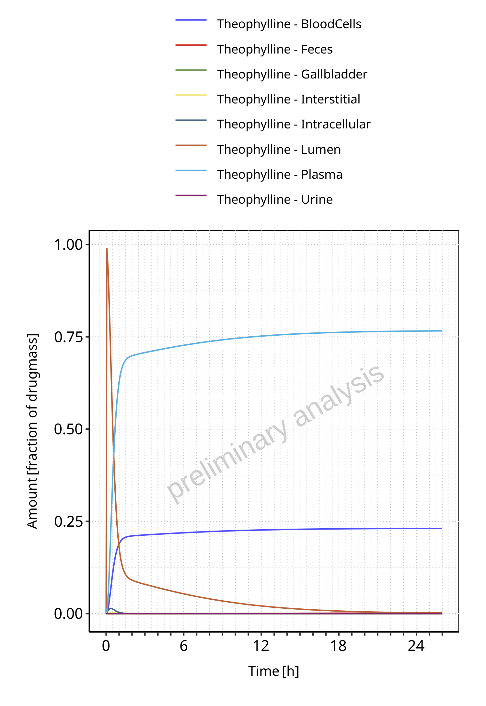
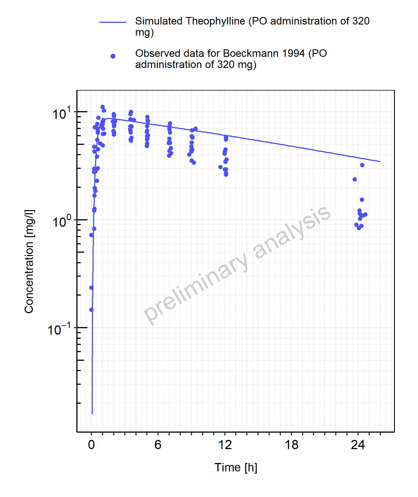
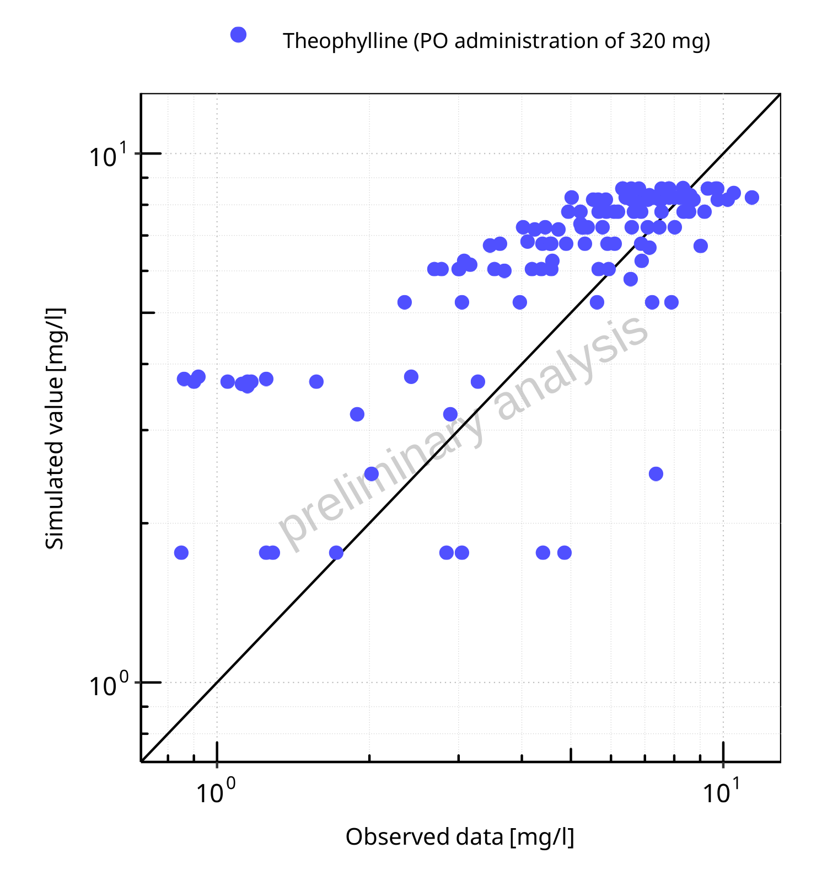

# Report NO12

# Table of Contents

 * [1 PK parameters ](#pk-parameters)
   * [1.1 PK parameters for PO administration of 320 mg ](#pk-parameters-po_administration_of_320_mg)
 * [2 Absorption ](#absorption)
   * [2.1 Absorption for PO administration of 320 mg ](#absorption-po_administration_of_320_mg)
 * [3 Mass Balance ](#mass-balance)
   * [3.1 Mass Balance for PO administration of 320 mg ](#mass-balance-po_administration_of_320_mg)
     * [3.1.1 Mass Balance for Theophylline ](#1_mass_balance)
 * [4 Time profiles and residual plots ](#time-profiles)
   * [4.1 Time profiles and residual plots for PO administration of 320 mg ](#time-profiles-po_administration_of_320_mg)

# 1 PK parameters 

## 1.1 PK parameters for PO administration of 320 mg 

**Table 1-1: PK parameters for PO administration of 320 mg**

|Path         |Parameter |Value  |Unit   |
|:------------|:---------|:------|:------|
|Theophylline |C_max     |8.68   |mg/l   |
|Theophylline |t_max     |1.55   |h      |
|Theophylline |C_tEnd    |3.46   |mg/l   |
|Theophylline |AUC_tEnd  |151.57 |mg*h/l |

 
 

# 2 Absorption 

## 2.1 Absorption for PO administration of 320 mg 

**Figure 2-1: Absorption of Theophylline**

 
 

# 3 Mass Balance 

## 3.1 Mass Balance for PO administration of 320 mg 

### 3.1.1 Mass Balance for Theophylline 

**Figure 3-1: Amount of drug vs time within the different compartments for Theophylline**

 
 

**Figure 3-2: Cumulated amount of drug vs time within the different compartments for Theophylline**

 
 

**Figure 3-3: Amount of drug vs time within the different compartments normalized to applicated drugmass for Theophylline**

 
 

**Figure 3-4: Cumulated amount of drug vs time within the different compartments normalized to applicated drugmass for Theophylline**

 
 

**Figure 3-5: Fraction of drug within the different compartments at 26.00h for Theophylline**

 
 

# 4 Time profiles and residual plots 

## 4.1 Time profiles and residual plots for PO administration of 320 mg 

**Figure 4-1: Time profiles for PO administration of 320 mg. Data source: Boeckmann 1994. Time profiles are plotted in a linear scale.**

 
 

**Figure 4-2: Time profiles for PO administration of 320 mg. Data source: Boeckmann 1994. Time profiles are plotted in a logarithmic scale.**

 
 

**Figure 4-3: Predicted vs observed for PO administration of 320 mg. Data source: Boeckmann 1994. Predictions and observations are plotted in a linear scale.**

 
 

**Figure 4-4: Predicted vs observed for PO administration of 320 mg. Data source: Boeckmann 1994. Predictions and observations are plotted in a logarithmic scale.**

 
 

**Figure 4-5: Logarithmic residuals vs predicted values for PO administration of 320 mg. Data source: Boeckmann 1994.**

 
 

**Figure 4-6: Logarithmic residuals vs time values for PO administration of 320 mg. Data source: Boeckmann 1994.**

 
 

**Figure 4-7: Logarithmic residuals distribution (stacked) for PO administration of 320 mg. Data source: Boeckmann 1994.**

 
 

**Figure 4-8: Logarithmic residuals for PO administration of 320 mg as quantile-quantile plot. Data source: Boeckmann 1994.**

 
 

