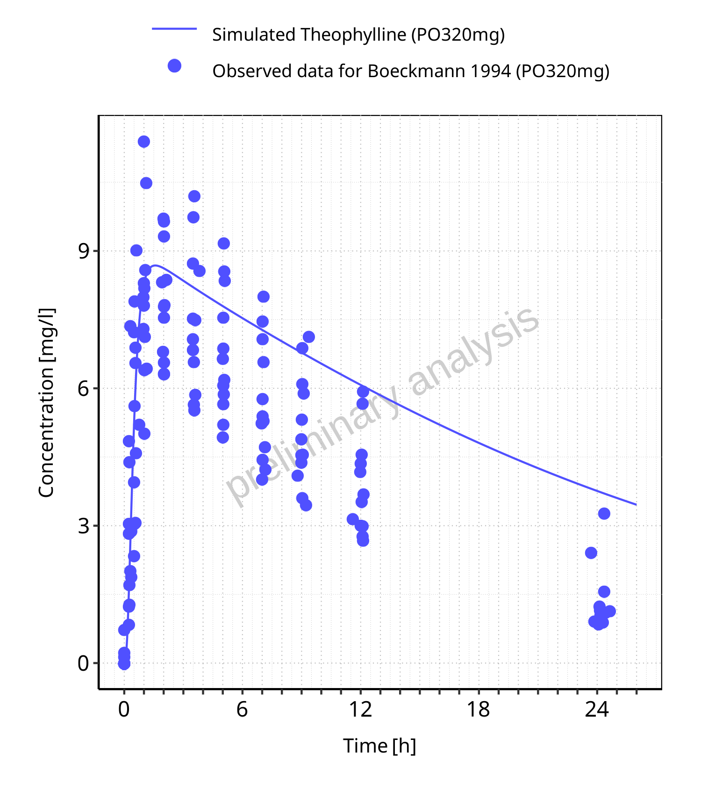
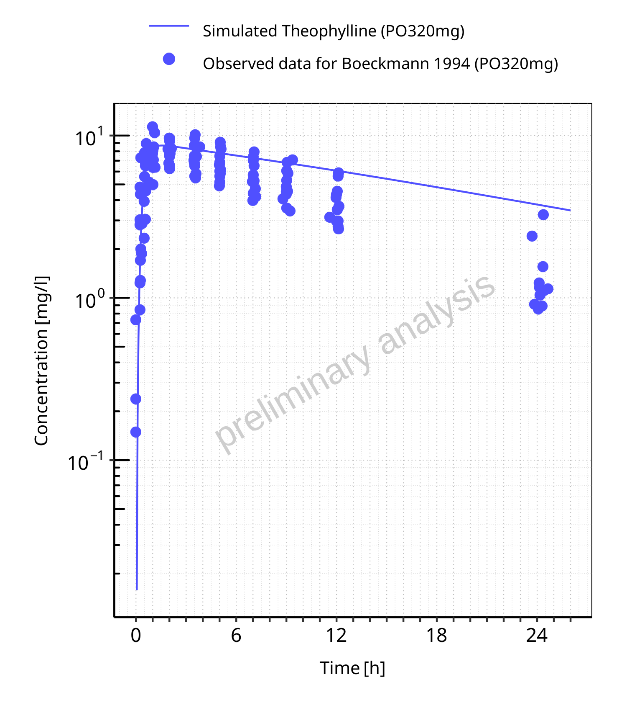

# Report NO7

# Table of Contents

 * [1 PK parameters](#pk-parameters)
   * [1.1 PK parameters for PO320mg](#pk-parameters-po320mg)
 * [2 Time profiles and residual plots](#time-profiles)
   * [2.1 Time profiles and residual plots for PO320mg](#time-profiles-po320mg)

# 1 PK parameters

## 1.1 PK parameters for PO320mg

**Table 1-1: PK parameters for PO320mg**

|Path         |Parameter |Value |Unit   |
|:------------|:---------|:-----|:------|
|Theophylline |C_max     |0     |mg/l   |
|Theophylline |t_max     |0     |h      |
|Theophylline |C_tEnd    |0     |mg/l   |
|Theophylline |AUC_tEnd  |0     |mg*h/l |

 
 

# 2 Time profiles and residual plots

## 2.1 Time profiles and residual plots for PO320mg

**Figure 2-1: Time profiles for PO320mg. Data source: Boeckmann 1994. Time profiles are plotted in a linear scale.**

 
 

**Figure 2-2: Time profiles for PO320mg. Data source: Boeckmann 1994. Time profiles are plotted in a logarithmic scale.**

 
 

