# UGT DDI Inhibition Qualification 

| Version                         | 1.0-OSP11.0                                                   |
| ------------------------------- | ------------------------------------------------------------ |
| Qualification Plan Release      | https://github.com/Open-Systems-Pharmacology/Qualification-DDI-UGT/releases/tag/v1.0 |
| OSP Version                     | 11.0                                                          |
| Qualification Framework Version | 3.0                                                          |

This qualification report is filed at:

https://github.com/Open-Systems-Pharmacology/OSP-Qualification-Reports

# Table of Contents

 * [1 Introduction](#1)
   * [1.1 Objective](#11)
   * [1.2 UGT DDI Network](#12)
     * [1.2.1 Atazanavir - Raltegravir DDI](#121)
     * [1.2.2 Mefenamic acid - Dapagliflozin DDI](#122)
 * [2 Qualification of Use Case UGT-mediated DDI](#2)
   * [2.1 Mechanism](#2-ddi-subunit-9)
     * [2.1.1 Reversible Inhibition](#2-ddi-subunit-10)
   * [2.2 Perpetrator](#2-ddi-subunit-18)
     * [2.2.1 Atazanavir](#2-ddi-subunit-19)
     * [2.2.2 Mefenamic Acid](#2-ddi-subunit-27)
   * [2.3 Victim](#2-ddi-subunit-35)
     * [2.3.1 Dapagliflozin](#2-ddi-subunit-36)
     * [2.3.2 Raltegravir](#2-ddi-subunit-44)
 * [3 Concentration-Time Profiles](#3)
   * [3.1 Atazanavir - Raltegravir DDI](#31)
   * [3.2 Mefenamic acid - Dapagliflozin DDI](#32)
 * [4 References](#4)
 * [5 Appendix](#5)
   * [5.1 Open Systems Pharmacology Suite (OSPS) Introduction](#51)
   * [5.2 Mathematical Implementation of Drug-Drug Interactions](#52)
   * [5.3 Automatic (re)-qualification workflow](#53)

# 1 Introduction

## 1.1 Objective

This **qualification report** evaluates for the PBPK platform **PK-Sim** (as part of the open systems pharmacology (OSP) suite) the ability to perform simulations with the intended purpose to predict UGT1A1- and UGT1A9-mediated drug-drug interactions (**DDI**)

To demonstrate the level of confidence the predictive performance of the platform for this indented purpose is assessed particularly for **inhibition** of UGT1A1 and UGT1A9 by selected perpetrators on sensitive substrates . All PBPK models represent whole-body PBPK models, which allow dynamic DDI simulations in organs expressing UGT1A1 or UGT1A9, respectively. 

The respective *qualification plan* to produce this *qualification report* is transparently documented and provided open-source (www.open-systems-pharmacology.org). The same applies for all presented PBPK models including *evaluation reports* on model building and evaluation of each model.

*Evaluation reports* including descriptions on model building and detailed evaluations of the included models are documented separately (see [Section 1.2](#12-ugt-ddi-network)).

Please refer to the [Appendix](#5-appendix) to learn more details:

- An overview over the Open Systems Pharmacology Suite is given in chapter [Section 5.1](#51-open-systems-pharmacology-suite-osps-introduction)

- [Section 5.2](#52-mathematical-implementation-of-drug-drug-interactions) shows the implementation of the underlying mathematical equations for drug-drug interactions in the OSP suite.

- A detailed general description of the performed qualification workflow (*qualification plan*, *qualification report*, etc.) can be found in chapter [Section 5.3](#53-automatic-re-qualification-workflow).

## 1.2 UGT DDI Network

The following perpetrator compounds were selected:

- **Atazanavir** (UGT1A1 inhibitor)
  Model snapshot and evaluation plan (*release* **v1.1**): https://github.com/Open-Systems-Pharmacology/Atazanavir-Model/releases/tag/v1.1
  
- **Mefenamic acid** (UGT1A9 inhibitor)
  Model snapshot and evaluation plan (*release* **v1.1**): https://github.com/Open-Systems-Pharmacology/Mefenamic-acid-Model/releases/tag/v1.1

The following sensitive substrates as victim drugs were selected:

- **Raltegravir** (UGT1A1 substrate)
  Model snapshot and evaluation plan (*release* **v1.2**): https://github.com/Open-Systems-Pharmacology/Raltegravir-Model/releases/tag/v1.2
  
- **Dapagliflozin** (UGT1A9 substrate):
  Model snapshot and evaluation plan (*release* **v1.1**): https://github.com/Open-Systems-Pharmacology/Dapagliflozin-Model/releases/tag/v1.1

The published DDI studies between the respective perpetrators and victim drugs were simulated and compared to observed data. The following sections give an overview of the clinical studies being part of this qualification report. The respective data identifier (DataID) refers to the **ID** of the dataset in the [OSP PK database](https://github.com/Open-Systems-Pharmacology/Database-for-observed-data).

### 1.2.1 Atazanavir - Raltegravir DDI

The release of the snapshot containing the respective simulations can be found here:
[https://github.com/Open-Systems-Pharmacology/Atazanavir-Raltegravir-DDI/releases/tag/v1.1]([https://github.com/Open-Systems-Pharmacology/Atazanavir-Raltegravir-DDI/releases/tag/v1.1).

The atazanavir / raltegravir interaction was evaluated using four clinical DDI studies ([Iwamoto 2008](#4-references), [Krishna 2008](#4-references), [Neely 2010](#4-references), [Zhu 2010](#4-references)).

| DataID | Enzyme | Perpetrator / victim     | Study design                                                 | Clinical study                 |
| ------ | ------ | ------------------------ | ------------------------------------------------------------ | ------------------------------ |
| 571    | UGT1A1 | Atazanavir / raltegravir | Atazanavir: 400 mg once daily dosing Raltegravir: 100 mg single dose on day 7 simultaneous with the 7th dose of atazanavir | [Iwamoto 2008](#4-references)  |
| 575    | UGT1A1 | Atazanavir / raltegravir | Atazanavir: 400 mg once daily dosing Raltegravir: 1200 mg single dose on day 7 simultaneous with the 7th dose of atazanavir | [Krishna 2008,](#4-references) |
| 573    | UGT1A1 | Atazanavir / raltegravir | Atazanavir: 400 mg once daily dosing Raltegravir: 400 mg once daily dosing (control phase 400 mg twice daily) DDI assessment on day 8 | [Neely 2010](#4-references)    |
| 579    | UGT1A1 | Atazanavir / raltegravir | Atazanavir: 300 mg twice daily dosing Raltegravir: 400 mg twice daily dosing  DDI assessment on day 27 | [Zhu 2010](#4-references)      |

### 1.2.2 Mefenamic acid - Dapagliflozin DDI

The release of the snapshot containing the respective simulations can be found here:
https://github.com/Open-Systems-Pharmacology/Mefenamic_acid-Dapagliflozin-DDI/releases/tag/v1.1.

The mefenamic acid / dapagliflozin interaction was evaluated using 1 clinical DDI study ([Kasichayanula 2013](#4-references)).

| DataID | Enzyme | Perpetrator / victim           | Study design                                                 | Clinical study                      |
| ------ | ------ | ------------------------------ | ------------------------------------------------------------ | ----------------------------------- |
| 642    | UGT1A9 | Mefenamic acid / dapagliflozin | Mefenamic acid: 500 mg loading dose, followed by 8 doses of 250 mg mefenamic acid every 6 hours Dapagliflozin: 10 mg single dose on day 2 simultaneous with the 5th dose of mefenamic acid (24 hours after the first mefenamic acid dose) | [Kasichayanula 2013](#4-references) |

# 2 Qualification of Use Case UGT-mediated DDI

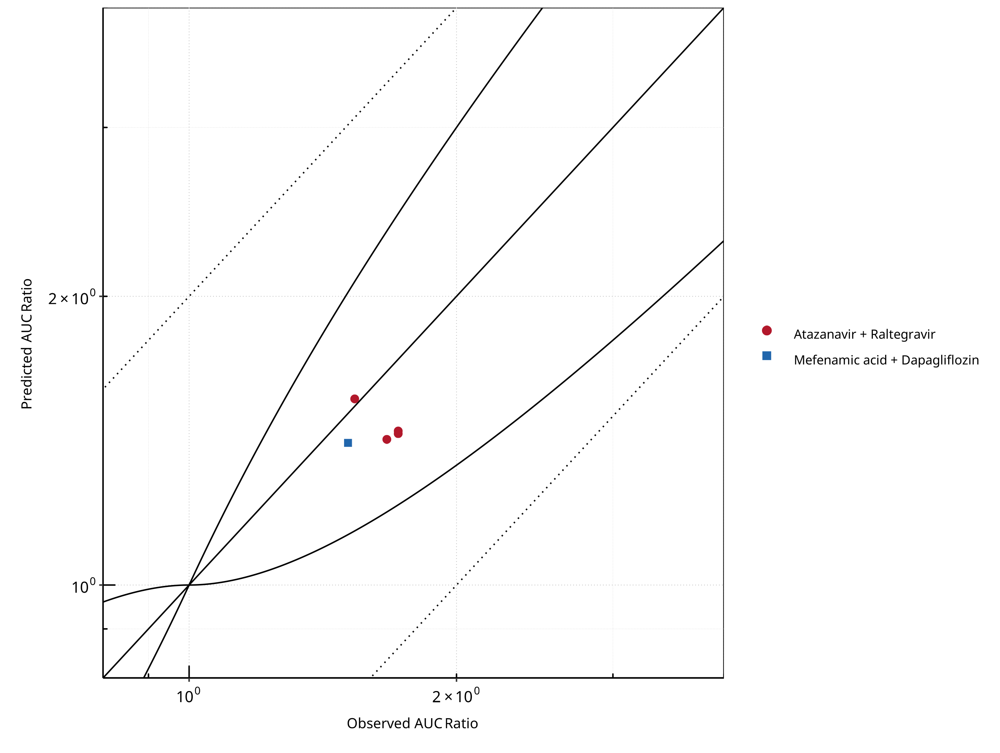

**Figure 2-1: UGT1A1 and UGT1A9 Inhibition DDI.  Predicted vs. Observed AUC Ratio. (&delta; = 1 in Guest *et al.* formula)**

 
 

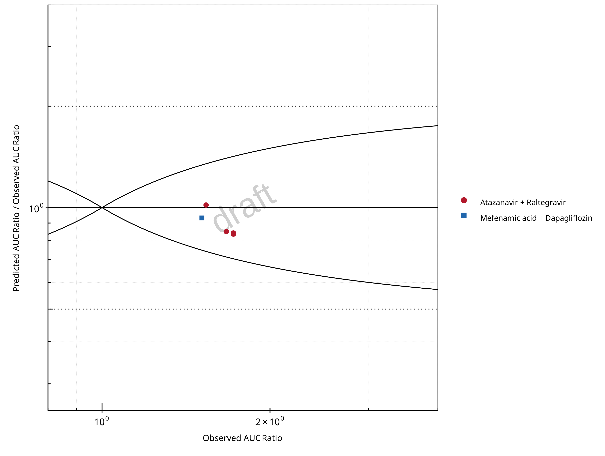

**Figure 2-2: UGT1A1 and UGT1A9 Inhibition DDI.  Predicted/Observed vs. Observed AUC Ratio. (&delta; = 1 in Guest *et al.* formula)**

 
 

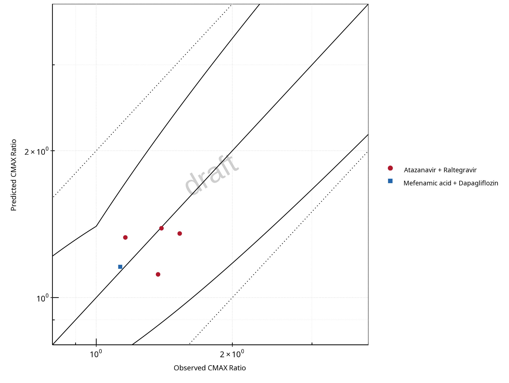

**Figure 2-3: UGT1A1 and UGT1A9 Inhibition DDI.  Predicted vs. Observed CMAX Ratio. (&delta; = 1.4 in Guest *et al.* formula)**

 
 

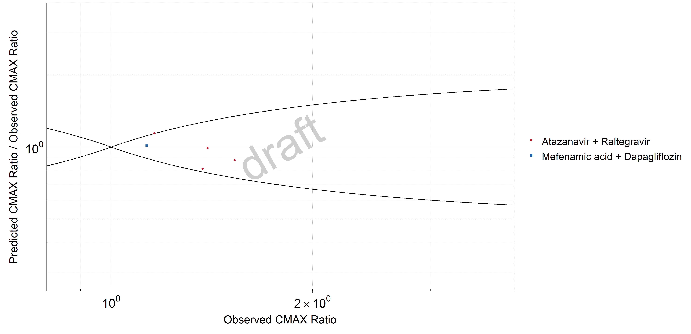

**Figure 2-4: UGT1A1 and UGT1A9 Inhibition DDI.  Predicted/Observed vs. Observed CMAX Ratio. (&delta; = 1.4 in Guest *et al.* formula)**

 
 

**Table 2-1: GMFE for UGT1A1 and UGT1A9 Inhibition DDI Ratio**

|PK parameter |GMFE |
|:------------|:----|
|AUC          |1.13 |
|CMAX         |1.10 |

 
 

**Table 2-2: Summary table for UGT1A1 and UGT1A9 Inhibition DDI - AUC Ratio. (&delta; = 1 in Guest *et al.* formula)**

|AUC                          |Number |Ratio [%] |
|:----------------------------|:------|:---------|
|Points total                 |5      |-        |
|Points within Guest *et al.* |5      |100       |
|Points within 2 fold         |5      |100       |

 
 

**Table 2-3: Summary table for UGT1A1 and UGT1A9 Inhibition DDI - CMAX Ratio. (&delta; = 1.4 in Guest *et al.* formula)**

|CMAX                         |Number |Ratio [%] |
|:----------------------------|:------|:---------|
|Points total                 |5      |-        |
|Points within Guest *et al.* |5      |100       |
|Points within 2 fold         |5      |100       |

 
 

**Table 2-4: Summary table for UGT1A1 and UGT1A9 Inhibition DDI**

|DataID |Perpetrator                                                                        |Victim            |Predicted AUC Ratio |Observed AUC Ratio |Pred/Obs AUC Ratio |Predicted CMAX Ratio |Observed CMAX Ratio |Pred/Obs CMAX Ratio |Reference           |
|:------|:----------------------------------------------------------------------------------|:-----------------|:-------------------|:------------------|:------------------|:--------------------|:-------------------|:-------------------|:-------------------|
|571    |Atazanavir, 400 mg, PO, MD OD (9 days)                                             |Raltegravir, PO   |1.45                |1.72               |0.84               |1.35                 |1.53                |0.89                |Iwamoto 2008        |
|573    |Atazanavir, 400 mg, PO, MD OD (8 days)                                             |Raltegravir, PO   |1.44                |1.72               |0.84               |1.12                 |1.37                |0.82                |Neely 2010          |
|575    |Atazanavir, 400 mg, PO, MD OD (9 days)                                             |Raltegravir, PO   |1.42                |1.67               |0.85               |1.33                 |1.16                |1.15                |Krishna 2016        |
|579    |Atazanavir, 400 mg, PO, MD BID (14 days)                                           |Raltegravir, PO   |1.57                |1.54               |1.02               |1.39                 |1.39                |1.00                |Zhu 2010            |
|642    |Mefenamic Acid, 500 / 250 mg, PO, MD QID (4 days)  with first dose ad loading dose |Dapagliflozin, PO |1.41                |1.51               |0.93               |1.16                 |1.13                |1.02                |Kasichayanula 2013a |

 
 

## 2.1 Mechanism

### 2.1.1 Reversible Inhibition

**Figure 2-5: UGT1A1 and UGT1A9 Inhibition DDI. Mechanism: Reversible Inhibition. Predicted vs. Observed AUC Ratio. (&delta; = 1 in Guest *et al.* formula)**

 
 

**Figure 2-6: UGT1A1 and UGT1A9 Inhibition DDI. Mechanism: Reversible Inhibition. Predicted/Observed vs. Observed AUC Ratio. (&delta; = 1 in Guest *et al.* formula)**

 
 

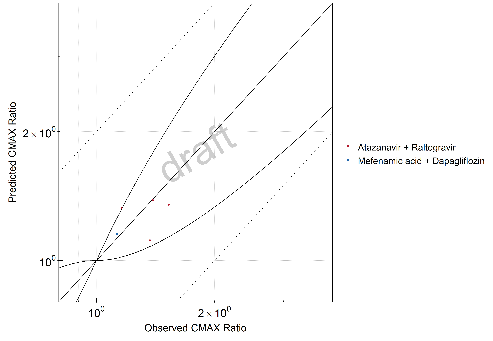

**Figure 2-7: UGT1A1 and UGT1A9 Inhibition DDI. Mechanism: Reversible Inhibition. Predicted vs. Observed CMAX Ratio. (&delta; = 1.4 in Guest *et al.* formula)**

 
 

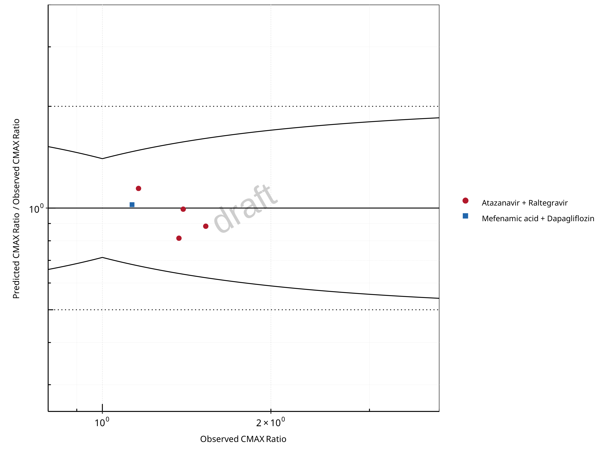

**Figure 2-8: UGT1A1 and UGT1A9 Inhibition DDI. Mechanism: Reversible Inhibition. Predicted/Observed vs. Observed CMAX Ratio. (&delta; = 1.4 in Guest *et al.* formula)**

 
 

**Table 2-5: GMFE for UGT1A1 and UGT1A9 Inhibition DDI Ratio**

|PK parameter |GMFE |
|:------------|:----|
|AUC          |1.13 |
|CMAX         |1.10 |

 
 

**Table 2-6: Summary table for UGT1A1 and UGT1A9 Inhibition DDI - AUC Ratio. (&delta; = 1 in Guest *et al.* formula)**

|AUC                          |Number |Ratio [%] |
|:----------------------------|:------|:---------|
|Points total                 |5      |-        |
|Points within Guest *et al.* |5      |100       |
|Points within 2 fold         |5      |100       |

 
 

**Table 2-7: Summary table for UGT1A1 and UGT1A9 Inhibition DDI - CMAX Ratio. (&delta; = 1.4 in Guest *et al.* formula)**

|CMAX                         |Number |Ratio [%] |
|:----------------------------|:------|:---------|
|Points total                 |5      |-        |
|Points within Guest *et al.* |5      |100       |
|Points within 2 fold         |5      |100       |

 
 

## 2.2 Perpetrator

### 2.2.1 Atazanavir

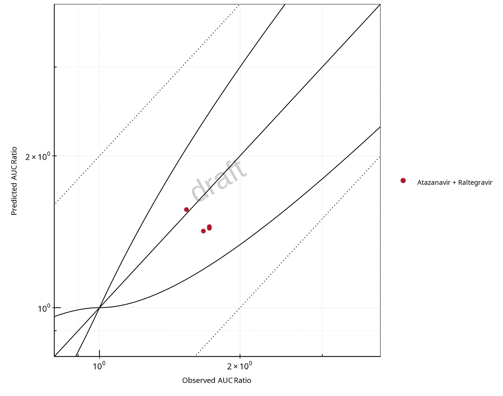

**Figure 2-9: UGT1A1 and UGT1A9 Inhibition DDI. Perpetrator: Atazanavir. Predicted vs. Observed AUC Ratio. (&delta; = 1 in Guest *et al.* formula)**

 
 

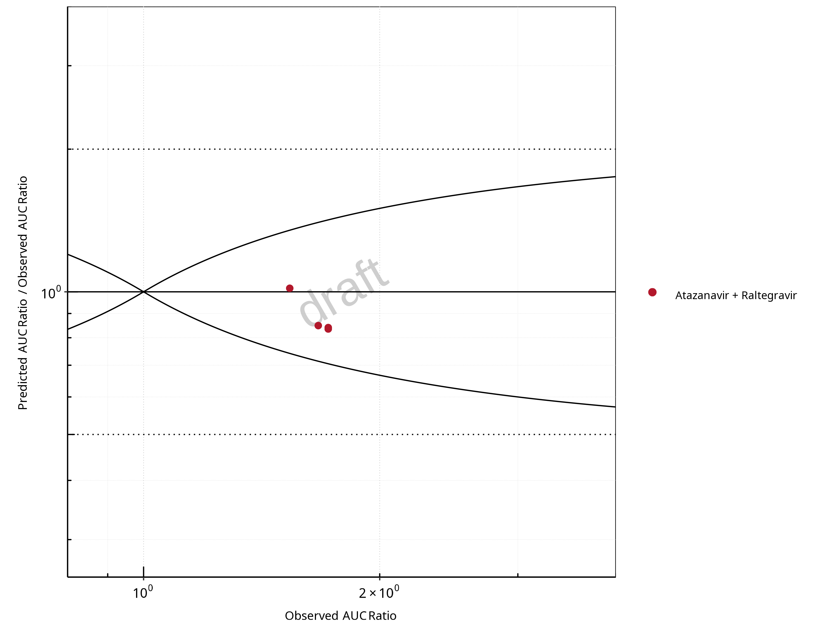

**Figure 2-10: UGT1A1 and UGT1A9 Inhibition DDI. Perpetrator: Atazanavir. Predicted/Observed vs. Observed AUC Ratio. (&delta; = 1 in Guest *et al.* formula)**

 
 

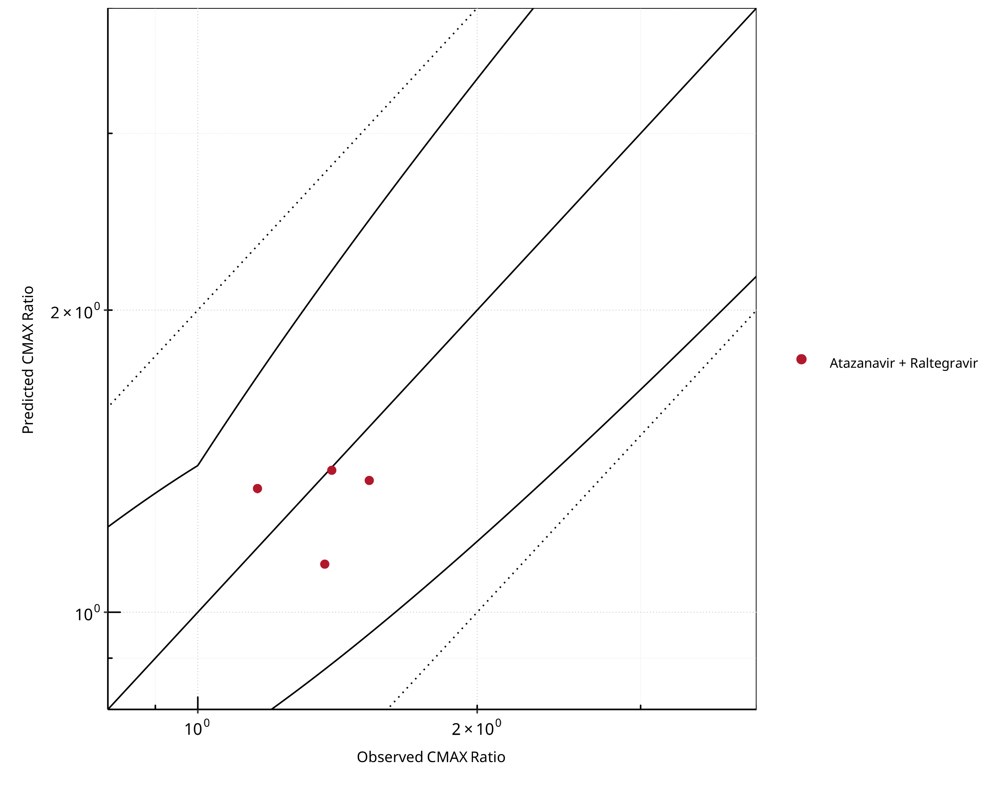

**Figure 2-11: UGT1A1 and UGT1A9 Inhibition DDI. Perpetrator: Atazanavir. Predicted vs. Observed CMAX Ratio. (&delta; = 1.4 in Guest *et al.* formula)**

 
 

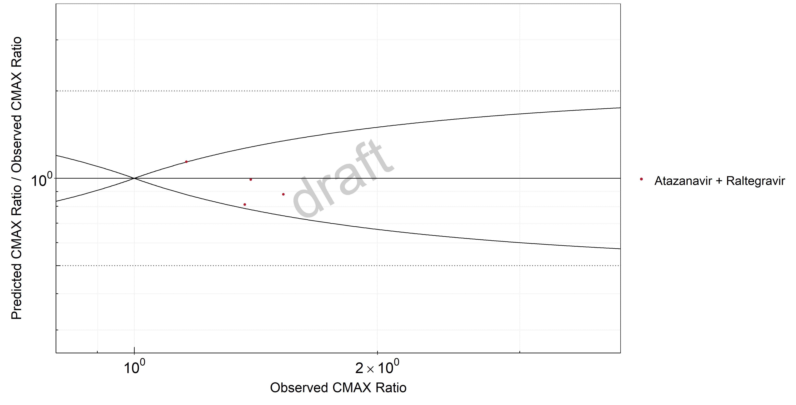

**Figure 2-12: UGT1A1 and UGT1A9 Inhibition DDI. Perpetrator: Atazanavir. Predicted/Observed vs. Observed CMAX Ratio. (&delta; = 1.4 in Guest *et al.* formula)**

 
 

**Table 2-8: GMFE for UGT1A1 and UGT1A9 Inhibition DDI Ratio**

|PK parameter |GMFE |
|:------------|:----|
|AUC          |1.14 |
|CMAX         |1.12 |

 
 

**Table 2-9: Summary table for UGT1A1 and UGT1A9 Inhibition DDI - AUC Ratio. (&delta; = 1 in Guest *et al.* formula)**

|AUC                          |Number |Ratio [%] |
|:----------------------------|:------|:---------|
|Points total                 |4      |-        |
|Points within Guest *et al.* |4      |100       |
|Points within 2 fold         |4      |100       |

 
 

**Table 2-10: Summary table for UGT1A1 and UGT1A9 Inhibition DDI - CMAX Ratio. (&delta; = 1.4 in Guest *et al.* formula)**

|CMAX                         |Number |Ratio [%] |
|:----------------------------|:------|:---------|
|Points total                 |4      |-        |
|Points within Guest *et al.* |4      |100       |
|Points within 2 fold         |4      |100       |

 
 

### 2.2.2 Mefenamic Acid

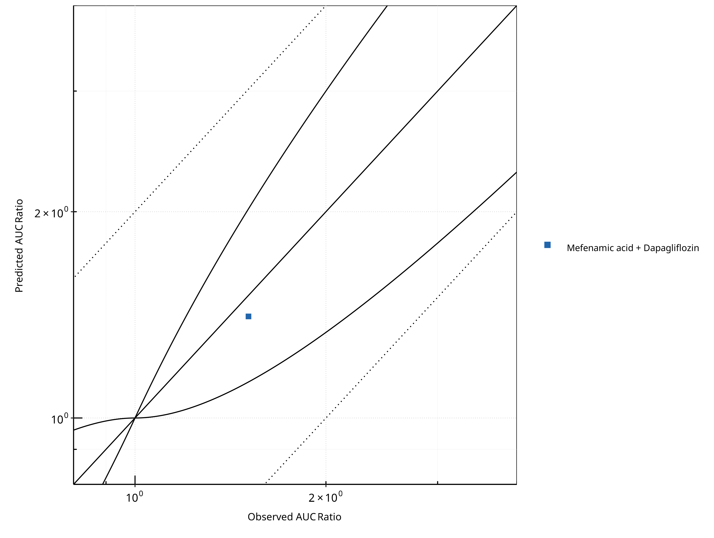

**Figure 2-13: UGT1A1 and UGT1A9 Inhibition DDI. Perpetrator: Mefenamic Acid. Predicted vs. Observed AUC Ratio. (&delta; = 1 in Guest *et al.* formula)**

 
 

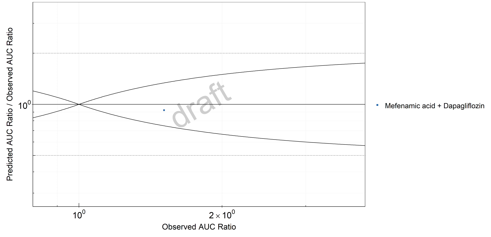

**Figure 2-14: UGT1A1 and UGT1A9 Inhibition DDI. Perpetrator: Mefenamic Acid. Predicted/Observed vs. Observed AUC Ratio. (&delta; = 1 in Guest *et al.* formula)**

 
 

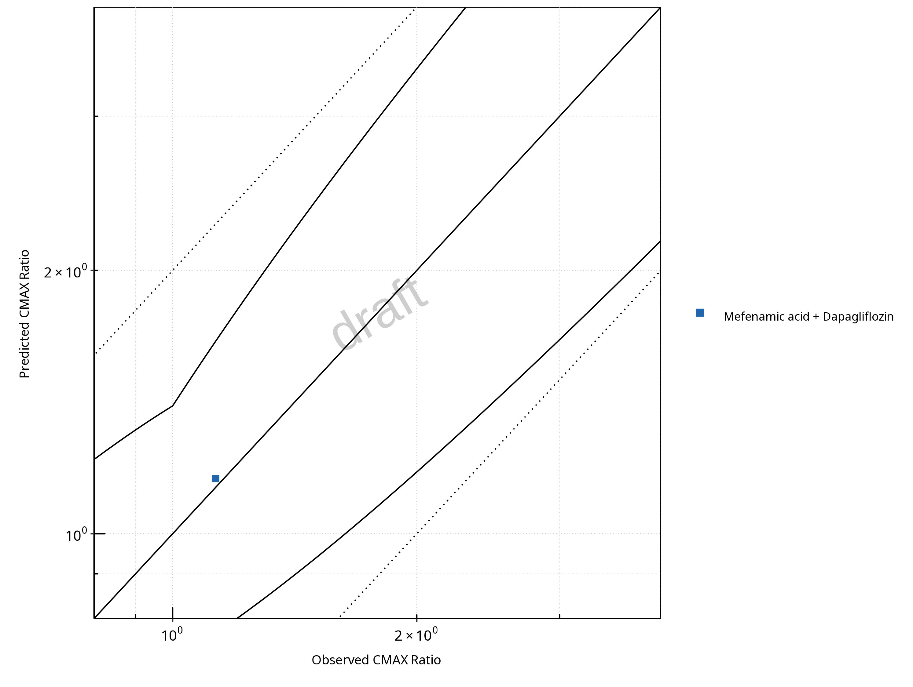

**Figure 2-15: UGT1A1 and UGT1A9 Inhibition DDI. Perpetrator: Mefenamic Acid. Predicted vs. Observed CMAX Ratio. (&delta; = 1.4 in Guest *et al.* formula)**

 
 

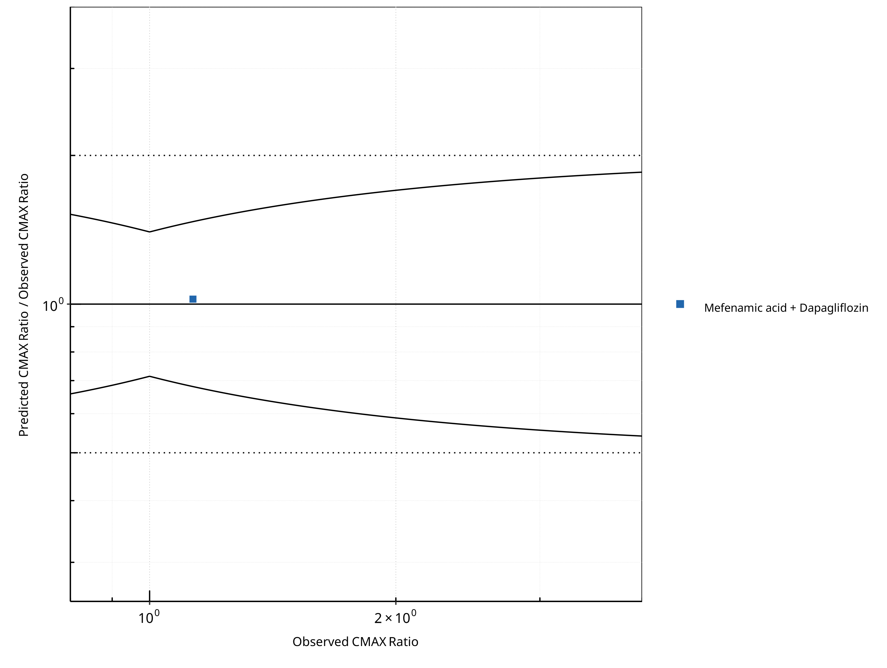

**Figure 2-16: UGT1A1 and UGT1A9 Inhibition DDI. Perpetrator: Mefenamic Acid. Predicted/Observed vs. Observed CMAX Ratio. (&delta; = 1.4 in Guest *et al.* formula)**

 
 

**Table 2-11: GMFE for UGT1A1 and UGT1A9 Inhibition DDI Ratio**

|PK parameter |GMFE |
|:------------|:----|
|AUC          |1.07 |
|CMAX         |1.02 |

 
 

**Table 2-12: Summary table for UGT1A1 and UGT1A9 Inhibition DDI - AUC Ratio. (&delta; = 1 in Guest *et al.* formula)**

|AUC                          |Number |Ratio [%] |
|:----------------------------|:------|:---------|
|Points total                 |1      |-        |
|Points within Guest *et al.* |1      |100       |
|Points within 2 fold         |1      |100       |

 
 

**Table 2-13: Summary table for UGT1A1 and UGT1A9 Inhibition DDI - CMAX Ratio. (&delta; = 1.4 in Guest *et al.* formula)**

|CMAX                         |Number |Ratio [%] |
|:----------------------------|:------|:---------|
|Points total                 |1      |-        |
|Points within Guest *et al.* |1      |100       |
|Points within 2 fold         |1      |100       |

 
 

## 2.3 Victim

### 2.3.1 Dapagliflozin

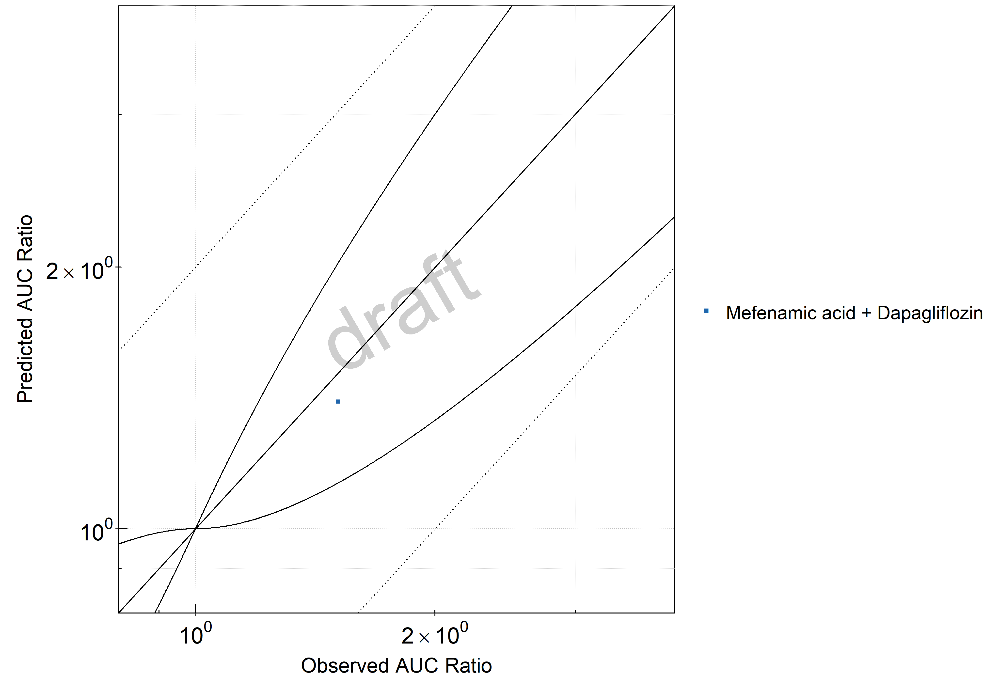

**Figure 2-17: UGT1A1 and UGT1A9 Inhibition DDI. Victim: Dapagliflozin. Predicted vs. Observed AUC Ratio. (&delta; = 1 in Guest *et al.* formula)**

 
 

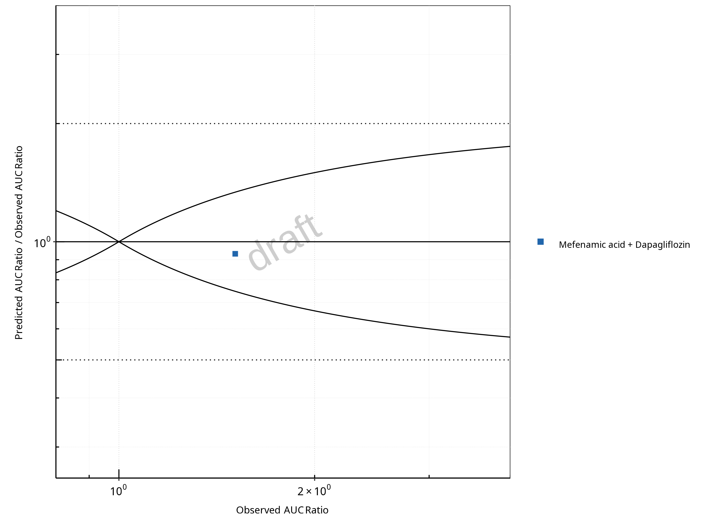

**Figure 2-18: UGT1A1 and UGT1A9 Inhibition DDI. Victim: Dapagliflozin. Predicted/Observed vs. Observed AUC Ratio. (&delta; = 1 in Guest *et al.* formula)**

 
 

**Figure 2-19: UGT1A1 and UGT1A9 Inhibition DDI. Victim: Dapagliflozin. Predicted vs. Observed CMAX Ratio. (&delta; = 1.4 in Guest *et al.* formula)**

 
 

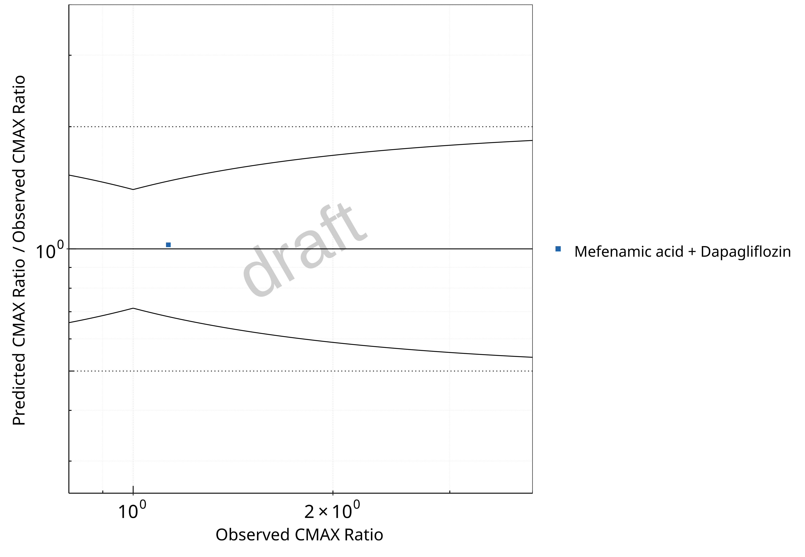

**Figure 2-20: UGT1A1 and UGT1A9 Inhibition DDI. Victim: Dapagliflozin. Predicted/Observed vs. Observed CMAX Ratio. (&delta; = 1.4 in Guest *et al.* formula)**

 
 

**Table 2-14: GMFE for UGT1A1 and UGT1A9 Inhibition DDI Ratio**

|PK parameter |GMFE |
|:------------|:----|
|AUC          |1.07 |
|CMAX         |1.02 |

 
 

**Table 2-15: Summary table for UGT1A1 and UGT1A9 Inhibition DDI - AUC Ratio. (&delta; = 1 in Guest *et al.* formula)**

|AUC                          |Number |Ratio [%] |
|:----------------------------|:------|:---------|
|Points total                 |1      |-        |
|Points within Guest *et al.* |1      |100       |
|Points within 2 fold         |1      |100       |

 
 

**Table 2-16: Summary table for UGT1A1 and UGT1A9 Inhibition DDI - CMAX Ratio. (&delta; = 1.4 in Guest *et al.* formula)**

|CMAX                         |Number |Ratio [%] |
|:----------------------------|:------|:---------|
|Points total                 |1      |-        |
|Points within Guest *et al.* |1      |100       |
|Points within 2 fold         |1      |100       |

 
 

### 2.3.2 Raltegravir

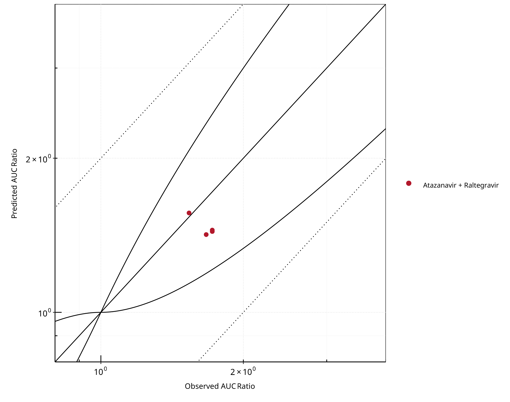

**Figure 2-21: UGT1A1 and UGT1A9 Inhibition DDI. Victim: Raltegravir. Predicted vs. Observed AUC Ratio. (&delta; = 1 in Guest *et al.* formula)**

 
 

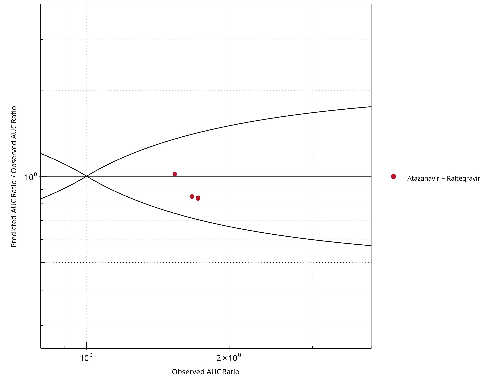

**Figure 2-22: UGT1A1 and UGT1A9 Inhibition DDI. Victim: Raltegravir. Predicted/Observed vs. Observed AUC Ratio. (&delta; = 1 in Guest *et al.* formula)**

 
 

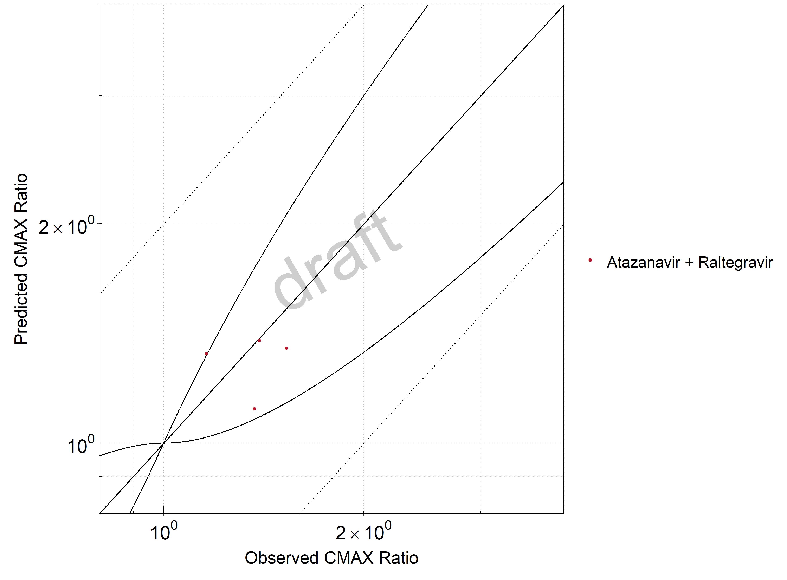

**Figure 2-23: UGT1A1 and UGT1A9 Inhibition DDI. Victim: Raltegravir. Predicted vs. Observed CMAX Ratio. (&delta; = 1.4 in Guest *et al.* formula)**

 
 

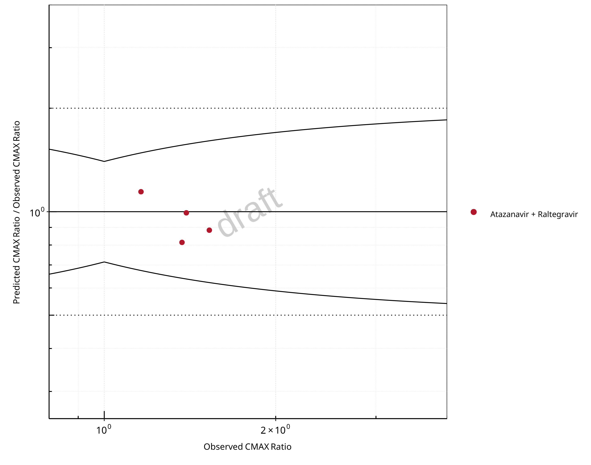

**Figure 2-24: UGT1A1 and UGT1A9 Inhibition DDI. Victim: Raltegravir. Predicted/Observed vs. Observed CMAX Ratio. (&delta; = 1.4 in Guest *et al.* formula)**

 
 

**Table 2-17: GMFE for UGT1A1 and UGT1A9 Inhibition DDI Ratio**

|PK parameter |GMFE |
|:------------|:----|
|AUC          |1.14 |
|CMAX         |1.12 |

 
 

**Table 2-18: Summary table for UGT1A1 and UGT1A9 Inhibition DDI - AUC Ratio. (&delta; = 1 in Guest *et al.* formula)**

|AUC                          |Number |Ratio [%] |
|:----------------------------|:------|:---------|
|Points total                 |4      |-        |
|Points within Guest *et al.* |4      |100       |
|Points within 2 fold         |4      |100       |

 
 

**Table 2-19: Summary table for UGT1A1 and UGT1A9 Inhibition DDI - CMAX Ratio. (&delta; = 1.4 in Guest *et al.* formula)**

|CMAX                         |Number |Ratio [%] |
|:----------------------------|:------|:---------|
|Points total                 |4      |-        |
|Points within Guest *et al.* |4      |100       |
|Points within 2 fold         |4      |100       |

 
 

# 3 Concentration-Time Profiles

The following section shows the correlations between observed and model-predicted AUC and Cmax ratios, respectively.

Specifically, the PBPK model performance for the PK parameters **AUC ratio (AUCR)** and **Cmax ratio (CMAXR)** is assessed via:

- predicted (*Pred*) vs. observed (*Obs*) plots

- *Pred*/*Obs* vs. *Obs* plots

- geometric mean fold error (GMFE):
  
  
  
- number of AUCR and CMAXR falling within 2-fold error range and within the limits as suggested by [Guest et al. 2011](#4-references)
  
- detailed table of results for each study

  

In the plots,

- the dotted lines denote 0.50–2.00 (2-fold) criterion,

- the solid lines denote the limits as suggested by [Guest et al. 2011](#4-references),

- the bold solid line denotes the unity line,

- each color represents one combination of drugs,

- squares represent studies with intravenous administration of the victim drug and circles represent studies with oral administration of the victim drug.

***

## 3.1 Atazanavir - Raltegravir DDI

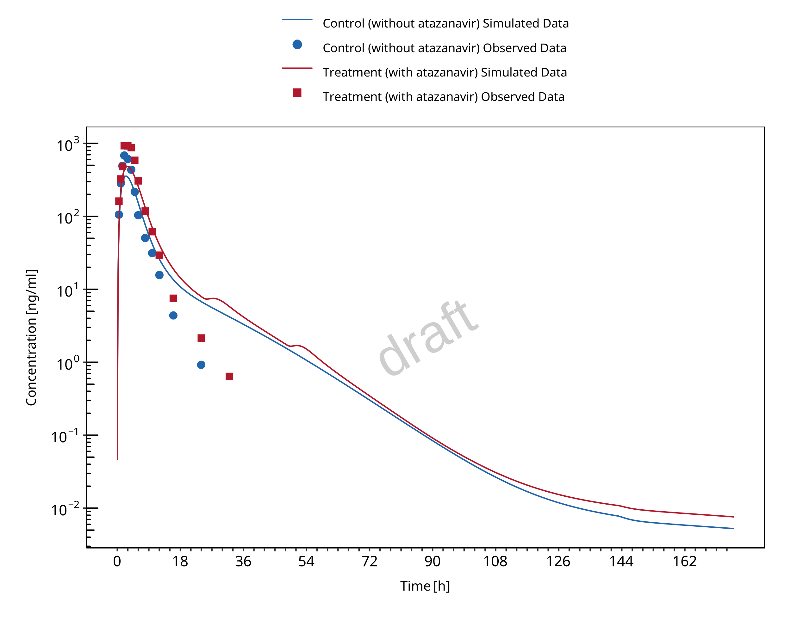

**Figure 3-1: Iwamoto 2008**

 
 

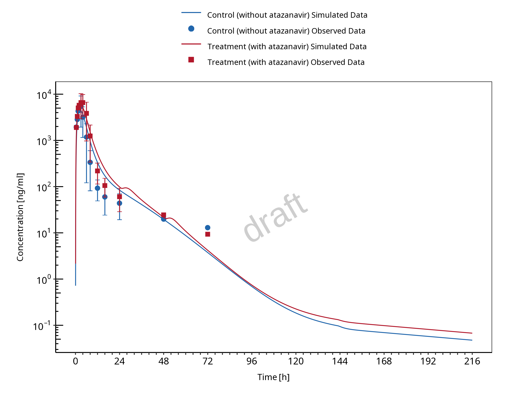

**Figure 3-2: Krishna 2016**

 
 

**Figure 3-3: Neely 2010**

 
 

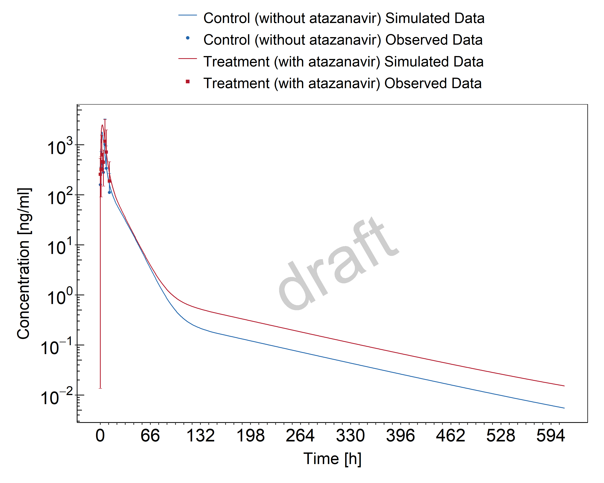

**Figure 3-4: Zhu 2010**

 
 

## 3.2 Mefenamic acid - Dapagliflozin DDI

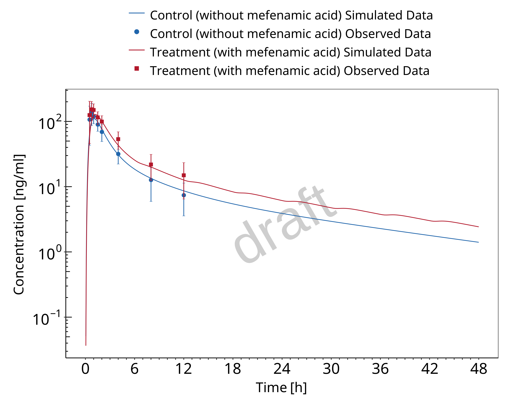

**Figure 3-5: Kasichayanula 2013a**

 
 

# 4 References

**Guest 2011** Guest EJ, Aarons L, Houston JB, Rostami-Hodjegan A, Galetin A. Critique of the twofold measure of prediction success for ratios: application for the assessment of drug-drug
interactions. Drug metabolism and disposition: the biological fate of chemicals. 2011;39(2):170-3

**Iwamoto 2008** Iwamoto M, Wenning LA, Mistry GC, Petry AS, Liou SY, Ghosh K, et al. Atazanavir modestly increases plasma levels of raltegravir in healthy subjects. Clinical infectious diseases :
an official publication of the Infectious Diseases Society of America. 2008;47(1):137-40.

**Kasichayanula 2013** Kasichayanula S, Liu X, Griffen SC, Lacreta FP, Boulton DW. Effects of
rifampin and mefenamic acid on the pharmacokinetics and pharmacodynamics of dapagliflozin.
Diabetes, obesity & metabolism. 2013;15(3):280-3. 	

**Krishna 2008** Krishna R, East L, Larson P, Valiathan C, Deschamps K, Luk JA, et al. Atazanavir
increases the plasma concentrations of 1200 mg raltegravir dose. Biopharmaceutics & drug
disposition. 2016;37(9):533-41.

**Neely 2010** Neely M, Decosterd L, Fayet A, Lee JS, Margol A, Kanani M, et al. Pharmacokinetics and pharmacogenomics of once-daily raltegravir and atazanavir in healthy volunteers.
Antimicrobial agents and chemotherapy. 2010;54(11):4619-25.

**Zhu 2010** Zhu L, Butterton J, Persson A, Stonier M, Comisar W, Panebianco D, et al.
Pharmacokinetics and safety of twice-daily atazanavir 300 mg and raltegravir 400 mg in healthy
individuals. Antiviral therapy. 2010;15(8):1107-14.

# 5 Appendix

## 5.1 Open Systems Pharmacology Suite (OSPS) Introduction

Open Systems Pharmacology Suite (OSP suite) is a tool for PBPK modeling and simulation of drugs in laboratory animals and humans. PK-Sim® and MoBi® are part of the OSP suite [[1](#references-for-osps-introduction)].  PK-Sim® is based on a generic PBPK-model with 18 organs and tissues. One of the main assumptions is that all compartments are well-stirred. Represented organs/tissues include arterial and venous blood, adipose tissue (separable adipose, excluding yellow marrow), brain, lung, bone (including yellow marrow), gonads, heart, kidneys, large intestine, liver, muscle, portal vein, pancreas, skin, small intestine, spleen and stomach, as shown in **Figure 1**.

Each organ consists of four sub-compartments namely the plasma, blood cells (which together build the vascular space), interstitial space, and cellular space. Distribution between the plasma and blood cells as well as between the interstitial and cellular compartments can be permeability-limited. In the brain, the permeation barrier is located between the vascular and the interstitial space. PK-Sim® estimates model parameters (intestinal permeability [[2](#references-for-osps-introduction)] organ partition coefficients (tissue-to-plasma partition coefficients) [[3,4](#references-for-osps-introduction)], and permeabilities) from physico-chemical properties of compounds (molecular weight, pKa, acid/base properties) and the composition of each tissue compartment (lipids, water and proteins). Partition coefficients can be calculated using a variety of methods available in PK-Sim®, for example the internal PK-Sim® method [[3,4](#references-for-osps-introduction)] or that of Rodgers and Rowland [[5-7](#references-for-osps-introduction)]. 

Physiological databases included in the software incorporate the dependencies of organ composition, organ weights, organ blood flows and gastrointestinal parameters (gastrointestinal length, radius of each section, intestinal surface area, gastrointestinal transit times, and pH in different intestinal segments [[2](#references-for-osps-introduction)]), with the user-defined body weight and height and ethnicity of the individual [[8](#references-for-osps-introduction)]. Thereby, PK Sim® allows generating realistic virtual populations. For a detailed description of the PBPK model structure implemented in PK Sim®, see Willmann et al. [[2,4,8,9](#references-for-osps-introduction)] or the OSP Suite homepage (<https://docs.open-systems-pharmacology.org/mechanistic-modeling-of-pharmacokinetics-and-dynamics/modeling-concepts>).

**Figure** **1: Structure of the Whole Body PBPK Model integrated in PK-Sim®**

## References for OSPS introduction

[1] [www.open-systems-pharmacology.org](http://www.open-systems-pharmacology.org/)

[2] [Willmann S, Schmitt W, Keldenich J, Lippert J, Dressman JB. A physiological model for the estimation of the fraction dose absorbed in humans.J Med Chem. 2004 Jul 29;47(16):4022-31.](https://www.ncbi.nlm.nih.gov/pubmed/15267240)

[3] [Haerter MW, K.J., Schmitt W, *Estimation of physicochemical and ADME parameters.* , in *Handbook of Combinatorial Chemistry: Drugs, Catalysts, Materials*, H.W. Nicolaou KC HR, Editor. 2002, Wiley VCH Verlag GmbH: Weinheim, Germany. p. 743-60.](https://onlinelibrary.wiley.com/doi/pdf/10.1002/3527603034.ch26)

[4] [Willmann S, Lippert J, Schmitt W. From physicochemistry to absorption and distribution: predictive mechanistic modelling and computational tools. Expert Opin Drug Metab Toxicol. 2005 Jun;1(1):159-68.](https://www.ncbi.nlm.nih.gov/pubmed/16922658)

[5] [Rodgers, T, D. Leahy, and M. Rowland. Physiologically based pharmacokinetic modeling 1: predicting the tissue distribution of moderate-to-strong bases. J Pharm Sci. 2005 Jun;94(6):1259-76.](https://www.ncbi.nlm.nih.gov/pubmed/15858854)

[6] [Rodgers T, Rowland M. Physiologically based pharmacokinetic modelling 2: predicting the tissue distribution of acids, very weak bases, neutrals and zwitterions. J Pharm Sci. 2006 Jun;95(6):1238-57.](https://www.ncbi.nlm.nih.gov/pubmed/16639716)

[7] [Rodgers T, Rowland M. Mechanistic approaches to volume of distribution predictions: understanding the processes. Pharm Res. 2007 May;24(5):918-33.](https://www.ncbi.nlm.nih.gov/pubmed/17372687)

[8] [Willmann S, Höhn K, Edginton A, Sevestre M, Solodenko J, Weiss W, Lippert J, Schmitt W. Development of a physiology-based whole-body population model for assessing the influence of individual variability on the pharmacokinetics of drugs. J Pharmacokinet Pharmacodyn. 2007 Jun;34(3):401-31.](https://www.ncbi.nlm.nih.gov/pubmed/17431751)

[9] [Willmann S, Lippert J, Sevestre M, Solodenko J, Fois F, Schmitt W. PK-Sim®: a physiologically based pharmacokinetic ‘whole-body’ model. Biosilico 2003.1(4):121-24.](https://www.sciencedirect.com/science/article/pii/S1478538203023424?via%3Dihub)

## 5.2 Mathematical Implementation of Drug-Drug Interactions

**DDI modeling: Competitive inhibition** 

A detailed representation of the mathematical implementation of competitive enzyme inhibition  can be found in the OSP manual [here](https://docs.open-systems-pharmacology.org/working-with-pk-sim/pk-sim-documentation/pk-sim-compounds-defining-inhibition-induction-processes#competitive-inhibition-simple-setting-with-one-inhibitor).

**DDI modeling: Mechanism-based inhibition**

A detailed representation of the mathematical implementation of mechanism-based enzyme inhibition  can be found in the OSP manual [here](https://docs.open-systems-pharmacology.org/working-with-pk-sim/pk-sim-documentation/pk-sim-compounds-defining-inhibition-induction-processes#irreversible-inhibition).

**DDI modeling: Induction**

A detailed representation of the mathematical implementation of enzyme induction can be found in the OSP manual [here](https://docs.open-systems-pharmacology.org/working-with-pk-sim/pk-sim-documentation/pk-sim-compounds-defining-inhibition-induction-processes#enzyme-induction).

## 5.3 Automatic (re)-qualification workflow

[Open Systems Pharmacology](http://www.open-systems-pharmacology.org) provides a dynamic landscape of model repositories and a database of observed clinical data. Additionally, a technical framework to assess confidence of a specific intended use has been developed (qualification runner and reporting engine). This framework allows for an automatic (re)-qualification workflow of the OSP suite, comprising the following steps (**Figure 1**):

- PBPK model development and verification with observed data,

- Qualification plan generation,

- Qualification plan execution,

- Qualification report generation.

  

**Figure 1: OSP suite automatic (re)-qualification workflow**

In a first step, the respective qualification scenario is saved in a special qualification repository on [GitHub](https://github.com/Open-Systems-Pharmacology/). This qualification scenario repository contains a detailed qualification plan that links and combines respective models and data to address the use case that shall be qualified. Therefore, the qualification plan consists of: 

- PK-Sim project files,
- Additional model building steps (if applicable),
- Description of potential cross-dependencies between PK-Sim project files (if applicable),
- Observed data (needed for model development and verification),
- Qualification scenario description text modules
- Detailed report settings to describe the generation of charts and qualification measures. 

PK-Sim projects, observed data sets, and qualification scenario text modules are deposited in distinct repositories and are referenced by the qualification plan (**Figure 2**).

**Figure 2: Qualification scenario repository landscape on GitHub**

In a second step the [qualification runner](https://github.com/Open-Systems-Pharmacology/QualificationRunner) processes the qualification plan, i.e. all project parts are exported and prepared for the [reporting engine](https://github.com/Open-Systems-Pharmacology/Reporting-Engine). The reporting engine provides a validated environment (currently implemented in MATLAB®, a transfer to R is in development) for model execution and finally generates the qualification report. This report contains the evaluation of the individual PBPK models with observed data (i.e. standard goodness of fit plots, visual predictive checks) and a comprehensive qualification of the specific use case assessing the predictive performance of the OSP suite by means of a predefined set of qualification measures and charts. 

The automated execution of the described workflow can be triggered to assess re-qualification in case new data, changes in model structure or parameterization, or new OSP suite releases arise.

