# Building and evaluation of a PBPK model for domain antibody dAb2 in mice

| Version                                         | 1.0-OSP12.3                                                   |
| ----------------------------------------------- | ------------------------------------------------------------ |
| based on *Model Snapshot* and *Evaluation Plan* | https://github.com/Open-Systems-Pharmacology/dAb2-Model/releases/tag/v1.0 |
| OSP Version                                     | 12.3                                                          |
| Qualification Framework Version                 | 3.2                                                          |

This evaluation report and the corresponding PK-Sim project file are filed at:

https://github.com/Open-Systems-Pharmacology/OSP-PBPK-Model-Library/

# Table of Contents

 * [1 Introduction](#introduction)
 * [2 Methods](#methods)
   * [2.1 Modeling Strategy](#modeling-strategy)
   * [2.2 Data](#methods-data)
     * [2.2.1 In vitro / physico-chemical Data ](#invitro-and-physico-chemical-data)
     * [2.2.2 PK Data ](#PK-data)
   * [2.3 Model Parameters and Assumptions](#model-parameters-and-assumptions)
     * [2.3.1 Absorption ](#model-parameters-and-assumptions-absorption)
     * [2.3.2 Distribution ](#model-parameters-and-assumptions-distribution)
     * [2.3.3 Metabolism and Elimination ](#model-parameters-and-assumptions-metabolism-and-elimination)
     * [2.3.4 Tissue Concentrations ](#model-parameters-and-assumptions-tissue-concentrations)
     * [2.3.5 Automated Parameter Identification ](#model-parameters-and-assumptions-parameter-identification)
 * [3 Results and Discussion](#results-and-discussion)
   * [3.1 Final input parameters](#final-input-parameters)
   * [3.2 Diagnostics Plots](#diagnostics-plots)
   * [3.3 Concentration-Time Profiles](#ct-profiles)
 * [4 Conclusion](#conclusion)
 * [5 References](#main-references)

# 1 Introduction

The dAb2 domain antibody is a fusion protein consisting of a VH (heavy chain) and a Vk (light chain) antibody fragment without known binding affinity which was used to a develop a PBPK model  ([Sepp2015](#5-references)). 

Since the dAb2 is smaller than antibodies, the PK data (blood and tissue concentration–time profiles in mice)  ([Sepp2015](#5-references)) were also used  together with pharmacokinetic (PK) data from 5 other compounds to identify unknown parameters during the development of the generic large molecule physiologically based pharmacokinetic (PBPK) model in PK-Sim ([Niederalt 2018](#5-references)). 

The herein presented evaluation report evaluates the performance of the PBPK model for dAb2 in mice for the PK data used for the development of the generic large molecule model in PK-Sim.

The presented dAb2 PBPK model as well as the respective evaluation plan and evaluation report are provided open-source (https://github.com/Open-Systems-Pharmacology/dAb2-Model)

# 2 Methods

## 2.1 Modeling Strategy

The development of the large molecule PBPK model in PK-Sim® has previously been described by Niederalt et al. ([Niederalt 2018](#5-references)). In short, the model was built as an extension of the PK-Sim® model for small molecules incorporating (i) the two-pore formalism for drug extravasation from blood plasma to interstitial space, (ii) lymph flow, (iii) endosomal clearance and (iv) protection from endosomal clearance by neonatal Fc receptor (FcRn) mediated recycling. 

For model development and evaluation, PK data were used from compounds with a wide range of solute radii and from different species. The PK data used for parameter estimation were from the following compounds:  antibody–drug conjugate BAY 79-4620 in mice (Bayer in house data),  antibody 7E3 in wild-type and FcRn knockout mice  ([Garg 2007](#5-references), [Garg2009](#5-references)), domain antibody dAb2 in mice ([Sepp 2015](#5-references)), antibodies MEDI-524 and MEDI-524-YTE in monkeys ([Dall'Acqua 2006](#5-references)), and antibody CDA1 in humans ([Taylor 2008](#5-references)). The PK data used for model evaluation were from inulin in rats  ([Tsuji1983](#5-references)) and tefibazumab in humans ([Reilly 2005](#5-references)).  

The PBPK model including the estimated physiological parameters as described by Niederalt et al. ([Niederalt 2018](#5-references)) is available in the Open Systems Pharmacology Suite from version 7.1 onwards.

This evaluation report focuses on the PBPK model for the domain antibody dAb2.

Details about input data (physicochemical, *in vitro* and PK) can be found in  [Section 2.2](#22-data).

Details about the structural model and its parameters can be found in  [Section 2.3](#23-model-parameters-and-assumptions).

## 2.2 Data

### 2.2.1 In vitro / physico-chemical Data 

A literature search was performed to collect available information on physicochemical properties of dAb2. The obtained information from literature is summarized in the table below. 

| **Parameter** | **Unit** | **Value** | Source                    | **Description**                                              |
| :------------ | -------- | --------- | ------------------------- | ------------------------------------------------------------ |
| MW            | g/mol    | 25600     | [Sepp2015](#5-references) | Molecular weight                                             |
| r             | nm       | 2.43      | calculated   from MW      | Hydrodynamic solute radius. Calculated by empirical equation given in [Niederalt2018](#5-references), supplemental material |
| Kd (FcRn)     | µM       | 999,999   |                           | high value representing no FcRn binding                      |

### 2.2.2 PK Data 

Published plasma and tissue PK data on dAb2 in mice were used.

| Publication               | Description                                                  |
| :------------------------ | :----------------------------------------------------------- |
| [Sepp2015](#5-references) | Plasma and tissue PK data after an intravenous dose of dose of 10 mg/kg in mice. Tissue concentrations were analyzed using quantitative whole-body autoradiography. The concentrations were reported as percentage of injected dose / g tissue. These values were converted to concentrations in µg/ml assuming a density of 1 g/ml for all tissues except for bone for which a density of 1.5 g/ml was assumed (as in Ref. [Baxter 1994](#5-references)). Furthermore, a body weight of 29 g (i.e. a dose of  290 µg) was assumed for unit conversion of the experimental concentrations (body weight range reported: 26-33 g). |

## 2.3 Model Parameters and Assumptions

### 2.3.1 Absorption 

There is no absorption process since dAb2 was administered intravenously.

### 2.3.2 Distribution 

The standard lymph and fluid recirculation flow rates and the standard vascular properties of the different tissues (hydraulic conductivity, pore radii, fraction of flow via large pores) from PK-Sim were  used. dAb2, among other compounds, has been used to identify these lymph and fluid recirculation flow rates used in PK-Sim ([Niederalt 2018](#5-references)). 

### 2.3.3 Metabolism and Elimination 

dAb2 is predominantly renally eliminated by glomerular filtration ([Sepp 2015](#5-references)). Due to the molecular size of dAb2 the glomerular filtration is hindered and the glomerular filtration fraction was fitted. While being only of minor importance, the endosomal clearance process is present. The standard physiological parameters related to endosomal clearance were used (assuming no binding to FcRn). 

### 2.3.4 Tissue Concentrations 

For the comparison with experimental data, the parameters `Fraction of blood for sampling` used in the Observer for the tissue concentrations were set for all organs to 0.42 for comparison with autoradiography data according to the fit results (across compounds) in Ref. ([Niederalt 2018](#5-references)). (The parameter `Fraction of blood for sampling` specifies residual blood in tissue as ratio of blood volume contributing to the measured tissue concentration to the total in vivo capillary blood volume.)

In the present evaluation report, the experimental gut concentrations were compared to simulated organ concentrations for small and large intestine separately in the goodness of fit plots as well as in the concentration-time profile plot.

### 2.3.5 Automated Parameter Identification 

The table shows the parameter values that were specified in the model based on the parameter identification reported in Ref. ([Niederalt 2018](#5-references)), and which were not included in the PK-Sim database since version 7.1.

| Model Parameter                                              | Optimized Value | Unit |
| ------------------------------------------------------------ | --------------- | ---- |
| `GFR fraction` (glomerular filtration rate fraction)         | 0.24            | -    |
| `Fraction of blood for sampling` (all organs) - for comparison with autoradiography data | 0.42            |      |

# 3 Results and Discussion

The PBPK model for dAb2 was evaluated with blood and tissue PK data in mice.

These PK data (except for kidney) have been used together with PK data from 5 other compounds to simultaneously identify parameters during the development of the generic model for proteins and large molecules in PK-Sim ([Niederalt 2018](#5-references)).

As expected, the kidney concentrations are considerably underestimated by the PBPK simulations. In the present PBPK model, the kidney has the same organ model structure as other organs. Thus, drug within the tubular fluid does not account to total kidney concentrations. Drug in tubular fluid is relevant for small proteins which are renally cleared by glomerular filtration. For these proteins, the representation of the kidney has to be extended in order to describe total kidney concentrations, see e.g. Sepp et. al. 2015 ([Sepp 2015](#5-references)). 

The next sections show:

1. the final model parameters for the building blocks: [Section 3.1](#final-input-parameters).
2. the overall goodness of fit: [Section 3.2](#diagnostics-plots).
3. simulated vs. observed concentration-time profiles for the clinical studies used for model building and for model verification: [Section 3.3](#ct-profiles).

## 3.1 Final input parameters

The compound parameter values of the final PBPK model are illustrated below.

### Compound: dAb2

#### Parameters

Name                                       | Value        | Value Origin                                  | Alternative | Default
------------------------------------------ | ------------ | --------------------------------------------- | ----------- | -------
Solubility at reference pH                 | 9999 mg/l    | Other-/Dummy value not used in the simulation | Measurement | True   
Reference pH                               | 7            | Other-/Dummy value not used in the simulation | Measurement | True   
Lipophilicity                              | -5 Log Units | Other-/Dummy value not used in the simulation | Measurement | True   
Fraction unbound (plasma, reference value) | 1            | Other-Assumption                              | Measurement | True   
Is small molecule                          | No           |                                               |             |        
Molecular weight                           | 25600 g/mol  | Publication-Sepp2015                          |             |        
Plasma protein binding partner             | Unknown      |                                               |             |        

#### Calculation methods

Name                    | Value          
----------------------- | ---------------
Partition coefficients  | PK-Sim Standard
Cellular permeabilities | PK-Sim Standard

#### Processes

##### Systemic Process: Glomerular Filtration-GFR

Species: Mouse

###### Parameters

Name         | Value | Value Origin            
------------ | -----:| ------------------------
GFR fraction |  0.24 | Parameter Identification

## 3.2 Diagnostics Plots

Below you find the goodness-of-fit visual diagnostic plots for the PBPK model performance of all data used presented in [Section 2.2.2](#PK-data).

The first plot shows observed versus simulated plasma concentration, the second weighted residuals versus time. 

**Table 3-1: GMFE for Goodness of fit plot for concentration in blood and tissues**

|Group                                           |GMFE  |
|:-----------------------------------------------|:-----|
|Blood and tissue concentrations - except kidney |1.89  |
|Kidney tissue concentrations                    |23.23 |
|All                                             |2.29  |

 
 

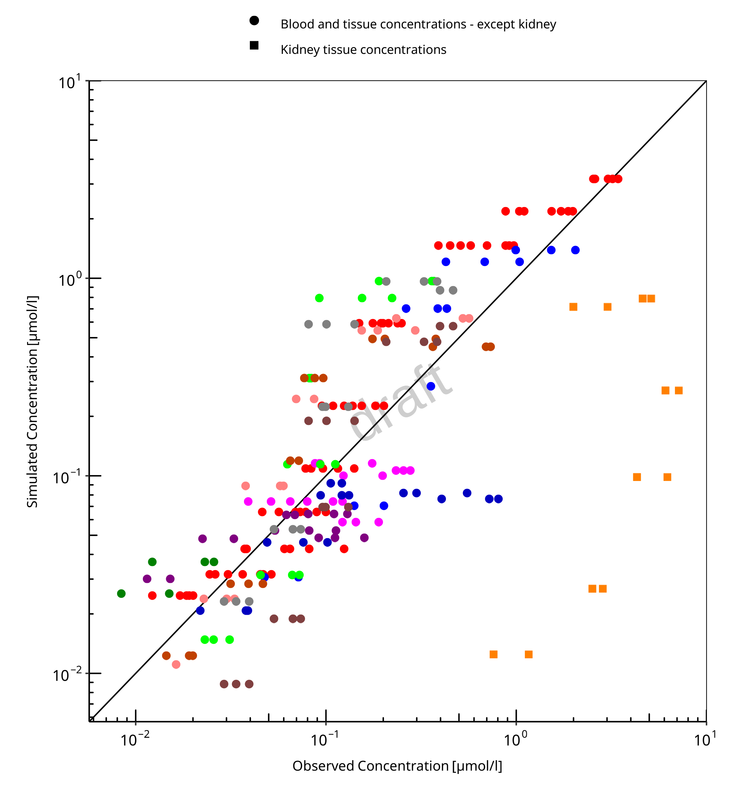

**Figure 3-1: Goodness of fit plot for concentration in blood and tissues**

 
 

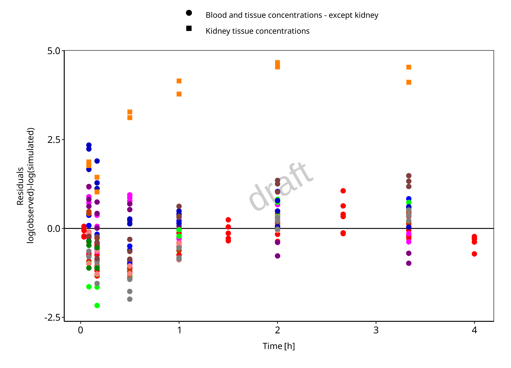

**Figure 3-2: Goodness of fit plot for concentration in blood and tissues**

 
 

## 3.3 Concentration-Time Profiles

Simulated versus observed concentration-time profiles of all data listed in [Section 2.2.2](#PK-data) are presented below.

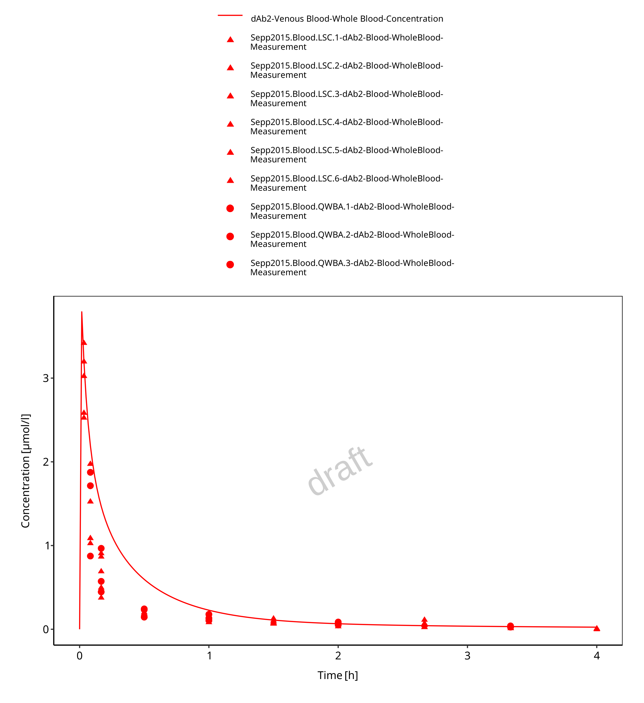

**Figure 3-3: Blood - lin scale**

 
 

**Figure 3-4: Blood - log scale**

 
 

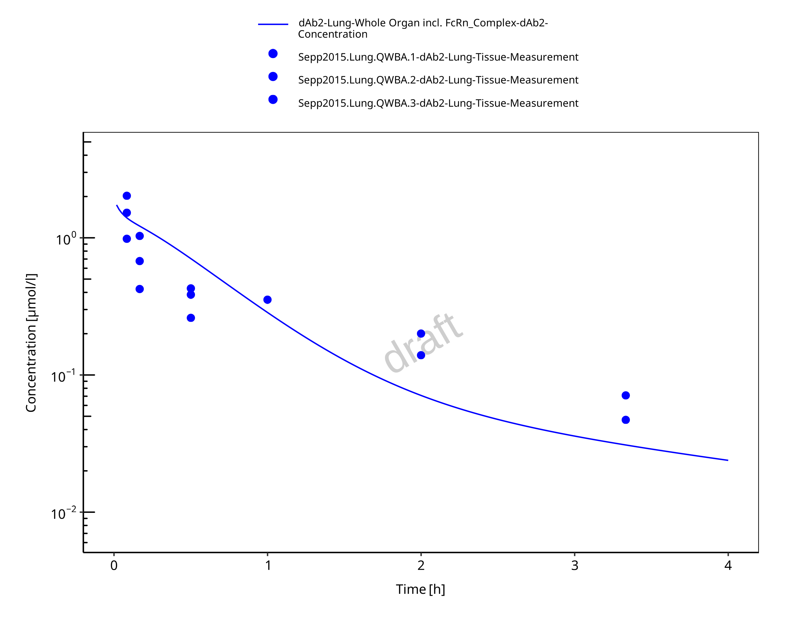

**Figure 3-5: Lung**

 
 

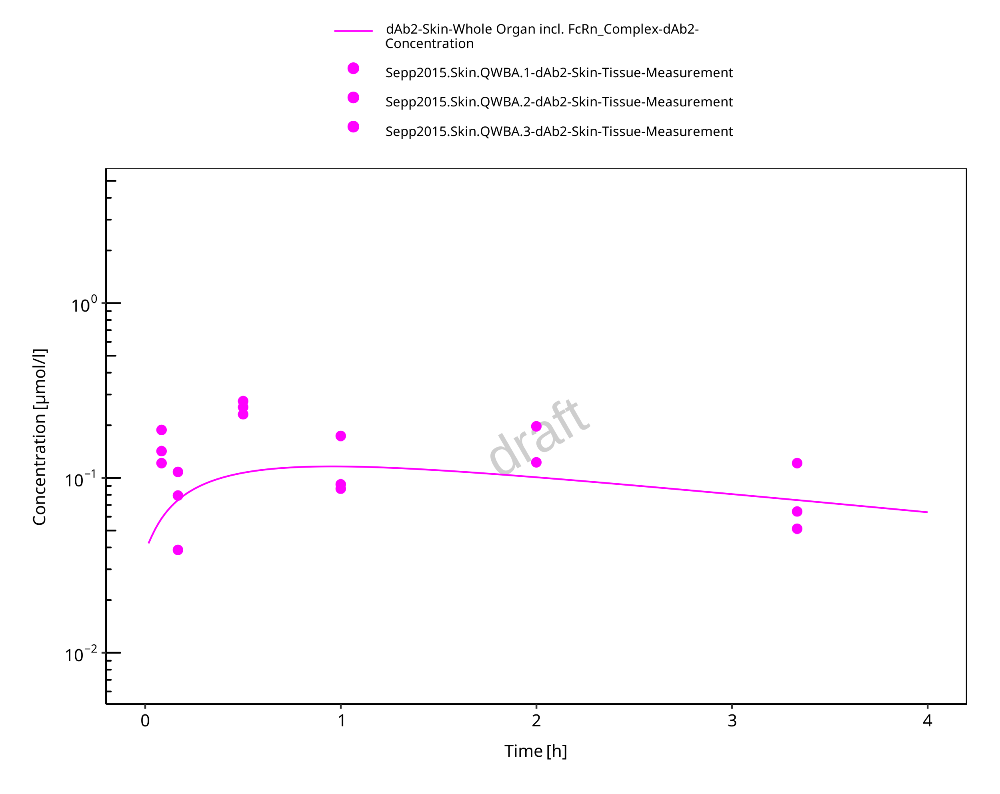

**Figure 3-6: Skin**

 
 

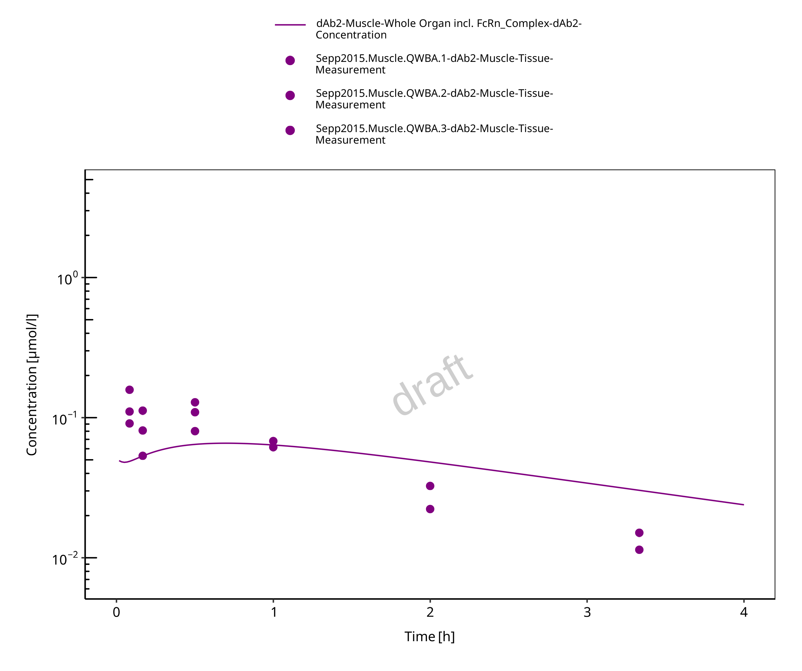

**Figure 3-7: Muscle**

 
 

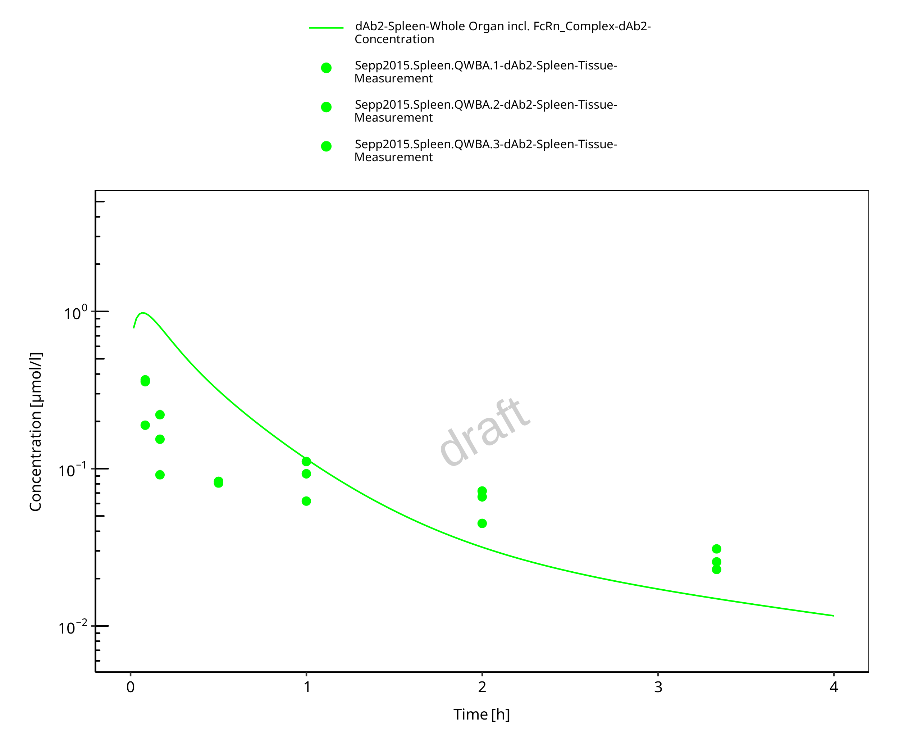

**Figure 3-8: Spleen**

 
 

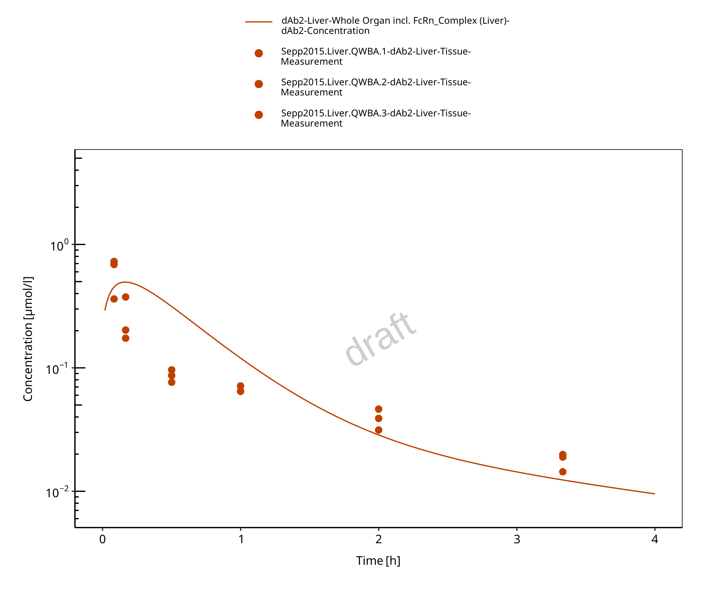

**Figure 3-9: Liver**

 
 

**Figure 3-10: Heart**

 
 

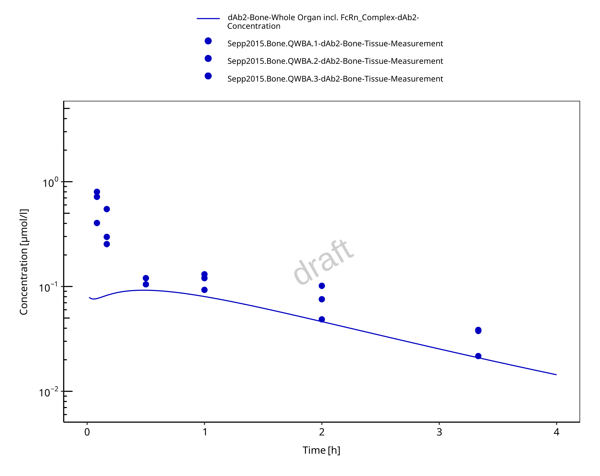

**Figure 3-11: Bone**

 
 

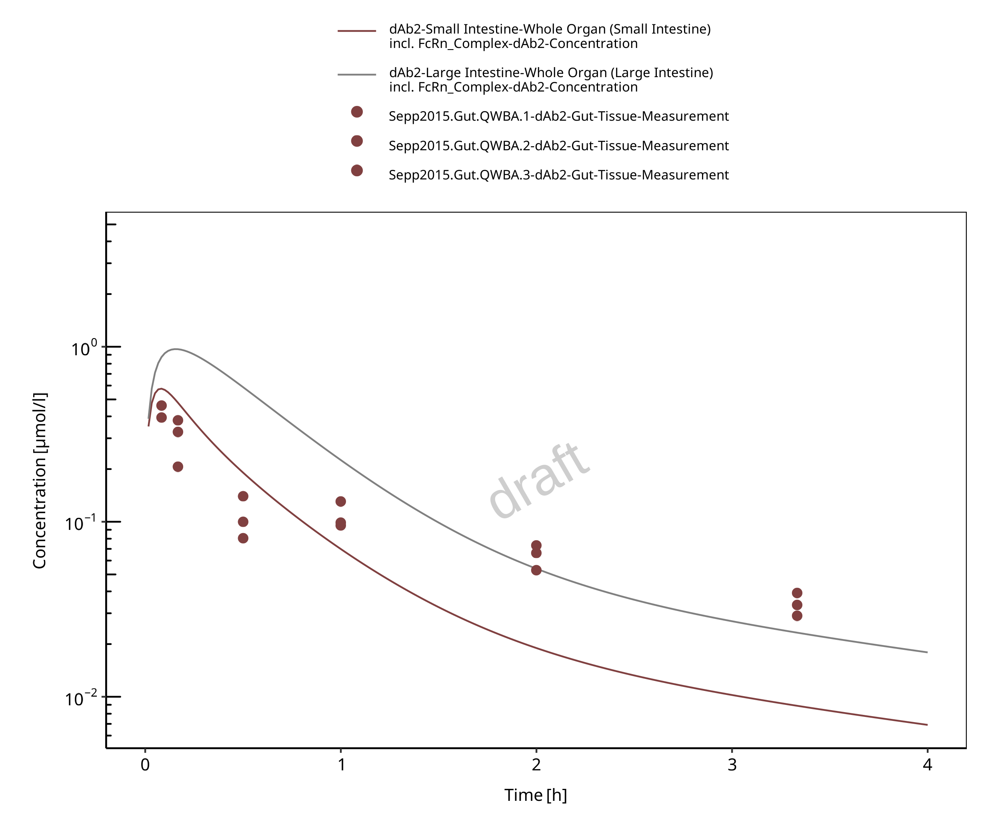

**Figure 3-12: Intestine**

 
 

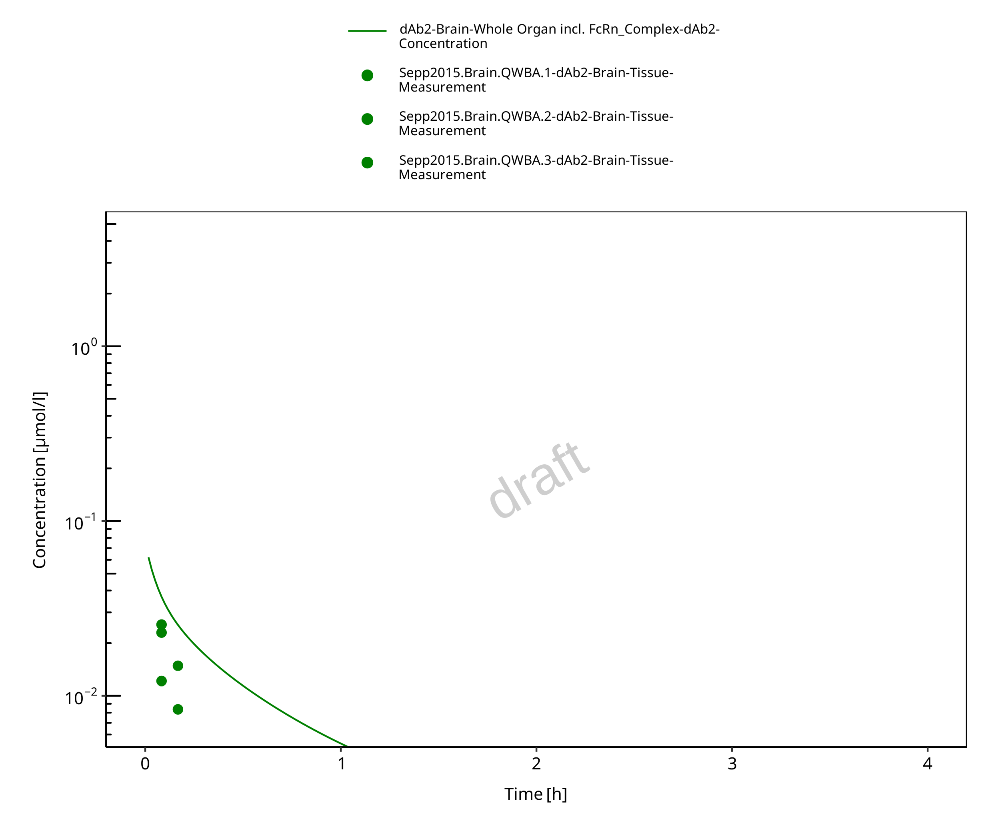

**Figure 3-13: Brain**

 
 

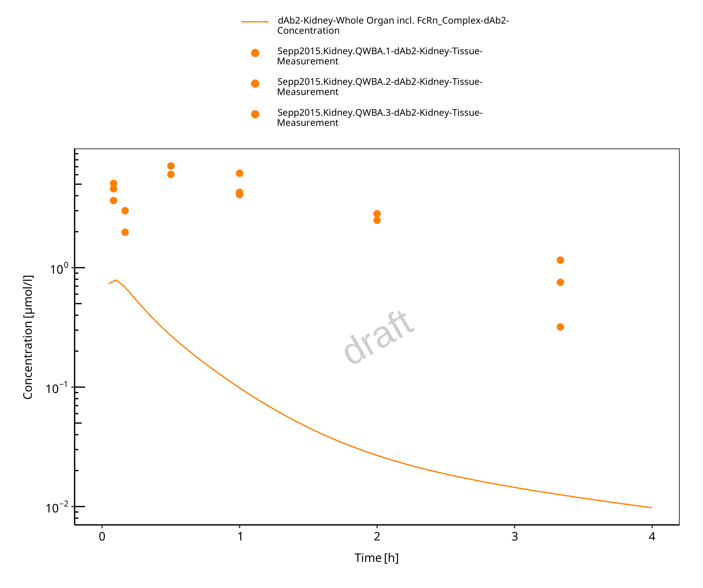

**Figure 3-14: Kidney - log scale**

 
 

# 4 Conclusion

The herein presented PBPK model overall adequately describes the pharmacokinetics of a domain antibody dAb2  in mice - except for kidney concentrations. Total kidney concentrations cannot be described by the standard kidney representation of PK-Sim for renally excreted biologics, since drug within the tubular fluid is not represented in the organ concentration. Apart from kidney, the largest deviations between measured and simulated concentration-time profiles are observed for spleen for which the initial concentrations are overestimated by the model and bone for which the initial concentrations are underestimated. 

The PK data of dAb2 (except kidney concentrations) had been used during the development of the generic large molecule PBPK model in PK-Sim ([Niederalt 2018](#5-references)) together with PK data from 5 other compounds (7E3, BAY 79-4620, CDA1, MEDI-524 & MEDI-524-YTE). 

# 5 References

**Dall'Acqua 2006** Dall’Acqua WF, Kiener PA, Wu H. Properties of human IgG1s engineered for enhanced binding to the neonatal Fc receptor (FcRn). J Biol Chem. 2006 Aug; 281(33):23514-23524. doi: 10.1074/jbc.M604292200.

**Garg 2007** Garg A, Balthasar JP. Physiologically-based pharmacokinetic (PBPK) model to predict IgG tissue kinetics in wild-type and FcRn-knockout mice. J Pharmacokinet Pharmacodyn. 2007 Jul; 34(5):687-709. doi: 10.1007/s10928-007-9065-1. 

**Garg 2009** Garg A, Balthasar J. Investigation of the influence of FcRn on the distribution of IgG to the brain. AAPS J. 2009 July; 11(3):553-557. doi: 10.1208/s12248-009-9129-9. 

**Lobo 2004** Lobo ED, Hansen R J, Balthasar JP.  Antibody pharmacokinetics and pharmacodynamics. J Pharm Sci. 2004 Nov;93(11):2645-2668. doi: 10.1002/jps.20178.

**Niederalt 2018** Niederalt C, Kuepfer L, Solodenko J, Eissing T, Siegmund HU, Block M, Willmann S, Lippert J. A generic whole body physiologically based pharmacokinetic model for therapeutic proteins in PK-Sim. J Pharmacokinet Pharmacodyn. 2018 Apr;45(2):235-257. doi: 10.1007/s10928-017-9559-4.

**Reilly 2005** Reilley S, Wenzel E, Reynolds L, Bennett B, Patti JM, Hetherington S. Open-label, dose escalation study of the safety and pharmacokinetic profile of tefibazumab in healthy volunteers. Antimicrob Agents Chemother. 2005 Mar;49(3):959–962. doi: 10.1128/AAC.49.3.959-962.2005.

**Sepp 2015** Sepp A, Berges A, Sanderson A, Meno-Tetang G. Development of a physiologically based pharmacokinetic model for a domain antibody in mice using the two-pore theory. J Pharmacokinet Pharmacodyn. 2015 Jan;42(2):97-109. doi: 10.1007/s10928-014-9402-0.

**Taylor 1984** Taylor AE, Granger DN. Exchange of macromolecules across the microcirculation. Handbook of Physiology - Cardiovascular System. Microcirculation (Eds. Renkin EM and Michel CC. Bethesda, MD, American Physiological Society). 1984; Vol. 4(Pt 2):467–520.

**Taylor 2008** Taylor CP, Tummala S, Molrine D, Davidson L, Farrell RJ, Lembo A, Hibberd PL, Lowy I, Kelly CP. Open-label, dose escalation phase I study in healthy volunteers to evaluate the safety and pharmacokinetics of a human monoclonal antibody to Clostridium difficile toxin A. Vaccine. 2008 Jun;26(27-28):3404–3409. doi: 10.1016/j.vaccine.2008.04.042.

**Tsuji 1983** Tsuji A, Yoshikawa T, Nishide K, Minami H, Kimura M, Nakashima E, Terasaki T, Miyamoto E, Nightingale CH, Yamana T. Physiologically based pharmacokinetic model for beta-lactam antibiotics I: tissue distribution and elimination in rats. J Pharm Sci. 1983 Nov;72(11):1239-1252. doi: 10.1002/jps.2600721103.

